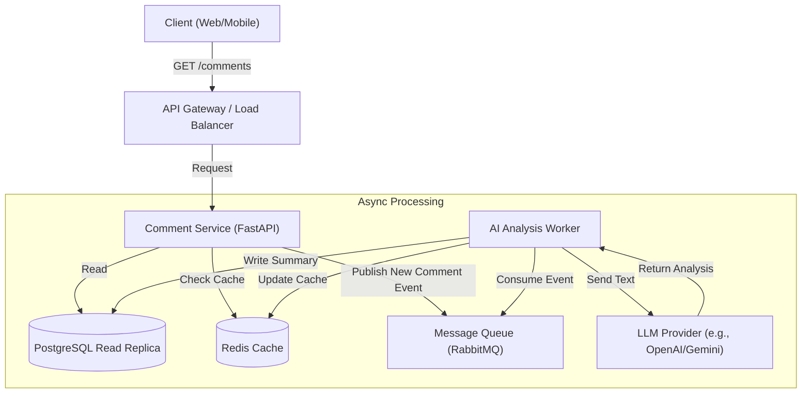
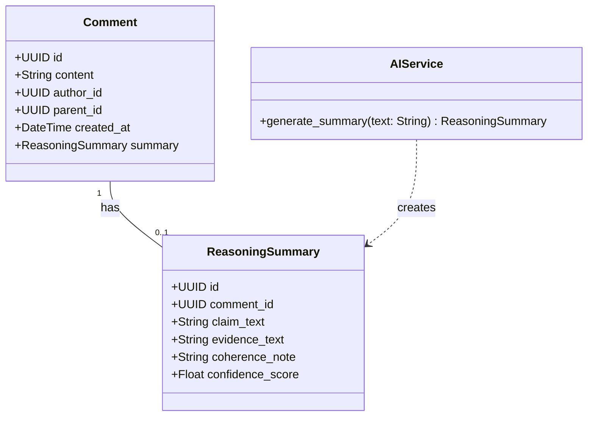
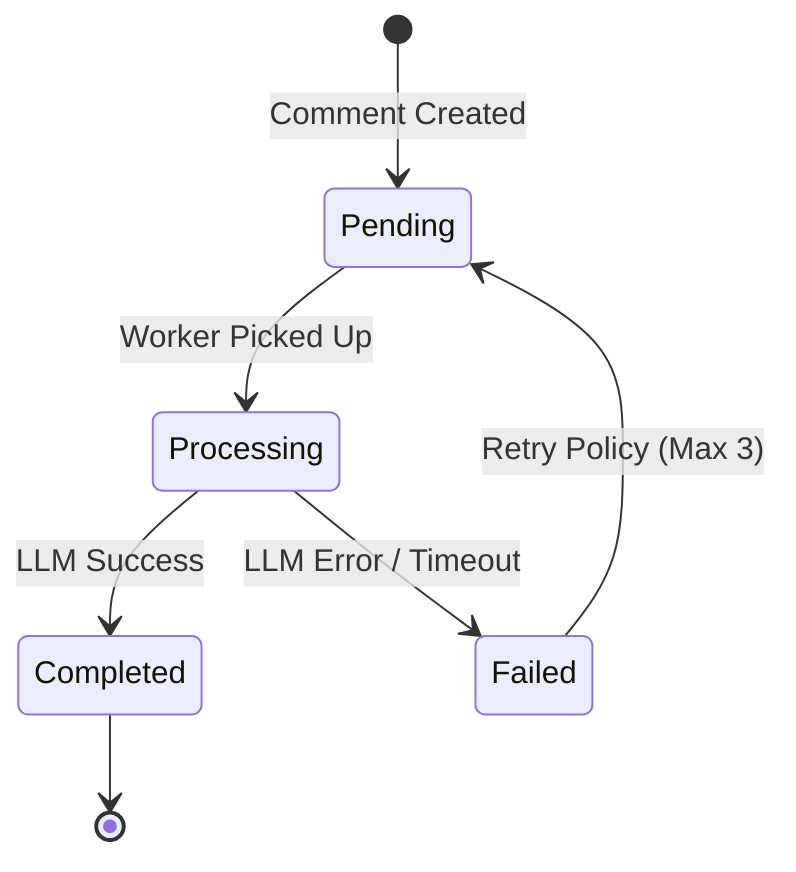
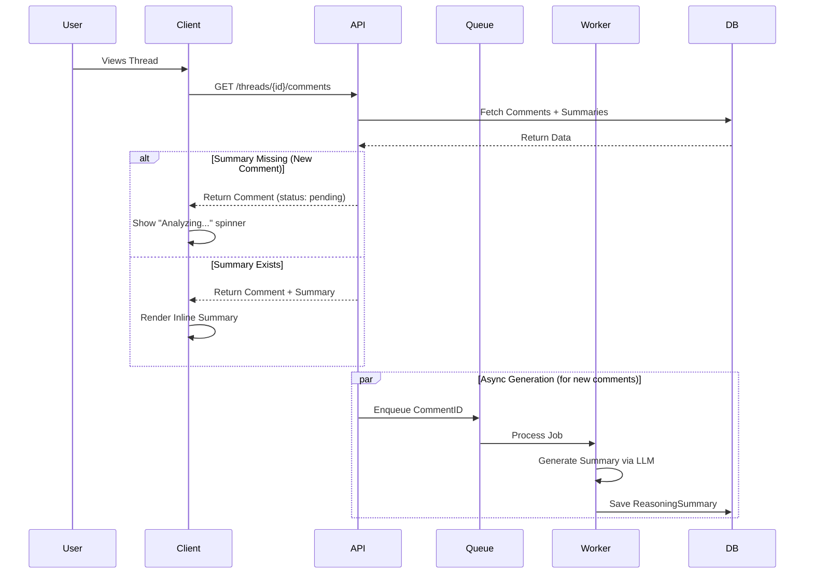

# Developer Specification: Inline AI Reasoning Summary

## 1. Overview
* **User Story:** As a new user, I want an inline AI summary of a comment's reasoning so that I can quickly understand its main claims and supporting evidence.
* **Goal:** Display a concise 1–2 sentence summary next to comments highlighting claims, evidence, and logical coherence.
* **T-Shirt Size:** Small

---

## 2. Architecture Diagram


---

## 3. Class Diagram

---
##5. State Diagrams

---
##6. Flow Chart Data Flow

---
##9. API's
```json
{
  "comment_id": "uuid",
  "status": "completed",
  "claim": "Nuclear energy is cleaner than coal.",
  "evidence": "Cites carbon output statistics from 2023.",
  "coherence": "Logically sound."
}
```
