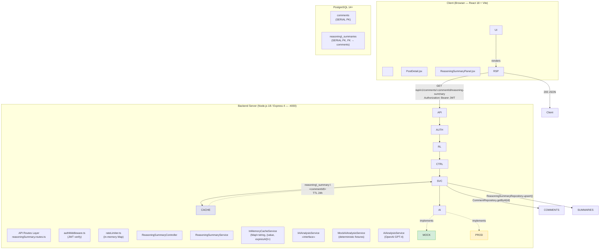

\# Development Specification: US1 — Inline AI Reasoning Summary

\## Overview

This document is the \*\*complete backend development specification\*\* for the Inline AI Reasoning Summary feature. It has been fully rewritten to integrate the \[Harmonized Backend Blueprint](HARMONIZED-BACKEND-BLUEPRINT.md), which establishes the shared architecture for both US1 and US3.

\*\*User Story:\*\* As a new user, I want an inline AI summary of a comment's reasoning so that I can quickly understand its main claims and supporting evidence.

\*\*T-Shirt Size:\*\* Small — Sprint 1 (2-week sprint), Priority: High, Dependencies: None.

\### Justification

Users leave lengthy Reddit threads because of repetition and buried arguments. This feature surfaces AI-generated reasoning quality indicators directly on each comment, giving new users immediate insight into the strength, coherence, and evidence behind any argument — without reading every reply.

\### Scope Boundaries

| In Scope | Out of Scope |

|----------|-------------|

| Single-comment AI reasoning summary (REST) | Thread-level debate summary (US2) |

| Lazy-load on user click ("Show AI Summary") | Auto-generating summaries for all comments |

| In-memory cache (Map-based, P4 constraint) | Redis or distributed cache |

| Mocked AI service for testing | Production OpenAI prompt tuning |

| Numeric `SERIAL` IDs for all tables | UUID primary keys |

\### P4 Constraints Recap

| Constraint | Decision |

|-----------|----------|

| Scale: 10 simultaneous users | In-memory `Map` replaces Redis; `Promise.all` replaces Bull |

| Mocked AI | All OpenAI calls behind `IAIAnalysisService`; `MockAIAnalysisService` for tests |

| Data standardization | `posts` (not threads); numeric `SERIAL` PKs everywhere |

---

\## Architecture Diagram



\### Component Locations

| Component | Runtime | Notes |

|-----------|---------|-------|

| Client | Browser (React 18 + Vite, `:3000`) | Plain JavaScript (JSX), NOT TypeScript |

| API Server | Node.js 18 + Express 4 (`:4000`) | TypeScript 5.x; single HTTP server shared with Socket.IO (US3) |

| Database | PostgreSQL 14+ | Single tenant; numeric `SERIAL` PKs |

| Cache | In-process `Map` | \*\*No Redis\*\* — P4 constraint (10 users) |

| AI Service | `IAIAnalysisService` interface | `MockAIAnalysisService` in dev/test; `AIAnalysisService` (OpenAI) in production |

\### Information Flows

1\. User clicks \*\*"Show AI Summary"\*\* on a comment in `ReasoningSummaryPanel.jsx`.

2\. Frontend sends `GET /api/v1/comments/:commentId/reasoning-summary` with JWT.

3\. `authMiddleware` verifies the token; `rateLimiter` checks the in-memory per-user window.

4\. `ReasoningSummaryController` delegates to `ReasoningSummaryService.getSummary(commentId)`.

5\. Service checks `InMemoryCacheService` (key: `reasoning\_summary:<commentId>`).

6\. \*\*Cache hit\*\* → return cached `ReasoningSummary` DTO immediately.

7\. \*\*Cache miss\*\* → query `reasoning\_summaries` table. If a non-expired row exists, cache it and return.

8\. \*\*DB miss\*\* → fetch comment text from `comments` table → call `IAIAnalysisService` methods → build DTO → upsert into `reasoning\_summaries` → cache → return.

9\. Frontend receives 200 JSON and renders the summary panel with claim, evidence blocks, and coherence score.

---

\## MIT 6.005 Data Abstraction — `InMemoryCacheService`

The **primary state-holding class** in the US1 module is `InMemoryCacheService`. It manages an in-process key-value store with time-based expiration, replacing what would otherwise be a Redis instance. Because this class owns mutable state that the rest of the system depends on, we define it as a formal data abstraction following [MIT 6.005 Reading 13](https://web.mit.edu/6.005/www/fa15/classes/13-abstraction-functions-rep-invariants/).

### Overview

`InMemoryCacheService` provides a **mutable** abstract data type that maps string keys to arbitrary JavaScript objects, each with an associated time-to-live (TTL). After the TTL expires, a key becomes invisible to consumers and is eventually reaped by a periodic sweep. The class implements `ICacheService`, the shared cache contract used by both US1 and US3.

### Space of Representation Values (Rep)

```typescript
class InMemoryCacheService implements ICacheService {
  // -- Rep --
  private store: Map<
    string,
    {
      value: object; // the cached datum (deep-cloned on get/set)
      expiresAt: number; // absolute epoch-ms deadline
    }
  >;
  private readonly maxEntries: number; // upper bound on Map size (default 10 000)
  private readonly sweepIntervalMs: number; // how often sweepExpired() runs (default 60 000 ms)
  private sweepIntervalId: NodeJS.Timeout | null; // handle for clearInterval; null when destroyed
}
```

**Rep components:**

| Field                  | Type                      | Domain                                                      |
| ---------------------- | ------------------------- | ----------------------------------------------------------- |
| `store`                | `Map<string, CacheEntry>` | keys ⊂ non-empty strings; size ∈ [0, `maxEntries`]          |
| `CacheEntry.value`     | `object`                  | any non-null JavaScript object                              |
| `CacheEntry.expiresAt` | `number`                  | positive integer (epoch milliseconds), always > 0           |
| `maxEntries`           | `number`                  | positive integer, default 10 000                            |
| `sweepIntervalMs`      | `number`                  | positive integer, default 60 000                            |
| `sweepIntervalId`      | `NodeJS.Timeout \| null`  | non-null while the cache is alive; `null` after `destroy()` |

### Space of Abstract Values

Abstractly, an `InMemoryCacheService` represents:

> A **finite partial function** _f : Key → Value_ from string keys to JavaScript objects, where each mapping has an associated deadline _d_, and only mappings whose deadline is in the future are visible. The function's domain has cardinality ≤ _N_ (the `maxEntries` cap).

In set-builder notation:

$$A = \{ f : \text{String} \rightharpoonup \text{Object} \mid |dom(f)| \leq N \}$$

where each element of the domain carries an implicit deadline:

$$\forall k \in dom(f): deadline(k) > now$$

Keys whose deadlines have passed are **not** in _dom(f)_ — they are invisible to the abstract value even if they still physically exist in `store` awaiting the next sweep.

### Rep Invariant (RI)

```
RI(r) =
    r.maxEntries > 0
  ∧ r.sweepIntervalMs > 0
  ∧ r.store.size ≤ r.maxEntries
  ∧ ∀ (key, entry) ∈ r.store:
        key.length > 0
      ∧ entry.value !== null
      ∧ entry.value !== undefined
      ∧ entry.expiresAt > 0
```

A `checkRep()` method enforces this invariant after every mutator in debug builds:

```typescript
private checkRep(): void {
    assert(this.maxEntries > 0, 'maxEntries must be positive');
    assert(this.sweepIntervalMs > 0, 'sweepIntervalMs must be positive');
    assert(this.store.size <= this.maxEntries,
           `store size ${this.store.size} exceeds cap ${this.maxEntries}`);
    for (const [key, entry] of this.store) {
        assert(key.length > 0, 'cache key must be non-empty');
        assert(entry.value !== null && entry.value !== undefined,
               `null/undefined value for key "${key}"`);
        assert(entry.expiresAt > 0,
               `expiresAt must be positive for key "${key}"`);
    }
}
```

### Abstraction Function (AF)

```
AF(r) = the partial function f where:
    dom(f) = { key | r.store.has(key) ∧ r.store.get(key).expiresAt > Date.now() }
    f(key)  = deep clone of r.store.get(key).value      for each key ∈ dom(f)
```

In words: _the abstract value is the set of non-expired entries in the store, where each key maps to a deep copy of its stored value._ Expired entries exist in `store` only until the next `sweepExpired()` call — they are ghosts in the representation but invisible to the abstraction.

### Safety from Rep Exposure

The class ensures no client can obtain a direct reference to its mutable internal state:

| Technique                       | Where Applied                                                                                                                                                |
| ------------------------------- | ------------------------------------------------------------------------------------------------------------------------------------------------------------ |
| **`private` fields**            | `store`, `maxEntries`, `sweepIntervalMs`, `sweepIntervalId` are all `private`. No public field exposes the Map.                                              |
| **Defensive copying on output** | `get<T>(key)` returns `structuredClone(entry.value)`, never the stored reference itself. If the caller mutates the returned object, the cache is unaffected. |
| **Defensive copying on input**  | `set(key, value, ttl)` stores `structuredClone(value)`, so the caller cannot mutate the cached object after insertion.                                       |
| **Immutable config**            | `maxEntries` and `sweepIntervalMs` are `readonly`; set once in the constructor, never changed.                                                               |
| **No iterator exposure**        | There is no public method that returns the `Map`, its keys, or its entries. The only way to read data is through `get(key)`, which returns a clone.          |
| **Timer encapsulation**         | `sweepIntervalId` is private; only `destroy()` clears it, preventing external interference with the sweep cycle.                                             |

---

\## Class Hierarchy Diagram

```mermaid
classDiagram

&nbsp;   class ReasoningSummaryController {

&nbsp;       -reasoningSummaryService: IReasoningSummaryService

&nbsp;       +getSummary(req, res): Promise~void~

&nbsp;   }


&nbsp;   class IReasoningSummaryService {

&nbsp;       <<interface>>

&nbsp;       +getSummary(commentId: number): Promise~ReasoningSummaryDTO~

&nbsp;       +generateAndCacheSummary(comment: Comment): Promise~ReasoningSummaryDTO~

&nbsp;       +invalidateCache(commentId: number): Promise~void~

&nbsp;   }


&nbsp;   class ReasoningSummaryService {

&nbsp;       -aiService: IAIAnalysisService

&nbsp;       -cache: ICacheService

&nbsp;       -commentRepo: CommentRepository

&nbsp;       -summaryRepo: ReasoningSummaryRepository

&nbsp;       +getSummary(commentId: number): Promise~ReasoningSummaryDTO~

&nbsp;       +generateAndCacheSummary(comment: Comment): Promise~ReasoningSummaryDTO~

&nbsp;       +invalidateCache(commentId: number): Promise~void~

&nbsp;       -buildDTO(row: DBRow): ReasoningSummaryDTO

&nbsp;   }


&nbsp;   class IAIAnalysisService {

&nbsp;       <<interface>>

&nbsp;       +extractClaims(text: string): Promise~Claim\[]~

&nbsp;       +extractEvidence(text: string): Promise~EvidenceBlock\[]~

&nbsp;       +evaluateCoherence(claims: Claim\[], evidence: EvidenceBlock\[]): Promise~number~

&nbsp;       +generateSummary(analysis: AnalysisResult): Promise~string~

&nbsp;   }


&nbsp;   class AIAnalysisService {

&nbsp;       -openaiClient: OpenAI

&nbsp;       -model: string

&nbsp;       +extractClaims(text: string): Promise~Claim\[]~

&nbsp;       +extractEvidence(text: string): Promise~EvidenceBlock\[]~

&nbsp;       +evaluateCoherence(claims: Claim\[], evidence: EvidenceBlock\[]): Promise~number~

&nbsp;       +generateSummary(analysis: AnalysisResult): Promise~string~

&nbsp;   }


&nbsp;   class MockAIAnalysisService {

&nbsp;       -fixtures: Map~string\_AnalysisResult~

&nbsp;       +extractClaims(text: string): Promise~Claim\[]~

&nbsp;       +extractEvidence(text: string): Promise~EvidenceBlock\[]~

&nbsp;       +evaluateCoherence(claims: Claim\[], evidence: EvidenceBlock\[]): Promise~number~

&nbsp;       +generateSummary(analysis: AnalysisResult): Promise~string~

&nbsp;   }


&nbsp;   class ICacheService {

&nbsp;       <<interface>>

&nbsp;       +get(key: string): Promise~object\_or\_null~

&nbsp;       +set(key: string, value: object, ttl: number): Promise~void~

&nbsp;       +delete(key: string): Promise~void~

&nbsp;       +exists(key: string): Promise~boolean~

&nbsp;   }


&nbsp;   class InMemoryCacheService {

&nbsp;       -store: Map~string\_CacheEntry~

&nbsp;       -sweepIntervalId: NodeJS.Timeout

&nbsp;       +get(key: string): Promise~object\_or\_null~

&nbsp;       +set(key: string, value: object, ttl: number): Promise~void~

&nbsp;       +delete(key: string): Promise~void~

&nbsp;       +exists(key: string): Promise~boolean~

&nbsp;       +sweepExpired(): void

&nbsp;       +destroy(): void

&nbsp;   }


&nbsp;   class CommentRepository {

&nbsp;       -pool: Pool

&nbsp;       +getById(id: number): Promise~Comment\_or\_null~

&nbsp;       +getByPostId(postId: number): Promise~Comment\[]~

&nbsp;   }


&nbsp;   class ReasoningSummaryRepository {

&nbsp;       -pool: Pool

&nbsp;       +findByCommentId(commentId: number): Promise~DBRow\_or\_null~

&nbsp;       +upsert(summary: ReasoningSummaryInsert): Promise~DBRow~

&nbsp;       +deleteByCommentId(commentId: number): Promise~void~

&nbsp;   }


&nbsp;   class CommentValidator {

&nbsp;       +validateCommentId(id: any): number

&nbsp;       +sanitizeText(text: string): string

&nbsp;   }


&nbsp;   class NLPProcessor {

&nbsp;       +tokenize(text: string): string\[]

&nbsp;       +parseSentences(text: string): string\[]

&nbsp;   }


&nbsp;   class ReasoningSummaryDTO {

&nbsp;       +commentId: number

&nbsp;       +summary: string

&nbsp;       +primaryClaim: string

&nbsp;       +evidenceBlocks: EvidenceBlock\[]

&nbsp;       +coherenceScore: number

&nbsp;       +generatedAt: Date

&nbsp;   }


&nbsp;   class EvidenceBlock {

&nbsp;       +type: string

&nbsp;       +content: string

&nbsp;       +strength: string

&nbsp;   }


&nbsp;   class Claim {

&nbsp;       +id: number

&nbsp;       +text: string

&nbsp;       +supportingEvidence: string\[]

&nbsp;   }


&nbsp;   ReasoningSummaryController --> IReasoningSummaryService

&nbsp;   IReasoningSummaryService <|.. ReasoningSummaryService

&nbsp;   ReasoningSummaryService --> IAIAnalysisService

&nbsp;   ReasoningSummaryService --> ICacheService

&nbsp;   ReasoningSummaryService --> CommentRepository

&nbsp;   ReasoningSummaryService --> ReasoningSummaryRepository

&nbsp;   IAIAnalysisService <|.. AIAnalysisService

&nbsp;   IAIAnalysisService <|.. MockAIAnalysisService

&nbsp;   ICacheService <|.. InMemoryCacheService

&nbsp;   ReasoningSummaryService --> CommentValidator

&nbsp;   ReasoningSummaryService --> NLPProcessor

&nbsp;   ReasoningSummaryService ..> ReasoningSummaryDTO : creates

&nbsp;   ReasoningSummaryDTO --> EvidenceBlock

&nbsp;   ReasoningSummaryDTO --> Claim

```

---

\## List of Classes

| Class Name | Package | Responsibility |

|------------|---------|----------------|

| `ReasoningSummaryController` | `controllers/` | Thin HTTP handler; validates params via `CommentValidator`, delegates to `IReasoningSummaryService`, serializes response |

| `ReasoningSummaryService` | `services/` | Orchestrates cache → DB → AI generation pipeline; implements `IReasoningSummaryService` |

| `IAIAnalysisService` | `services/interfaces/` | Interface — single contract for all LLM interaction (shared with US3) |

| `AIAnalysisService` | `services/` | Production implementation; wraps `openai` npm client; sends structured prompts to GPT-4 |

| `MockAIAnalysisService` | `services/` | Test implementation; returns deterministic fixtures; zero network calls |

| `ICacheService` | `services/interfaces/` | Interface for key-value cache with TTL |

| `InMemoryCacheService` | `services/` | `Map`-based implementation; 60 s sweep interval; replaces Redis (P4) |

| `CommentRepository` | `repositories/` | Parameterized SQL queries against `comments` table via `pg` Pool |

| `ReasoningSummaryRepository` | `repositories/` | CRUD on `reasoning\_summaries` table; `upsert` uses `ON CONFLICT (comment\_id) DO UPDATE` |

| `CommentValidator` | `utils/` | Validates and sanitizes `commentId` param (must be positive integer) |

| `NLPProcessor` | `utils/` | Sentence splitting and tokenization (used as fallback when AI service calls fail) |

| `ReasoningSummaryDTO` | `models/` | Immutable DTO matching the frontend `aiSummary` shape |

| `EvidenceBlock` | `models/` | Value object: `{ type, content, strength }` |

| `Claim` | `models/` | Value object: `{ id, text, supportingEvidence }` |

---

\## State Diagram

```mermaid

stateDiagram-v2

&nbsp;   \[\*] --> Idle


&nbsp;   Idle --> ValidatingRequest : GET /comments/:id/reasoning-summary


&nbsp;   ValidatingRequest --> Rejected : Invalid commentId or auth failure

&nbsp;   ValidatingRequest --> CheckingCache : Valid request


&nbsp;   Rejected --> \[\*] : Return 400/401/429


&nbsp;   CheckingCache --> ReturningResponse : Cache HIT (Map lookup)

&nbsp;   CheckingCache --> CheckingDatabase : Cache MISS


&nbsp;   CheckingDatabase --> CachingFromDB : DB row exists \& not expired

&nbsp;   CheckingDatabase --> FetchingComment : No DB row or expired


&nbsp;   CachingFromDB --> ReturningResponse : Cache set, return DTO


&nbsp;   FetchingComment --> CommentNotFound : Comment ID not in DB

&nbsp;   FetchingComment --> AnalyzingText : Comment found


&nbsp;   CommentNotFound --> \[\*] : Return 404


&nbsp;   AnalyzingText --> ExtractingClaims : IAIAnalysisService.extractClaims()

&nbsp;   ExtractingClaims --> ExtractingEvidence : IAIAnalysisService.extractEvidence()

&nbsp;   ExtractingEvidence --> EvaluatingCoherence : IAIAnalysisService.evaluateCoherence()

&nbsp;   EvaluatingCoherence --> GeneratingSummary : IAIAnalysisService.generateSummary()


&nbsp;   GeneratingSummary --> PersistingResult : Build ReasoningSummaryDTO


&nbsp;   GeneratingSummary --> AnalysisError : AI service throws


&nbsp;   AnalysisError --> \[\*] : Return 500 with graceful message


&nbsp;   PersistingResult --> CachingResult : Upsert into reasoning\_summaries


&nbsp;   CachingResult --> ReturningResponse : InMemoryCacheService.set(key, dto, 86400)


&nbsp;   ReturningResponse --> \[\*] : Return 200 JSON


&nbsp;   note right of CheckingCache

&nbsp;       Key: reasoning\_summary:<commentId>

&nbsp;       TTL: 86,400s (24 hours)

&nbsp;   end note


&nbsp;   note right of AnalyzingText

&nbsp;       Uses IAIAnalysisService interface.

&nbsp;       MockAIAnalysisService in tests;

&nbsp;       AIAnalysisService (OpenAI) in prod.

&nbsp;   end note

```

---

\## Flow Chart

```mermaid

flowchart TD

&nbsp;   A(\[User clicks 'Show AI Summary']) --> B\["Client: GET /api/v1/comments/:commentId/reasoning-summary<br/>Header: Authorization: Bearer JWT"]


&nbsp;   B --> C{authMiddleware:<br/>JWT valid?}

&nbsp;   C -- No --> C1\[Return 401 Unauthorized]

&nbsp;   C -- Yes --> D{rateLimiter:<br/>under 100 req/min?}

&nbsp;   D -- No --> D1\[Return 429 Too Many Requests]

&nbsp;   D -- Yes --> E\["CommentValidator.validateCommentId(commentId)"]


&nbsp;   E --> F{Valid positive<br/>integer?}

&nbsp;   F -- No --> F1\[Return 400 Bad Request]

&nbsp;   F -- Yes --> G\["InMemoryCacheService.get('reasoning\_summary:' + commentId)"]


&nbsp;   G --> H{Cache<br/>HIT?}

&nbsp;   H -- Yes --> R\[Return 200 JSON — cached ReasoningSummaryDTO]


&nbsp;   H -- No --> I\["ReasoningSummaryRepository.findByCommentId(commentId)"]

&nbsp;   I --> J{DB row exists<br/>and not expired?}

&nbsp;   J -- Yes --> K\["InMemoryCacheService.set(key, dto, 86400)"] --> R


&nbsp;   J -- No --> L\["CommentRepository.getById(commentId)"]

&nbsp;   L --> M{Comment<br/>found?}

&nbsp;   M -- No --> M1\[Return 404 Not Found]

&nbsp;   M -- Yes --> N\["IAIAnalysisService.extractClaims(comment.text)"]

&nbsp;   N --> O\["IAIAnalysisService.extractEvidence(comment.text)"]

&nbsp;   O --> P\["IAIAnalysisService.evaluateCoherence(claims, evidence)"]

&nbsp;   P --> Q\["IAIAnalysisService.generateSummary({claims, evidence, coherence})"]


&nbsp;   Q --> S{AI service<br/>error?}

&nbsp;   S -- Yes --> S1\[Return 500 Internal Server Error]

&nbsp;   S -- No --> T\["Build ReasoningSummaryDTO"]


&nbsp;   T --> U\["ReasoningSummaryRepository.upsert(dto)"]

&nbsp;   U --> V\["InMemoryCacheService.set(key, dto, 86400)"]

&nbsp;   V --> R


&nbsp;   R --> W(\[Client renders ReasoningSummaryPanel<br/>with summary, claim, evidence, coherence score])

```

---

\## Technology Stack

| Layer | Technology | Version | Purpose | P4 Note |

|-------|-----------|---------|---------|---------|

| \*\*Frontend\*\* | React | 18.x | UI — `ReasoningSummaryPanel.jsx` | Plain JSX (not TypeScript) |

| \*\*Frontend\*\* | Vite | 5.x | Dev server on `:3000`, proxy `/api → :4000` | |

| \*\*Frontend\*\* | Tailwind CSS | 3.x | Styling + lucide-react icons | |

| \*\*Backend\*\* | Node.js | 18.x LTS | Runtime | |

| \*\*Backend\*\* | Express.js | 4.x | HTTP framework | Shared server with Socket.IO (US3) |

| \*\*Backend\*\* | TypeScript | 5.x | Type safety | |

| \*\*Database\*\* | PostgreSQL | 14+ | Primary store (`comments`, `reasoning\_summaries`) | Numeric `SERIAL` PKs |

| \*\*Cache\*\* | \*\*In-memory `Map`\*\* | N/A | Key-value w/ TTL (replaces Redis) | \*\*P4: 10-user scale\*\* |

| \*\*Job Queue\*\* | \*\*`Promise.all`\*\* | N/A | Parallel AI calls (replaces Bull) | \*\*P4: no Bull\*\* |

| \*\*AI\*\* | OpenAI API (GPT-4) | Latest | Behind `IAIAnalysisService` | \*\*Mocked in tests\*\* |

| \*\*NLP Fallback\*\* | natural / compromise | Latest | Local tokenization \& sentence splitting | |

| \*\*Testing\*\* | Jest | 29.x | Unit + integration (`MockAIAnalysisService`) | |

| \*\*Auth\*\* | jsonwebtoken | Latest | JWT HS256 | |

| \*\*Validation\*\* | zod | 3.x | Request schema validation | |

| \*\*Query\*\* | pg (node-postgres) | 8.x | Raw parameterized SQL | |

---

\## APIs

\### 1. Get Reasoning Summary

```http

GET /api/v1/comments/:commentId/reasoning-summary

Authorization: Bearer {jwt\_token}

```

\*\*Path Parameters:\*\*

| Param | Type | Constraints | Example |

|-------|------|-------------|---------|

| `commentId` | `integer` | Positive, matches `comments.id` | `3` |

\*\*Response — 200 OK:\*\*

```json

{

&nbsp; "commentId": 3,

&nbsp; "summary": "Takes a balanced position, arguing that team familiarity and project consistency matter more than the specific CSS approach chosen.",

&nbsp; "primaryClaim": "Team familiarity is the key factor in CSS methodology effectiveness, not the tool itself",

&nbsp; "evidenceBlocks": \[

&nbsp;   {

&nbsp;     "type": "anecdote",

&nbsp;     "content": "Personal experience shipping production apps with both approaches",

&nbsp;     "strength": "medium"

&nbsp;   }

&nbsp; ],

&nbsp; "coherenceScore": 0.91,

&nbsp; "generatedAt": "2026-03-10T14:30:00.000Z"

}

```

\*\*Response — 400 Bad Request:\*\*

```json

{

&nbsp; "error": "INVALID\_COMMENT\_ID",

&nbsp; "message": "commentId must be a positive integer"

}

```

\*\*Response — 401 Unauthorized:\*\*

```json

{

&nbsp; "error": "UNAUTHORIZED",

&nbsp; "message": "Missing or invalid JWT token"

}

```

\*\*Response — 404 Not Found:\*\*

```json

{

&nbsp; "error": "COMMENT\_NOT\_FOUND",

&nbsp; "message": "No comment found with id 9999"

}

```

\*\*Response — 429 Too Many Requests:\*\*

```json

{

&nbsp; "error": "RATE\_LIMIT\_EXCEEDED",

&nbsp; "message": "Rate limit of 100 requests per minute exceeded",

&nbsp; "retryAfterMs": 12400

}

```

\*\*Response — 500 Internal Server Error:\*\*

```json

{

&nbsp; "error": "ANALYSIS\_FAILED",

&nbsp; "message": "Failed to generate reasoning summary. Please try again."

}

```

\### Response DTO Contract

The response body \*\*must\*\* match the shape consumed by the frontend's `ReasoningSummaryPanel.jsx` (via the `comment.aiSummary` field):

```typescript

interface ReasoningSummaryResponse {

&nbsp; commentId: number;

&nbsp; summary: string;

&nbsp; primaryClaim: string;

&nbsp; evidenceBlocks: {

&nbsp;   type: 'study' | 'data' | 'anecdote' | 'authority' | 'other';

&nbsp;   content: string;

&nbsp;   strength: 'high' | 'medium' | 'low';

&nbsp; }\[];

&nbsp; coherenceScore: number;   // 0.00–1.00

&nbsp; generatedAt: string;      // ISO 8601

}

```

\### Zod Validation Schema

```typescript

import { z } from 'zod';


export const getReasoningSummaryParams = z.object({

&nbsp; commentId: z.coerce.number().int().positive(),

});

```

\### Related CRUD Endpoints (Defined in Blueprint)

These core endpoints are \*\*not\*\* US1-specific but are required for the summary to function:

| # | Method | Endpoint | Purpose |

|---|--------|----------|---------|

| 1 | `GET` | `/api/v1/posts/:id/comments` | List comments (returns `aiSummary: null`; lazy-load via US1 endpoint) |

| 2 | `POST` | `/api/v1/posts/:id/comments` | Create comment (new comments have no summary) |

| 3 | `POST` | `/api/v1/auth/login` | Obtain JWT for authenticated requests |

| 4 | `POST` | `/api/v1/auth/register` | Register user |

---

\## Public Interfaces

\### Backend Service Interfaces

```typescript

// ─── services/interfaces/IReasoningSummaryService.ts ───

import { ReasoningSummaryDTO } from '../../models/ReasoningSummary';

import { Comment } from '../../models/Comment';


export interface IReasoningSummaryService {

&nbsp; /\*\* Retrieve summary (cache → DB → generate). \*/

&nbsp; getSummary(commentId: number): Promise<ReasoningSummaryDTO>;


&nbsp; /\*\* Force-generate summary, persist, and cache. \*/

&nbsp; generateAndCacheSummary(comment: Comment): Promise<ReasoningSummaryDTO>;


&nbsp; /\*\* Remove from both cache and DB. \*/

&nbsp; invalidateCache(commentId: number): Promise<void>;

}

```

```typescript

// ─── services/interfaces/IAIAnalysisService.ts ───  (shared with US3)

import { Claim } from '../../models/Claim';

import { EvidenceBlock } from '../../models/EvidenceBlock';

import { AnalysisResult } from '../../models/AnalysisResult';


export interface IAIAnalysisService {

&nbsp; extractClaims(text: string): Promise<Claim\[]>;

&nbsp; extractEvidence(text: string): Promise<EvidenceBlock\[]>;

&nbsp; evaluateCoherence(claims: Claim\[], evidence: EvidenceBlock\[]): Promise<number>;

&nbsp; generateSummary(analysis: AnalysisResult): Promise<string>;

}

```

```typescript

// ─── services/interfaces/ICacheService.ts ───  (shared with US3)

export interface ICacheService {

&nbsp; get<T = object>(key: string): Promise<T | null>;

&nbsp; set(key: string, value: object, ttlSeconds?: number): Promise<void>;

&nbsp; delete(key: string): Promise<void>;

&nbsp; exists(key: string): Promise<boolean>;

}

```

\### Model Interfaces (DTOs)

```typescript

// ─── models/ReasoningSummary.ts ───

import { EvidenceBlock } from './EvidenceBlock';


/\*\* Immutable DTO returned to the frontend. \*/

export interface ReasoningSummaryDTO {

&nbsp; commentId: number;

&nbsp; summary: string;

&nbsp; primaryClaim: string;

&nbsp; evidenceBlocks: EvidenceBlock\[];

&nbsp; coherenceScore: number;   // 0–1

&nbsp; generatedAt: Date;

}


/\*\* Shape for inserting/upserting into the DB. \*/

export interface ReasoningSummaryInsert {

&nbsp; commentId: number;

&nbsp; summary: string;

&nbsp; primaryClaim: string;

&nbsp; evidenceBlocks: EvidenceBlock\[];  // stored as JSONB

&nbsp; coherenceScore: number;

}


/\*\* Raw row shape from PostgreSQL. \*/

export interface ReasoningSummaryRow {

&nbsp; id: number;

&nbsp; comment\_id: number;

&nbsp; summary: string;

&nbsp; primary\_claim: string;

&nbsp; evidence\_blocks: EvidenceBlock\[];  // JSONB auto-parsed by pg

&nbsp; coherence\_score: string;           // NUMERIC comes as string from pg

&nbsp; created\_at: Date;

&nbsp; updated\_at: Date;

&nbsp; expires\_at: Date;

}

```

```typescript

// ─── models/EvidenceBlock.ts ───

export interface EvidenceBlock {

&nbsp; type: 'study' | 'data' | 'anecdote' | 'authority' | 'other';

&nbsp; content: string;

&nbsp; strength: 'high' | 'medium' | 'low';

}

```

```typescript

// ─── models/Claim.ts ───

export interface Claim {

&nbsp; id: number;

&nbsp; text: string;

&nbsp; supportingEvidence: string\[];

}

```

```typescript

// ─── models/Comment.ts ───

export interface Comment {

&nbsp; id: number;

&nbsp; postId: number;

&nbsp; authorId: number;

&nbsp; parentCommentId: number | null;

&nbsp; text: string;

&nbsp; upvotes: number;

&nbsp; downvotes: number;

&nbsp; createdAt: Date;

&nbsp; updatedAt: Date;

}

```

```typescript

// ─── models/AnalysisResult.ts ───

import { Claim } from './Claim';

import { EvidenceBlock } from './EvidenceBlock';


export interface AnalysisResult {

&nbsp; claims: Claim\[];

&nbsp; evidence: EvidenceBlock\[];

&nbsp; coherenceScore: number;

}

```

\### Repository Interfaces

```typescript

// ─── repositories/CommentRepository.ts ───

import { Comment } from '../models/Comment';

import { Pool } from 'pg';


export class CommentRepository {

&nbsp; constructor(private pool: Pool) {}


&nbsp; async getById(id: number): Promise<Comment | null> {

&nbsp;   const { rows } = await this.pool.query(

&nbsp;     'SELECT \* FROM comments WHERE id = $1',

&nbsp;     \[id]

&nbsp;   );

&nbsp;   return rows.length ? this.mapRow(rows\[0]) : null;

&nbsp; }


&nbsp; async getByPostId(postId: number): Promise<Comment\[]> {

&nbsp;   const { rows } = await this.pool.query(

&nbsp;     'SELECT \* FROM comments WHERE post\_id = $1 ORDER BY created\_at ASC',

&nbsp;     \[postId]

&nbsp;   );

&nbsp;   return rows.map(this.mapRow);

&nbsp; }


&nbsp; private mapRow(row: any): Comment {

&nbsp;   return {

&nbsp;     id: row.id,

&nbsp;     postId: row.post\_id,

&nbsp;     authorId: row.author\_id,

&nbsp;     parentCommentId: row.parent\_comment\_id,

&nbsp;     text: row.text,

&nbsp;     upvotes: row.upvotes,

&nbsp;     downvotes: row.downvotes,

&nbsp;     createdAt: row.created\_at,

&nbsp;     updatedAt: row.updated\_at,

&nbsp;   };

&nbsp; }

}

```

```typescript

// ─── repositories/ReasoningSummaryRepository.ts ───

import { ReasoningSummaryInsert, ReasoningSummaryRow } from '../models/ReasoningSummary';

import { Pool } from 'pg';


export class ReasoningSummaryRepository {

&nbsp; constructor(private pool: Pool) {}


&nbsp; async findByCommentId(commentId: number): Promise<ReasoningSummaryRow | null> {

&nbsp;   const { rows } = await this.pool.query(

&nbsp;     `SELECT \* FROM reasoning\_summaries

&nbsp;      WHERE comment\_id = $1 AND expires\_at > NOW()`,

&nbsp;     \[commentId]

&nbsp;   );

&nbsp;   return rows.length ? rows\[0] : null;

&nbsp; }


&nbsp; async upsert(data: ReasoningSummaryInsert): Promise<ReasoningSummaryRow> {

&nbsp;   const { rows } = await this.pool.query(

&nbsp;     `INSERT INTO reasoning\_summaries

&nbsp;        (comment\_id, summary, primary\_claim, evidence\_blocks, coherence\_score, expires\_at)

&nbsp;      VALUES ($1, $2, $3, $4, $5, NOW() + INTERVAL '24 hours')

&nbsp;      ON CONFLICT (comment\_id) DO UPDATE SET

&nbsp;        summary = EXCLUDED.summary,

&nbsp;        primary\_claim = EXCLUDED.primary\_claim,

&nbsp;        evidence\_blocks = EXCLUDED.evidence\_blocks,

&nbsp;        coherence\_score = EXCLUDED.coherence\_score,

&nbsp;        updated\_at = NOW(),

&nbsp;        expires\_at = NOW() + INTERVAL '24 hours'

&nbsp;      RETURNING \*`,

&nbsp;     \[data.commentId, data.summary, data.primaryClaim,

&nbsp;      JSON.stringify(data.evidenceBlocks), data.coherenceScore]

&nbsp;   );

&nbsp;   return rows\[0];

&nbsp; }


&nbsp; async deleteByCommentId(commentId: number): Promise<void> {

&nbsp;   await this.pool.query(

&nbsp;     'DELETE FROM reasoning\_summaries WHERE comment\_id = $1',

&nbsp;     \[commentId]

&nbsp;   );

&nbsp; }

}

```

\### MockAIAnalysisService (Test Implementation)

```typescript

// ─── services/MockAIAnalysisService.ts ───

import { IAIAnalysisService } from './interfaces/IAIAnalysisService';

import { Claim } from '../models/Claim';

import { EvidenceBlock } from '../models/EvidenceBlock';

import { AnalysisResult } from '../models/AnalysisResult';


/\*\*

&nbsp;\* Deterministic mock — returns fixtures based on text length.

&nbsp;\* Zero network calls. Used in all Jest test suites.

&nbsp;\*/

export class MockAIAnalysisService implements IAIAnalysisService {

&nbsp; async extractClaims(text: string): Promise<Claim\[]> {

&nbsp;   return \[

&nbsp;     { id: 1, text: text.substring(0, 60), supportingEvidence: \['mock-ev-1'] },

&nbsp;   ];

&nbsp; }


&nbsp; async extractEvidence(text: string): Promise<EvidenceBlock\[]> {

&nbsp;   const strength = text.length > 200 ? 'high' : text.length > 100 ? 'medium' : 'low';

&nbsp;   return \[

&nbsp;     { type: 'anecdote', content: 'Mock evidence from text analysis', strength },

&nbsp;   ];

&nbsp; }


&nbsp; async evaluateCoherence(\_claims: Claim\[], \_evidence: EvidenceBlock\[]): Promise<number> {

&nbsp;   return 0.75; // deterministic

&nbsp; }


&nbsp; async generateSummary(analysis: AnalysisResult): Promise<string> {

&nbsp;   const claimText = analysis.claims\[0]?.text ?? 'No claims found';

&nbsp;   return `Mock summary: Argues "${claimText}" with ${analysis.evidence.length} piece(s) of evidence.`;

&nbsp; }

}

```

---

\## Data Schemas

> All schemas below use \*\*numeric `SERIAL` primary keys\*\* per the P4 Data Standardization constraint. These replace the UUID PKs from the original DS1.

\### `reasoning\_summaries` Table

```sql

CREATE TABLE reasoning\_summaries (

&nbsp;   id              SERIAL PRIMARY KEY,

&nbsp;   comment\_id      INTEGER       NOT NULL UNIQUE REFERENCES comments(id) ON DELETE CASCADE,

&nbsp;   summary         TEXT          NOT NULL,

&nbsp;   primary\_claim   TEXT          NOT NULL,

&nbsp;   evidence\_blocks JSONB         NOT NULL,

&nbsp;   coherence\_score NUMERIC(3,2)  CHECK (coherence\_score >= 0 AND coherence\_score <= 1),

&nbsp;   created\_at      TIMESTAMP     DEFAULT CURRENT\_TIMESTAMP,

&nbsp;   updated\_at      TIMESTAMP     DEFAULT CURRENT\_TIMESTAMP,

&nbsp;   expires\_at      TIMESTAMP     DEFAULT (CURRENT\_TIMESTAMP + INTERVAL '24 hours')

);


CREATE INDEX idx\_reasoning\_comment ON reasoning\_summaries(comment\_id);

CREATE INDEX idx\_reasoning\_expires ON reasoning\_summaries(expires\_at);

```

\*\*Design decisions:\*\*

\- `evidence\_blocks` stored as \*\*JSONB\*\* (denormalized) — sufficient for the read-heavy, write-rare pattern of summaries. No separate `evidence\_blocks` table needed.

\- `expires\_at` defaults to 24 h from creation; `ReasoningSummaryRepository.findByCommentId` filters `WHERE expires\_at > NOW()`.

\- `ON DELETE CASCADE` from `comments(id)` — deleting a comment auto-deletes its summary (GDPR right-to-deletion).

\### Dependent Base Tables (Defined in Blueprint)

The `reasoning\_summaries` table has a foreign key to `comments(id)`. The complete `comments` and related base table schemas are defined in the \[Harmonized Backend Blueprint §2](HARMONIZED-BACKEND-BLUEPRINT.md). Key schemas referenced:

```sql

-- comments (Blueprint §2.5)

CREATE TABLE comments (

&nbsp;   id                SERIAL PRIMARY KEY,

&nbsp;   post\_id           INTEGER NOT NULL REFERENCES posts(id) ON DELETE CASCADE,

&nbsp;   author\_id         INTEGER NOT NULL REFERENCES users(id) ON DELETE CASCADE,

&nbsp;   parent\_comment\_id INTEGER          REFERENCES comments(id) ON DELETE CASCADE,

&nbsp;   text              TEXT    NOT NULL,

&nbsp;   upvotes           INTEGER DEFAULT 0,

&nbsp;   downvotes         INTEGER DEFAULT 0,

&nbsp;   created\_at        TIMESTAMP DEFAULT CURRENT\_TIMESTAMP,

&nbsp;   updated\_at        TIMESTAMP DEFAULT CURRENT\_TIMESTAMP

);


-- users (Blueprint §2.1)

CREATE TABLE users (

&nbsp;   id            SERIAL PRIMARY KEY,

&nbsp;   username      VARCHAR(50)  NOT NULL UNIQUE,

&nbsp;   email         VARCHAR(255) NOT NULL UNIQUE,

&nbsp;   password\_hash VARCHAR(255) NOT NULL,

&nbsp;   avatar        VARCHAR(255) DEFAULT '👤',

&nbsp;   karma         INTEGER      DEFAULT 0,

&nbsp;   joined\_date   TIMESTAMP    DEFAULT CURRENT\_TIMESTAMP,

&nbsp;   created\_at    TIMESTAMP    DEFAULT CURRENT\_TIMESTAMP,

&nbsp;   updated\_at    TIMESTAMP    DEFAULT CURRENT\_TIMESTAMP

);

```

\### In-Memory Cache Key Structure (replaces Redis)

```

Key pattern:  reasoning\_summary:<commentId>

Value:        ReasoningSummaryDTO (JavaScript object)

TTL:          86,400 seconds (24 hours)

Storage:      Map<string, { value: ReasoningSummaryDTO; expiresAt: number }>

Sweep:        setInterval every 60 s removes entries where Date.now() > expiresAt


Example:

&nbsp; Key:   "reasoning\_summary:3"

&nbsp; Value: {

&nbsp;   commentId: 3,

&nbsp;   summary: "Takes a balanced position...",

&nbsp;   primaryClaim: "Team familiarity is the key factor...",

&nbsp;   evidenceBlocks: \[{ type: "anecdote", content: "...", strength: "medium" }],

&nbsp;   coherenceScore: 0.91,

&nbsp;   generatedAt: "2026-03-10T14:30:00.000Z"

&nbsp; }

```

### Stable Storage Justification

> **Rubric constraint addressed:** _"Determine the stable storage mechanism… you can't just use an in-memory data structure because your app might crash and lose its memory. Customers really hate data loss."_

**PostgreSQL 14+ is the sole, authoritative stable storage mechanism for all US1 customer data.** Every reasoning summary that is generated passes through the following persistence guarantee before a success response is ever returned to the client:

1. `ReasoningSummaryService` calls `ReasoningSummaryRepository.upsert()`, which executes a parameterized `INSERT … ON CONFLICT DO UPDATE … RETURNING *` against the `reasoning_summaries` table.
2. The `pg` driver awaits the PostgreSQL server's acknowledgment (i.e., the row has been committed to WAL and the transaction is durable) **before** the service proceeds to cache the result or return the DTO.
3. Only after the durable write completes does `InMemoryCacheService.set()` populate the in-process `Map`.

**What happens on a Node.js process crash:**

| Layer                     | Effect of Crash                                                                                                      | Customer Data Loss?                                                                                                                                                                                                                                                                                             |
| ------------------------- | -------------------------------------------------------------------------------------------------------------------- | --------------------------------------------------------------------------------------------------------------------------------------------------------------------------------------------------------------------------------------------------------------------------------------------------------------- |
| **PostgreSQL**            | Unaffected. Committed rows survive process, container, and OS restarts. WAL + `fsync` guarantee ACID durability.     | **None**                                                                                                                                                                                                                                                                                                        |
| **In-memory `Map` cache** | Entire cache is lost (expected).                                                                                     | **None** — the cache is a _derived, ephemeral replica_ of data already committed to Postgres. On the next `GET /reasoning-summary` request, the service simply re-reads the `reasoning_summaries` table (a cache miss → DB hit path already implemented in the state diagram) and repopulates the cache lazily. |
| **In-flight analysis**    | If the crash occurs _during_ an AI analysis (after `extractClaims` but before `upsert`), the partial result is lost. | **None** — no row was committed, so no stale data exists. The next user request triggers a fresh analysis, and the user sees a normal loading state.                                                                                                                                                            |

**Design invariant:** At no point does the system return a `200 OK` to the client unless the summary row has been durably committed to PostgreSQL. The `InMemoryCacheService` is strictly a **read-through performance optimization** — a warm lookup that avoids a round-trip to Postgres on repeated requests. It holds no data that does not already exist in the database. Losing the cache is operationally equivalent to a cold start: the first request for each comment incurs one extra DB read, which at P4 scale (≤ 10 concurrent users) adds negligible latency (< 5 ms per query on indexed `comment_id`).

**Summary:** PostgreSQL is the durable, crash-safe source of truth. The in-memory `Map` is a disposable acceleration layer. Customers experience zero data loss on any process crash.

\### Seed Data

The seed script must mirror `frontend/src/mockData.js` to ensure dev parity. The 6 mock comments across posts 1–3 should be seeded with pre-generated reasoning summaries matching the existing `aiSummary` fields:

| Comment ID | Post ID | Author | Existing `aiSummary` | Seed Summary? |

|-----------|---------|--------|---------------------|---------------|

| 1 | 1 | ReactFan42 | Yes (coherence 0.87) | Yes |

| 2 | 1 | CSSPurist | Yes (coherence 0.72) | Yes |

| 3 | 1 | FullStackDev | Yes (coherence 0.91) | Yes |

| 4 | 2 | EdgeComputing | Yes (coherence 0.83) | Yes |

| 5 | 2 | AISkeptic | Yes (coherence 0.88) | Yes |

| 6 | 3 | UXResearcher | Yes (coherence 0.79) | Yes |

---

\## Security and Privacy

\### Authentication \& Authorization

| Concern | Implementation |

|---------|---------------|

| \*\*Auth method\*\* | JWT (HS256) — token required in `Authorization: Bearer` header |

| \*\*Middleware\*\* | `authMiddleware.ts` — verifies signature, expiry, and extracts `userId` onto `req.user` |

| \*\*Authorization\*\* | Any authenticated user may request a reasoning summary for any comment (public content) |

| \*\*Rate limiting\*\* | In-memory `Map<number, { count: number; windowStart: number }>` — 100 req/min/user; returns 429 with `retryAfterMs` |

\### Data Protection

| Layer | Measure |

|-------|---------|

| \*\*In transit\*\* | HTTPS / TLS 1.3 for all REST calls |

| \*\*At rest\*\* | PostgreSQL storage-level encryption |

| \*\*AI service\*\* | Comment text sent to OpenAI under enterprise DPA; in test/dev, `MockAIAnalysisService` sends nothing |

| \*\*Cache\*\* | In-process `Map` — no network exposure (unlike Redis); data lost on process restart (acceptable at P4 scale) |

\### Privacy Considerations

1\. \*\*Anonymization\*\*: Strip PII (usernames, emails) from text before sending to OpenAI in production `AIAnalysisService`.

2\. \*\*User consent\*\*: Frontend displays notice that summaries are AI-generated by a third-party service.

3\. \*\*Data retention\*\*: Summaries expire after 24 h (`expires\_at` column); a scheduled sweep (`DELETE FROM reasoning\_summaries WHERE expires\_at < NOW()`) runs daily.

4\. \*\*Right-to-deletion\*\*: `ON DELETE CASCADE` from `comments` — deleting a comment auto-purges its summary from both DB and triggers cache invalidation.

5\. \*\*AI transparency\*\*: All AI-generated content is labeled with the ✨ `Sparkles` icon and "AI Summary" header in the frontend.

\### Compliance

| Regulation | How Met |

|-----------|---------|

| \*\*GDPR\*\* | Cascade delete on comment removal; 24 h TTL; user can request data deletion |

| \*\*CCPA\*\* | Minimum-necessary retention; no secondary use of summary data |

| \*\*AI Act\*\* | Clear labeling of AI-generated content in UI |

---

\## Development Risks and Mitigations

| # | Risk | Likelihood | Impact | Mitigation |

|---|------|-----------|--------|------------|

| 1 | \*\*AI latency on first load\*\* | High | UX — user sees spinner for 2–5 s | Frontend shows animated loading state (already in `ReasoningSummaryPanel.jsx`); pre-seed popular comments; cache aggressively (24 h TTL) |

| 2 | \*\*Mock ↔ production AI divergence\*\* | Medium | Integration bugs on deploy | `MockAIAnalysisService` returns structurally identical DTOs; integration tests validate the `IAIAnalysisService` interface contract |

| 3 | \*\*In-memory cache lost on restart\*\* | Medium | Cold-start latency spike | Acceptable at P4 scale (10 users); DB serves as persistent fallback; summaries regenerate lazily |

| 4 | \*\*Coherence score accuracy\*\* | Medium | Misleading quality signals | Start with mock-era fixed scores; iterate prompt engineering post-MVP; add user-feedback loop later |

| 5 | \*\*OpenAI API rate limiting\*\* | High | Service degradation | `MockAIAnalysisService` eliminates this in dev/test; in production: per-user rate limiter + 24 h cache means ≤ 1 OpenAI call per comment per day |

| 6 | \*\*Cache staleness on comment edit\*\* | Low | User sees old summary after edit | Invalidate cache + DB row when comment is updated (`CommentController.update()` calls `ReasoningSummaryService.invalidateCache()`) |

| 7 | \*\*Prompt injection\*\* | Low | Malicious comment text manipulates AI output | `CommentValidator.sanitizeText()` strips control characters; AI output is treated as untrusted display-only text (no HTML rendering) |

| 8 | \*\*10-user ceiling exceeded\*\* | Low | Memory growth, potential OOM | `InMemoryCacheService.sweepExpired()` runs every 60 s; `maxEntries` guard on Map size (default 10 000) |

---

\## Testing Strategy

\### Testing with `MockAIAnalysisService`

All tests inject `MockAIAnalysisService` instead of the production `AIAnalysisService`. This ensures:

\- \*\*Zero network calls\*\* — tests are fast and deterministic.

\- \*\*Interface compliance\*\* — `MockAIAnalysisService` implements the exact same `IAIAnalysisService` interface.

\- \*\*Reproducible results\*\* — same input always produces the same output.

\### Unit Tests

| Test File | Class Under Test | Key Cases |

|-----------|-----------------|-----------|

| `ReasoningSummaryService.test.ts` | `ReasoningSummaryService` | Cache hit returns DTO; cache miss + DB hit returns \& caches; cache miss + DB miss generates via AI; `invalidateCache` clears both |

| `MockAIAnalysisService.test.ts` | `MockAIAnalysisService` | Returns valid `Claim\[]`; returns valid `EvidenceBlock\[]`; coherence in \[0,1]; summary is non-empty string |

| `InMemoryCacheService.test.ts` | `InMemoryCacheService` | `get` returns null for missing key; `get` returns null after TTL; `set` + `get` round-trip; `sweepExpired` evicts expired entries |

| `CommentValidator.test.ts` | `CommentValidator` | Positive int passes; zero/negative/NaN/string throws; sanitize strips control chars |

| `ReasoningSummaryRepository.test.ts` | `ReasoningSummaryRepository` | `upsert` inserts new row; `upsert` updates existing; `findByCommentId` respects `expires\_at`; `deleteByCommentId` removes row |

\### Integration Tests

| Test File | Flow Tested |

|-----------|------------|

| `reasoning-summary.integration.test.ts` | Full HTTP flow: seed comment → `GET /api/v1/comments/:id/reasoning-summary` → assert 200 with correct DTO shape → second request hits cache |

| `reasoning-summary-errors.integration.test.ts` | 401 without JWT; 400 with invalid ID; 404 with nonexistent comment; 429 after rate limit exceeded |

\### Example Test (Unit)

```typescript

// tests/unit/ReasoningSummaryService.test.ts

import { ReasoningSummaryService } from '../../src/services/ReasoningSummaryService';

import { MockAIAnalysisService } from '../../src/services/MockAIAnalysisService';

import { InMemoryCacheService } from '../../src/services/InMemoryCacheService';


describe('ReasoningSummaryService', () => {

&nbsp; let service: ReasoningSummaryService;

&nbsp; let cache: InMemoryCacheService;

&nbsp; let mockAI: MockAIAnalysisService;

&nbsp; let mockCommentRepo: jest.Mocked<CommentRepository>;

&nbsp; let mockSummaryRepo: jest.Mocked<ReasoningSummaryRepository>;


&nbsp; beforeEach(() => {

&nbsp;   cache = new InMemoryCacheService();

&nbsp;   mockAI = new MockAIAnalysisService();

&nbsp;   mockCommentRepo = { getById: jest.fn() } as any;

&nbsp;   mockSummaryRepo = { findByCommentId: jest.fn(), upsert: jest.fn(), deleteByCommentId: jest.fn() } as any;

&nbsp;   service = new ReasoningSummaryService(mockAI, cache, mockCommentRepo, mockSummaryRepo);

&nbsp; });


&nbsp; afterEach(() => cache.destroy());


&nbsp; it('returns cached summary on cache hit', async () => {

&nbsp;   const dto = { commentId: 1, summary: 'cached', primaryClaim: 'c', evidenceBlocks: \[], coherenceScore: 0.8, generatedAt: new Date() };

&nbsp;   await cache.set('reasoning\_summary:1', dto, 86400);


&nbsp;   const result = await service.getSummary(1);

&nbsp;   expect(result).toEqual(dto);

&nbsp;   expect(mockCommentRepo.getById).not.toHaveBeenCalled();

&nbsp; });


&nbsp; it('generates and caches on full miss', async () => {

&nbsp;   mockSummaryRepo.findByCommentId.mockResolvedValue(null);

&nbsp;   mockCommentRepo.getById.mockResolvedValue({ id: 1, text: 'Some argument text', postId: 1, authorId: 1 } as any);

&nbsp;   mockSummaryRepo.upsert.mockImplementation(async (data) => ({ ...data, id: 99, created\_at: new Date(), updated\_at: new Date(), expires\_at: new Date() }));


&nbsp;   const result = await service.getSummary(1);


&nbsp;   expect(result.commentId).toBe(1);

&nbsp;   expect(result.summary).toContain('Mock summary');

&nbsp;   expect(result.coherenceScore).toBe(0.75);

&nbsp;   expect(mockSummaryRepo.upsert).toHaveBeenCalledTimes(1);

&nbsp;   expect(await cache.exists('reasoning\_summary:1')).toBe(true);

&nbsp; });


&nbsp; it('invalidateCache removes from cache and DB', async () => {

&nbsp;   await cache.set('reasoning\_summary:1', { commentId: 1 }, 86400);

&nbsp;   mockSummaryRepo.deleteByCommentId.mockResolvedValue(undefined);


&nbsp;   await service.invalidateCache(1);


&nbsp;   expect(await cache.exists('reasoning\_summary:1')).toBe(false);

&nbsp;   expect(mockSummaryRepo.deleteByCommentId).toHaveBeenCalledWith(1);

&nbsp; });

});

```

---

\## File Structure (US1-Specific within Backend)

```

backend/src/

├── routes/

│   └── reasoningSummary.routes.ts       # Route registration

├── controllers/

│   └── ReasoningSummaryController.ts    # HTTP handler

├── services/

│   ├── interfaces/

│   │   ├── IAIAnalysisService.ts        # Shared AI contract

│   │   ├── ICacheService.ts             # Shared cache contract

│   │   └── IReasoningSummaryService.ts  # US1 service contract

│   ├── AIAnalysisService.ts             # Prod OpenAI impl (shared)

│   ├── MockAIAnalysisService.ts         # Mock impl (shared)

│   ├── InMemoryCacheService.ts          # Map cache (shared)

│   └── ReasoningSummaryService.ts       # US1 orchestrator

├── repositories/

│   ├── CommentRepository.ts             # Shared

│   └── ReasoningSummaryRepository.ts    # US1

├── models/

│   ├── ReasoningSummary.ts              # DTOs + row types

│   ├── EvidenceBlock.ts                 # Value object

│   ├── Claim.ts                         # Value object

│   ├── Comment.ts                       # Entity

│   └── AnalysisResult.ts               # AI pipeline DTO

├── utils/

│   ├── CommentValidator.ts              # Param validation

│   └── NLPProcessor.ts                  # Sentence/token util

└── middleware/

&nbsp;   ├── authMiddleware.ts                # JWT verification (shared)

&nbsp;   ├── rateLimiter.ts                   # In-memory rate limiter (shared)

&nbsp;   ├── validate.ts                      # Zod middleware (shared)

&nbsp;   └── errorHandler.ts                  # Global error handler (shared)


backend/tests/

├── unit/

│   ├── ReasoningSummaryService.test.ts

│   ├── MockAIAnalysisService.test.ts

│   ├── InMemoryCacheService.test.ts

│   ├── CommentValidator.test.ts

│   └── ReasoningSummaryRepository.test.ts

└── integration/

&nbsp;   ├── reasoning-summary.integration.test.ts

&nbsp;   └── reasoning-summary-errors.integration.test.ts

```

---

\## Appendix A — Frontend Integration Notes

\### `ReasoningSummaryPanel.jsx` Integration

The existing frontend component (`frontend/src/components/ReasoningSummaryPanel.jsx`) currently reads `comment.aiSummary` directly from mock data. To integrate with the US1 backend:

1\. \*\*Lazy-load on expand\*\*: When the user clicks "Show AI Summary", the panel calls `GET /api/v1/comments/:commentId/reasoning-summary` instead of reading from `comment.aiSummary`.

2\. \*\*Loading state\*\*: The `ReasoningSummaryPanel` already supports a `'loading'` state with a `Loader2` spinner — this remains unchanged.

3\. \*\*Error handling\*\*: The `'error'` state (with retry button) maps to HTTP 500 responses; the `handleRetry` function re-fetches the endpoint.

4\. \*\*Empty state\*\*: If the backend returns 404 (no comment found), show the `'empty'` panel state.

\### Vite Proxy Configuration

Add to `frontend/vite.config.js`:

```javascript

export default defineConfig({

&nbsp; plugins: \[react()],

&nbsp; server: {

&nbsp;   port: 3000,

&nbsp;   proxy: {

&nbsp;     '/api': {

&nbsp;       target: 'http://localhost:4000',

&nbsp;       changeOrigin: true,

&nbsp;     },

&nbsp;   },

&nbsp; },

});

```

\### `aiSummary` Delivery Strategy

\*\*Decision: Separate lazy-load\*\* (not inline on comment response).

\- `GET /api/v1/posts/:id/comments` returns comments with `aiSummary: null`.

\- When the user expands the summary panel, `GET /api/v1/comments/:commentId/reasoning-summary` is called.

\- This avoids loading AI summaries for all comments upfront (may be dozens per post).

---

\## Appendix B — Sequence Diagram

```mermaid

sequenceDiagram

&nbsp;   actor User

&nbsp;   participant FE as ReasoningSummaryPanel.jsx

&nbsp;   participant Auth as authMiddleware

&nbsp;   participant RL as rateLimiter

&nbsp;   participant Ctrl as ReasoningSummaryController

&nbsp;   participant Svc as ReasoningSummaryService

&nbsp;   participant Cache as InMemoryCacheService

&nbsp;   participant DB as PostgreSQL

&nbsp;   participant AI as IAIAnalysisService


&nbsp;   User->>FE: Click "Show AI Summary"

&nbsp;   FE->>Auth: GET /api/v1/comments/3/reasoning-summary<br/>Bearer JWT


&nbsp;   Auth->>Auth: Verify JWT signature \& expiry

&nbsp;   Auth->>RL: Pass userId

&nbsp;   RL->>RL: Check Map<userId, {count, windowStart}>


&nbsp;   alt Rate limit exceeded

&nbsp;       RL-->>FE: 429 Too Many Requests

&nbsp;   end


&nbsp;   RL->>Ctrl: req.user = { id: userId }

&nbsp;   Ctrl->>Ctrl: CommentValidator.validateCommentId(3)

&nbsp;   Ctrl->>Svc: getSummary(3)


&nbsp;   Svc->>Cache: get("reasoning\_summary:3")


&nbsp;   alt Cache HIT

&nbsp;       Cache-->>Svc: ReasoningSummaryDTO

&nbsp;       Svc-->>Ctrl: DTO

&nbsp;       Ctrl-->>FE: 200 JSON

&nbsp;   else Cache MISS

&nbsp;       Svc->>DB: SELECT \* FROM reasoning\_summaries WHERE comment\_id = 3 AND expires\_at > NOW()


&nbsp;       alt DB row exists

&nbsp;           DB-->>Svc: ReasoningSummaryRow

&nbsp;           Svc->>Cache: set("reasoning\_summary:3", dto, 86400)

&nbsp;           Svc-->>Ctrl: DTO

&nbsp;           Ctrl-->>FE: 200 JSON

&nbsp;       else No DB row

&nbsp;           Svc->>DB: SELECT \* FROM comments WHERE id = 3

&nbsp;           DB-->>Svc: Comment row


&nbsp;           alt Comment not found

&nbsp;               Svc-->>Ctrl: throw 404

&nbsp;               Ctrl-->>FE: 404 Not Found

&nbsp;           else Comment found

&nbsp;               Svc->>AI: extractClaims(comment.text)

&nbsp;               AI-->>Svc: Claim\[]

&nbsp;               Svc->>AI: extractEvidence(comment.text)

&nbsp;               AI-->>Svc: EvidenceBlock\[]

&nbsp;               Svc->>AI: evaluateCoherence(claims, evidence)

&nbsp;               AI-->>Svc: number (0–1)

&nbsp;               Svc->>AI: generateSummary({ claims, evidence, coherence })

&nbsp;               AI-->>Svc: string


&nbsp;               Svc->>Svc: Build ReasoningSummaryDTO

&nbsp;               Svc->>DB: UPSERT INTO reasoning\_summaries

&nbsp;               DB-->>Svc: ReasoningSummaryRow

&nbsp;               Svc->>Cache: set("reasoning\_summary:3", dto, 86400)

&nbsp;               Svc-->>Ctrl: DTO

&nbsp;               Ctrl-->>FE: 200 JSON

&nbsp;           end

&nbsp;       end

&nbsp;   end


&nbsp;   FE->>User: Render summary panel<br/>(claim, evidence, coherence score)

```

---

\## Appendix C — Environment Variables (US1-Relevant)

```env

\# Server

PORT=4000

NODE\_ENV=development     # "development" uses MockAIAnalysisService; "production" uses AIAnalysisService


\# Database

DB\_HOST=localhost

DB\_PORT=5432

DB\_NAME=reddit\_ai\_debate

DB\_USER=postgres

DB\_PASSWORD=postgres


\# Auth

JWT\_SECRET=<random-256-bit-hex>

JWT\_EXPIRES\_IN=7d


\# OpenAI (only used when NODE\_ENV=production)

OPENAI\_API\_KEY=sk-...

OPENAI\_MODEL=gpt-4


\# Cache

CACHE\_REASONING\_TTL=86400       # 24 hours in seconds

CACHE\_SWEEP\_INTERVAL=60000      # 60 seconds in ms


\# Rate Limiting

RATE\_LIMIT\_WINDOW\_MS=60000      # 1 minute

RATE\_LIMIT\_MAX\_REQUESTS=100     # per user per window

```

---

\## Appendix D — Glossary

| Term | Definition |

|------|-----------|

| \*\*Reasoning Summary\*\* | An AI-generated analysis of a single comment, containing its primary claim, supporting evidence, and a coherence score |

| \*\*Coherence Score\*\* | A number in \[0, 1] indicating how logically consistent the comment's argument is |

| \*\*Evidence Block\*\* | A structured piece of evidence extracted from comment text, typed (study/data/anecdote/authority/other) and rated (high/medium/low) |

| \*\*`IAIAnalysisService`\*\* | The shared interface abstracting all LLM calls; has production (OpenAI) and mock implementations |

| \*\*InMemoryCacheService\*\* | A `Map`-based in-process cache that replaces Redis under P4 constraints |

| \*\*P4\*\* | The set of architectural constraints for this project: 10 users, no Redis/Bull, mocked AI, numeric IDs, single-tenant PostgreSQL |

| \*\*DTO\*\* | Data Transfer Object — an immutable structure for transferring data between layers |

---

\## Appendix E — Generated Backend Code

The following production-ready TypeScript implementations correspond to the two key shared services defined in this specification. Both classes explicitly document and enforce the MIT 6.005 Rep Invariants defined in the Data Abstraction section via `private checkRep(): void` methods.

### `InMemoryCacheService.ts`

```typescript
// ─── services/InMemoryCacheService.ts ───
import { ICacheService } from "./interfaces/ICacheService";

/**
 * InMemoryCacheService — Map-based in-process cache with TTL.
 *
 * Replaces Redis under P4 constraints (10 concurrent users).
 * Implements ICacheService (shared contract for US1 and US3).
 *
 * === MIT 6.005 Data Abstraction ===
 *
 * Rep:
 *   store          : Map<string, { value: object; expiresAt: number }>
 *   maxEntries     : number   (positive integer, default 10_000)
 *   sweepIntervalMs: number   (positive integer, default 60_000)
 *   sweepIntervalId: NodeJS.Timeout | null
 *
 * Abstraction Function:
 *   AF(r) = the partial function f where
 *     dom(f) = { key | r.store.has(key) ∧ r.store.get(key).expiresAt > Date.now() }
 *     f(key) = deep clone of r.store.get(key).value   for each key ∈ dom(f)
 *
 * Rep Invariant:
 *   r.maxEntries > 0
 *   ∧ r.sweepIntervalMs > 0
 *   ∧ r.store.size ≤ r.maxEntries
 *   ∧ ∀ (key, entry) ∈ r.store:
 *       key.length > 0
 *     ∧ entry.value !== null ∧ entry.value !== undefined
 *     ∧ entry.expiresAt > 0
 *
 * Safety from Rep Exposure:
 *   - All fields are private.
 *   - get() returns structuredClone(entry.value), not the stored reference.
 *   - set() stores structuredClone(value), not the caller's reference.
 *   - No public method exposes the Map, its keys, or its entries.
 *   - maxEntries and sweepIntervalMs are readonly.
 */

interface CacheEntry {
  value: object;
  expiresAt: number;
}

export class InMemoryCacheService implements ICacheService {
  // -- Rep --
  private readonly store: Map<string, CacheEntry>;
  private readonly maxEntries: number;
  private readonly sweepIntervalMs: number;
  private sweepIntervalId: NodeJS.Timeout | null;

  constructor(maxEntries: number = 10_000, sweepIntervalMs: number = 60_000) {
    if (maxEntries <= 0) throw new Error("maxEntries must be positive");
    if (sweepIntervalMs <= 0)
      throw new Error("sweepIntervalMs must be positive");

    this.store = new Map();
    this.maxEntries = maxEntries;
    this.sweepIntervalMs = sweepIntervalMs;
    this.sweepIntervalId = setInterval(
      () => this.sweepExpired(),
      this.sweepIntervalMs,
    );

    // Prevent the timer from keeping the Node.js process alive
    if (this.sweepIntervalId.unref) {
      this.sweepIntervalId.unref();
    }

    this.checkRep();
  }

  // ──────── Public API (ICacheService) ────────

  async get<T = object>(key: string): Promise<T | null> {
    const entry = this.store.get(key);
    if (!entry) return null;

    // Expired entries are invisible to the abstract value
    if (Date.now() > entry.expiresAt) {
      this.store.delete(key);
      this.checkRep();
      return null;
    }

    // Defensive copy on output — caller cannot mutate cached data
    return structuredClone(entry.value) as T;
  }

  async set(
    key: string,
    value: object,
    ttlSeconds: number = 3600,
  ): Promise<void> {
    if (!key || key.length === 0) {
      throw new Error("Cache key must be non-empty");
    }
    if (value === null || value === undefined) {
      throw new Error("Cache value must not be null/undefined");
    }
    if (ttlSeconds <= 0) {
      throw new Error("TTL must be positive");
    }

    // Evict oldest entry if at capacity and this is a new key
    if (!this.store.has(key) && this.store.size >= this.maxEntries) {
      const oldestKey = this.store.keys().next().value;
      if (oldestKey !== undefined) {
        this.store.delete(oldestKey);
      }
    }

    // Defensive copy on input — caller cannot mutate stored data after set()
    this.store.set(key, {
      value: structuredClone(value),
      expiresAt: Date.now() + ttlSeconds * 1000,
    });

    this.checkRep();
  }

  async delete(key: string): Promise<void> {
    this.store.delete(key);
    this.checkRep();
  }

  async exists(key: string): Promise<boolean> {
    const entry = this.store.get(key);
    if (!entry) return false;

    if (Date.now() > entry.expiresAt) {
      this.store.delete(key);
      this.checkRep();
      return false;
    }

    return true;
  }

  // ──────── Sweep & Lifecycle ────────

  /**
   * Remove all entries whose expiresAt deadline has passed.
   * Called automatically every sweepIntervalMs by the internal timer.
   */
  sweepExpired(): void {
    const now = Date.now();
    for (const [key, entry] of this.store) {
      if (now > entry.expiresAt) {
        this.store.delete(key);
      }
    }
    this.checkRep();
  }

  /**
   * Stop the sweep timer and clear the store.
   * Must be called in test teardown (afterEach) to prevent open handles.
   */
  destroy(): void {
    if (this.sweepIntervalId !== null) {
      clearInterval(this.sweepIntervalId);
      this.sweepIntervalId = null;
    }
    this.store.clear();
  }

  // ──────── Rep Invariant Check ────────

  /**
   * Asserts the rep invariant holds.
   * Called after every mutator in debug/test builds.
   * In production, the check is skipped for performance.
   */
  private checkRep(): void {
    if (process.env.NODE_ENV === "production") return;

    console.assert(
      this.maxEntries > 0,
      "RI violation: maxEntries must be positive",
    );
    console.assert(
      this.sweepIntervalMs > 0,
      "RI violation: sweepIntervalMs must be positive",
    );
    console.assert(
      this.store.size <= this.maxEntries,
      `RI violation: store size ${this.store.size} exceeds cap ${this.maxEntries}`,
    );

    for (const [key, entry] of this.store) {
      console.assert(
        key.length > 0,
        "RI violation: cache key must be non-empty",
      );
      console.assert(
        entry.value !== null && entry.value !== undefined,
        `RI violation: null/undefined value for key "${key}"`,
      );
      console.assert(
        entry.expiresAt > 0,
        `RI violation: expiresAt must be positive for key "${key}"`,
      );
    }
  }
}
```

### `MockAIAnalysisService.ts`

```typescript
// ─── services/MockAIAnalysisService.ts ───
import { IAIAnalysisService } from "./interfaces/IAIAnalysisService";
import { Claim } from "../models/Claim";
import { EvidenceBlock } from "../models/EvidenceBlock";
import { AnalysisResult } from "../models/AnalysisResult";

/**
 * MockAIAnalysisService — Deterministic test double for IAIAnalysisService.
 *
 * Shared between US1 and US3. Returns fixture data based on input text length.
 * Zero network calls. Used in all Jest test suites.
 *
 * === MIT 6.005 Data Abstraction ===
 *
 * Rep:
 *   fixtures: ReadonlyMap<string, AnalysisResult>   (immutable lookup table)
 *
 * Abstraction Function:
 *   AF(r) = an IAIAnalysisService that, for any input text t:
 *     - If r.fixtures.has(t), returns the pre-configured AnalysisResult for t.
 *     - Otherwise, returns a deterministic default result derived from len(t).
 *
 * Rep Invariant:
 *   ∀ (key, result) ∈ r.fixtures:
 *       key.length > 0
 *     ∧ result.claims.length ≥ 0
 *     ∧ result.evidence.length ≥ 0
 *     ∧ result.coherenceScore ≥ 0 ∧ result.coherenceScore ≤ 1
 *
 * Safety from Rep Exposure:
 *   - fixtures is private and readonly; its type is ReadonlyMap.
 *   - All returned arrays and objects are freshly constructed (not refs into fixtures).
 *   - The class has no setters or mutators.
 */
export class MockAIAnalysisService implements IAIAnalysisService {
  // -- Rep --
  private readonly fixtures: ReadonlyMap<string, AnalysisResult>;

  constructor(fixtures?: Map<string, AnalysisResult>) {
    this.fixtures = fixtures ? new Map(fixtures) : new Map();
    this.checkRep();
  }

  // ──────── Public API (IAIAnalysisService) ────────

  async extractClaims(text: string): Promise<Claim[]> {
    const fixtureResult = this.fixtures.get(text);
    if (fixtureResult) {
      // Return a defensive copy of fixture claims
      return fixtureResult.claims.map((c) => ({
        ...c,
        supportingEvidence: [...c.supportingEvidence],
      }));
    }

    // Default deterministic behavior: one claim derived from input
    return [
      {
        id: 1,
        text: text.substring(0, 60),
        supportingEvidence: ["mock-evidence-1"],
      },
    ];
  }

  async extractEvidence(text: string): Promise<EvidenceBlock[]> {
    const fixtureResult = this.fixtures.get(text);
    if (fixtureResult) {
      return fixtureResult.evidence.map((e) => ({ ...e }));
    }

    // Deterministic strength based on text length
    const strength: EvidenceBlock["strength"] =
      text.length > 200 ? "high" : text.length > 100 ? "medium" : "low";

    return [
      {
        type: "anecdote",
        content: "Mock evidence from text analysis",
        strength,
      },
    ];
  }

  async evaluateCoherence(
    _claims: Claim[],
    _evidence: EvidenceBlock[],
  ): Promise<number> {
    // Deterministic: always returns 0.75
    return 0.75;
  }

  async generateSummary(analysis: AnalysisResult): Promise<string> {
    const claimText = analysis.claims[0]?.text ?? "No claims found";
    return `Mock summary: Argues "${claimText}" with ${analysis.evidence.length} piece(s) of evidence.`;
  }

  // ──────── Rep Invariant Check ────────

  /**
   * Asserts the rep invariant holds.
   * Called once in the constructor (fixtures are immutable after construction).
   */
  private checkRep(): void {
    for (const [key, result] of this.fixtures) {
      console.assert(
        key.length > 0,
        "RI violation: fixture key must be non-empty",
      );
      console.assert(
        Array.isArray(result.claims) && result.claims.length >= 0,
        `RI violation: claims must be an array for fixture "${key}"`,
      );
      console.assert(
        Array.isArray(result.evidence) && result.evidence.length >= 0,
        `RI violation: evidence must be an array for fixture "${key}"`,
      );
      console.assert(
        result.coherenceScore >= 0 && result.coherenceScore <= 1,
        `RI violation: coherenceScore must be in [0,1] for fixture "${key}", got ${result.coherenceScore}`,
      );
    }
  }
}
```
