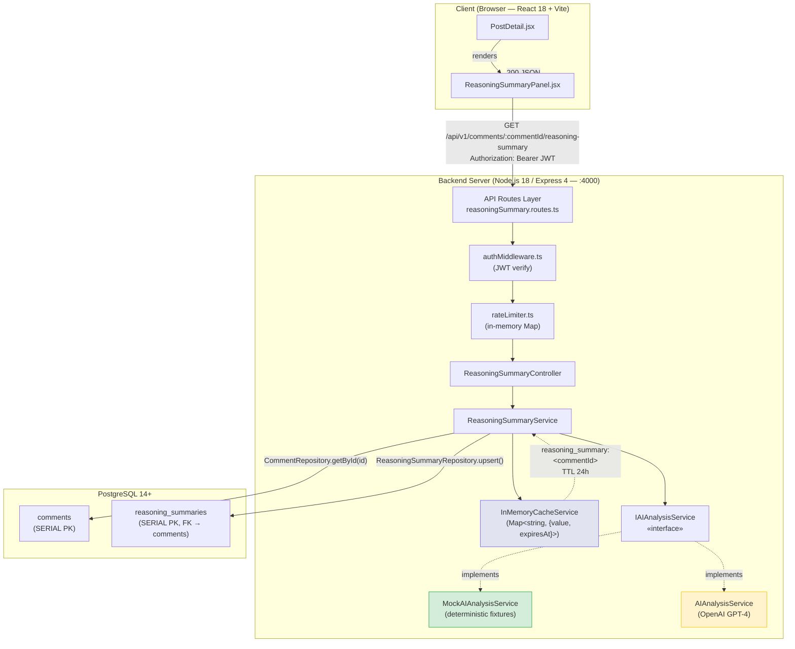

# US1 — Backend Modules Specification: Inline AI Reasoning Summary

---

## 1. Module Features

### What This Module Does

- **Single-comment AI reasoning summary via REST**: Provides an on-demand AI-generated reasoning quality analysis (claims, evidence, coherence score) for any individual comment, triggered by a `GET /api/v1/comments/:commentId/reasoning-summary` request.
- **Lazy-load on user click ("Show AI Summary")**: Summaries are not pre-computed for all comments. They are generated and returned only when the user explicitly requests one by clicking "Show AI Summary" in the UI.
- **In-memory cache (Map-based, P4 constraint)**: Caches generated summaries in a JavaScript `Map` with a 24-hour TTL, avoiding round-trips to PostgreSQL on repeated requests. Replaces Redis under the P4 10-user constraint.
- **Mocked AI service for testing**: All AI/LLM interactions are abstracted behind the `IAIAnalysisService` interface. A `MockAIAnalysisService` returns deterministic fixtures for development and test environments — zero network calls.
- **Numeric `SERIAL` IDs for all tables**: All primary keys use PostgreSQL `SERIAL` (auto-incrementing integers), not UUIDs.

### What This Module Does NOT Do

- **Thread-level debate summary (US2)**: Does not analyze or summarize entire threads/debates.
- **Auto-generating summaries for all comments**: Does not proactively generate summaries; strictly lazy-load on demand.
- **Redis or distributed cache**: Does not use Redis or any external cache system.
- **Production OpenAI prompt tuning**: Does not include optimized production prompts; relies on the mock implementation for dev/test.
- **UUID primary keys**: Does not use UUIDs for any table.

---

## 2. Internal Architecture

### Textual Description of Information Flows

1. User clicks **"Show AI Summary"** on a comment in `ReasoningSummaryPanel.jsx`.
2. Frontend sends `GET /api/v1/comments/:commentId/reasoning-summary` with JWT.
3. `authMiddleware` verifies the token; `rateLimiter` checks the in-memory per-user window.
4. `ReasoningSummaryController` delegates to `ReasoningSummaryService.getSummary(commentId)`.
5. Service checks `InMemoryCacheService` (key: `reasoning_summary:<commentId>`).
6. **Cache hit** → return cached `ReasoningSummary` DTO immediately.
7. **Cache miss** → query `reasoning_summaries` table. If a non-expired row exists, cache it and return.
8. **DB miss** → fetch comment text from `comments` table → call `IAIAnalysisService` methods → build DTO → upsert into `reasoning_summaries` → cache → return.
9. Frontend receives 200 JSON and renders the summary panel with claim, evidence blocks, and coherence score.

### Architecture Diagram



### Architectural Justifications

| Component  | Runtime                            | Notes                                                                           |
| ---------- | ---------------------------------- | ------------------------------------------------------------------------------- |
| Client     | Browser (React 18 + Vite, `:3000`) | Plain JavaScript (JSX), NOT TypeScript                                          |
| API Server | Node.js 18 + Express 4 (`:4000`)   | TypeScript 5.x; single HTTP server shared with Socket.IO (US3)                  |
| Database   | PostgreSQL 14+                     | Single tenant; numeric `SERIAL` PKs                                             |
| Cache      | In-process `Map`                   | **No Redis** — P4 constraint (10 users)                                         |
| AI Service | `IAIAnalysisService` interface     | `MockAIAnalysisService` in dev/test; `AIAnalysisService` (OpenAI) in production |

---

## 3. Data Abstraction (MIT 6.005) — `InMemoryCacheService`

The **primary state-holding class** in the US1 module is `InMemoryCacheService`. It manages an in-process key-value store with time-based expiration, replacing what would otherwise be a Redis instance. Because this class owns mutable state that the rest of the system depends on, we define it as a formal data abstraction following [MIT 6.005 Reading 13](https://web.mit.edu/6.005/www/fa15/classes/13-abstraction-functions-rep-invariants/).

### Overview

`InMemoryCacheService` provides a **mutable** abstract data type that maps string keys to arbitrary JavaScript objects, each with an associated time-to-live (TTL). After the TTL expires, a key becomes invisible to consumers and is eventually reaped by a periodic sweep. The class implements `ICacheService`, the shared cache contract used by both US1 and US3.

### Space of Representation Values (Rep)

```typescript
class InMemoryCacheService implements ICacheService {
  // -- Rep --
  private store: Map<
    string,
    {
      value: object; // the cached datum (deep-cloned on get/set)
      expiresAt: number; // absolute epoch-ms deadline
    }
  >;
  private readonly maxEntries: number; // upper bound on Map size (default 10 000)
  private readonly sweepIntervalMs: number; // how often sweepExpired() runs (default 60 000 ms)
  private sweepIntervalId: NodeJS.Timeout | null; // handle for clearInterval; null when destroyed
}
```

**Rep components:**

| Field                  | Type                      | Domain                                                      |
| ---------------------- | ------------------------- | ----------------------------------------------------------- |
| `store`                | `Map<string, CacheEntry>` | keys ⊂ non-empty strings; size ∈ [0, `maxEntries`]          |
| `CacheEntry.value`     | `object`                  | any non-null JavaScript object                              |
| `CacheEntry.expiresAt` | `number`                  | positive integer (epoch milliseconds), always > 0           |
| `maxEntries`           | `number`                  | positive integer, default 10 000                            |
| `sweepIntervalMs`      | `number`                  | positive integer, default 60 000                            |
| `sweepIntervalId`      | `NodeJS.Timeout \| null`  | non-null while the cache is alive; `null` after `destroy()` |

### Space of Abstract Values

Abstractly, an `InMemoryCacheService` represents:

> A **finite partial function** _f : Key → Value_ from string keys to JavaScript objects, where each mapping has an associated deadline _d_, and only mappings whose deadline is in the future are visible. The function's domain has cardinality ≤ _N_ (the `maxEntries` cap).

In set-builder notation:

$$A = \{ f : \text{String} \rightharpoonup \text{Object} \mid |dom(f)| \leq N \}$$

where each element of the domain carries an implicit deadline:

$$\forall k \in dom(f): deadline(k) > now$$

Keys whose deadlines have passed are **not** in _dom(f)_ — they are invisible to the abstract value even if they still physically exist in `store` awaiting the next sweep.

### Rep Invariant (RI)

```
RI(r) =
    r.maxEntries > 0
  ∧ r.sweepIntervalMs > 0
  ∧ r.store.size ≤ r.maxEntries
  ∧ ∀ (key, entry) ∈ r.store:
        key.length > 0
      ∧ entry.value !== null
      ∧ entry.value !== undefined
      ∧ entry.expiresAt > 0
```

A `checkRep()` method enforces this invariant after every mutator in debug builds:

```typescript
private checkRep(): void {
    assert(this.maxEntries > 0, 'maxEntries must be positive');
    assert(this.sweepIntervalMs > 0, 'sweepIntervalMs must be positive');
    assert(this.store.size <= this.maxEntries,
           `store size ${this.store.size} exceeds cap ${this.maxEntries}`);
    for (const [key, entry] of this.store) {
        assert(key.length > 0, 'cache key must be non-empty');
        assert(entry.value !== null && entry.value !== undefined,
               `null/undefined value for key "${key}"`);
        assert(entry.expiresAt > 0,
               `expiresAt must be positive for key "${key}"`);
    }
}
```

### Abstraction Function (AF)

```
AF(r) = the partial function f where:
    dom(f) = { key | r.store.has(key) ∧ r.store.get(key).expiresAt > Date.now() }
    f(key)  = deep clone of r.store.get(key).value      for each key ∈ dom(f)
```

In words: _the abstract value is the set of non-expired entries in the store, where each key maps to a deep copy of its stored value._ Expired entries exist in `store` only until the next `sweepExpired()` call — they are ghosts in the representation but invisible to the abstraction.

### Safety from Rep Exposure

The class ensures no client can obtain a direct reference to its mutable internal state:

| Technique                       | Where Applied                                                                                                                                                |
| ------------------------------- | ------------------------------------------------------------------------------------------------------------------------------------------------------------ |
| **`private` fields**            | `store`, `maxEntries`, `sweepIntervalMs`, `sweepIntervalId` are all `private`. No public field exposes the Map.                                              |
| **Defensive copying on output** | `get<T>(key)` returns `structuredClone(entry.value)`, never the stored reference itself. If the caller mutates the returned object, the cache is unaffected. |
| **Defensive copying on input**  | `set(key, value, ttl)` stores `structuredClone(value)`, so the caller cannot mutate the cached object after insertion.                                       |
| **Immutable config**            | `maxEntries` and `sweepIntervalMs` are `readonly`; set once in the constructor, never changed.                                                               |
| **No iterator exposure**        | There is no public method that returns the `Map`, its keys, or its entries. The only way to read data is through `get(key)`, which returns a clone.          |
| **Timer encapsulation**         | `sweepIntervalId` is private; only `destroy()` clears it, preventing external interference with the sweep cycle.                                             |

---

## 4. Stable Storage Mechanism

> **Rubric constraint addressed:** _"Determine the stable storage mechanism… you can't just use an in-memory data structure because your app might crash and lose its memory. Customers really hate data loss."_

**PostgreSQL 14+ is the sole, authoritative stable storage mechanism for all US1 customer data.** Every reasoning summary that is generated passes through the following persistence guarantee before a success response is ever returned to the client:

1. `ReasoningSummaryService` calls `ReasoningSummaryRepository.upsert()`, which executes a parameterized `INSERT … ON CONFLICT DO UPDATE … RETURNING *` against the `reasoning_summaries` table.
2. The `pg` driver awaits the PostgreSQL server's acknowledgment (i.e., the row has been committed to WAL and the transaction is durable) **before** the service proceeds to cache the result or return the DTO.
3. Only after the durable write completes does `InMemoryCacheService.set()` populate the in-process `Map`.

### What Happens on a Node.js Process Crash

| Layer                     | Effect of Crash                                                                                                      | Customer Data Loss?                                                                                                                                                                                                                                                                                             |
| ------------------------- | -------------------------------------------------------------------------------------------------------------------- | --------------------------------------------------------------------------------------------------------------------------------------------------------------------------------------------------------------------------------------------------------------------------------------------------------------- |
| **PostgreSQL**            | Unaffected. Committed rows survive process, container, and OS restarts. WAL + `fsync` guarantee ACID durability.     | **None**                                                                                                                                                                                                                                                                                                        |
| **In-memory `Map` cache** | Entire cache is lost (expected).                                                                                     | **None** — the cache is a _derived, ephemeral replica_ of data already committed to Postgres. On the next `GET /reasoning-summary` request, the service simply re-reads the `reasoning_summaries` table (a cache miss → DB hit path already implemented in the state diagram) and repopulates the cache lazily. |
| **In-flight analysis**    | If the crash occurs _during_ an AI analysis (after `extractClaims` but before `upsert`), the partial result is lost. | **None** — no row was committed, so no stale data exists. The next user request triggers a fresh analysis, and the user sees a normal loading state.                                                                                                                                                            |

### Design Invariant

At no point does the system return a `200 OK` to the client unless the summary row has been durably committed to PostgreSQL. The `InMemoryCacheService` is strictly a **read-through performance optimization** — a warm lookup that avoids a round-trip to Postgres on repeated requests. It holds no data that does not already exist in the database. Losing the cache is operationally equivalent to a cold start: the first request for each comment incurs one extra DB read, which at P4 scale (≤ 10 concurrent users) adds negligible latency (< 5 ms per query on indexed `comment_id`).

**Summary:** PostgreSQL is the durable, crash-safe source of truth. The in-memory `Map` is a disposable acceleration layer. Customers experience zero data loss on any process crash.

---

## 5. Data Schemas

> All schemas below use **numeric `SERIAL` primary keys** per the P4 Data Standardization constraint.

### `reasoning_summaries` Table

```sql
CREATE TABLE reasoning_summaries (
    id              SERIAL PRIMARY KEY,
    comment_id      INTEGER       NOT NULL UNIQUE REFERENCES comments(id) ON DELETE CASCADE,
    summary         TEXT          NOT NULL,
    primary_claim   TEXT          NOT NULL,
    evidence_blocks JSONB         NOT NULL,
    coherence_score NUMERIC(3,2)  CHECK (coherence_score >= 0 AND coherence_score <= 1),
    created_at      TIMESTAMP     DEFAULT CURRENT_TIMESTAMP,
    updated_at      TIMESTAMP     DEFAULT CURRENT_TIMESTAMP,
    expires_at      TIMESTAMP     DEFAULT (CURRENT_TIMESTAMP + INTERVAL '24 hours')
);

CREATE INDEX idx_reasoning_comment ON reasoning_summaries(comment_id);
CREATE INDEX idx_reasoning_expires ON reasoning_summaries(expires_at);
```

### Dependent Base Tables (Defined in Blueprint)

```sql
-- comments (Blueprint §2.5)
CREATE TABLE comments (
    id                SERIAL PRIMARY KEY,
    post_id           INTEGER NOT NULL REFERENCES posts(id) ON DELETE CASCADE,
    author_id         INTEGER NOT NULL REFERENCES users(id) ON DELETE CASCADE,
    parent_comment_id INTEGER          REFERENCES comments(id) ON DELETE CASCADE,
    text              TEXT    NOT NULL,
    upvotes           INTEGER DEFAULT 0,
    downvotes         INTEGER DEFAULT 0,
    created_at        TIMESTAMP DEFAULT CURRENT_TIMESTAMP,
    updated_at        TIMESTAMP DEFAULT CURRENT_TIMESTAMP
);

-- users (Blueprint §2.1)
CREATE TABLE users (
    id            SERIAL PRIMARY KEY,
    username      VARCHAR(50)  NOT NULL UNIQUE,
    email         VARCHAR(255) NOT NULL UNIQUE,
    password_hash VARCHAR(255) NOT NULL,
    avatar        VARCHAR(255) DEFAULT '👤',
    karma         INTEGER      DEFAULT 0,
    joined_date   TIMESTAMP    DEFAULT CURRENT_TIMESTAMP,
    created_at    TIMESTAMP    DEFAULT CURRENT_TIMESTAMP,
    updated_at    TIMESTAMP    DEFAULT CURRENT_TIMESTAMP
);
```

---

## 6. API Definitions

### 1. Get Reasoning Summary

```http
GET /api/v1/comments/:commentId/reasoning-summary
Authorization: Bearer {jwt_token}
```

**Path Parameters:**

| Param       | Type      | Constraints                     | Example |
| ----------- | --------- | ------------------------------- | ------- |
| `commentId` | `integer` | Positive, matches `comments.id` | `3`     |

**Response — 200 OK:**

```json
{
  "commentId": 3,
  "summary": "Takes a balanced position, arguing that team familiarity and project consistency matter more than the specific CSS approach chosen.",
  "primaryClaim": "Team familiarity is the key factor in CSS methodology effectiveness, not the tool itself",
  "evidenceBlocks": [
    {
      "type": "anecdote",
      "content": "Personal experience shipping production apps with both approaches",
      "strength": "medium"
    }
  ],
  "coherenceScore": 0.91,
  "generatedAt": "2026-03-10T14:30:00.000Z"
}
```

**Response — 400 Bad Request:**

```json
{
  "error": "INVALID_COMMENT_ID",
  "message": "commentId must be a positive integer"
}
```

**Response — 401 Unauthorized:**

```json
{
  "error": "UNAUTHORIZED",
  "message": "Missing or invalid JWT token"
}
```

**Response — 404 Not Found:**

```json
{
  "error": "COMMENT_NOT_FOUND",
  "message": "No comment found with id 9999"
}
```

**Response — 429 Too Many Requests:**

```json
{
  "error": "RATE_LIMIT_EXCEEDED",
  "message": "Rate limit of 100 requests per minute exceeded",
  "retryAfterMs": 12400
}
```

**Response — 500 Internal Server Error:**

```json
{
  "error": "ANALYSIS_FAILED",
  "message": "Failed to generate reasoning summary. Please try again."
}
```

### Response DTO Contract

The response body **must** match the shape consumed by the frontend's `ReasoningSummaryPanel.jsx` (via the `comment.aiSummary` field):

```typescript
interface ReasoningSummaryResponse {
  commentId: number;
  summary: string;
  primaryClaim: string;
  evidenceBlocks: {
    type: "study" | "data" | "anecdote" | "authority" | "other";
    content: string;
    strength: "high" | "medium" | "low";
  }[];
  coherenceScore: number; // 0.00–1.00
  generatedAt: string; // ISO 8601
}
```

### Zod Validation Schema

```typescript
import { z } from "zod";

export const getReasoningSummaryParams = z.object({
  commentId: z.coerce.number().int().positive(),
});
```

### Related CRUD Endpoints (Defined in Blueprint)

These core endpoints are **not** US1-specific but are required for the summary to function:

| #   | Method | Endpoint                     | Purpose                                                               |
| --- | ------ | ---------------------------- | --------------------------------------------------------------------- |
| 1   | `GET`  | `/api/v1/posts/:id/comments` | List comments (returns `aiSummary: null`; lazy-load via US1 endpoint) |
| 2   | `POST` | `/api/v1/posts/:id/comments` | Create comment (new comments have no summary)                         |
| 3   | `POST` | `/api/v1/auth/login`         | Obtain JWT for authenticated requests                                 |
| 4   | `POST` | `/api/v1/auth/register`      | Register user                                                         |

---

## 7. Class Declarations

### List of Classes

| Class Name                   | Package                | Responsibility                                                                                                           |
| ---------------------------- | ---------------------- | ------------------------------------------------------------------------------------------------------------------------ |
| `ReasoningSummaryController` | `controllers/`         | Thin HTTP handler; validates params via `CommentValidator`, delegates to `IReasoningSummaryService`, serializes response |
| `ReasoningSummaryService`    | `services/`            | Orchestrates cache → DB → AI generation pipeline; implements `IReasoningSummaryService`                                  |
| `IAIAnalysisService`         | `services/interfaces/` | Interface — single contract for all LLM interaction (shared with US3)                                                    |
| `AIAnalysisService`          | `services/`            | Production implementation; wraps `openai` npm client; sends structured prompts to GPT-4                                  |
| `MockAIAnalysisService`      | `services/`            | Test implementation; returns deterministic fixtures; zero network calls                                                  |
| `ICacheService`              | `services/interfaces/` | Interface for key-value cache with TTL                                                                                   |
| `InMemoryCacheService`       | `services/`            | `Map`-based implementation; 60 s sweep interval; replaces Redis (P4)                                                     |
| `CommentRepository`          | `repositories/`        | Parameterized SQL queries against `comments` table via `pg` Pool                                                         |
| `ReasoningSummaryRepository` | `repositories/`        | CRUD on `reasoning_summaries` table; `upsert` uses `ON CONFLICT (comment_id) DO UPDATE`                                  |
| `CommentValidator`           | `utils/`               | Validates and sanitizes `commentId` param (must be positive integer)                                                     |
| `NLPProcessor`               | `utils/`               | Sentence splitting and tokenization (used as fallback when AI service calls fail)                                        |
| `ReasoningSummaryDTO`        | `models/`              | Immutable DTO matching the frontend `aiSummary` shape                                                                    |
| `EvidenceBlock`              | `models/`              | Value object: `{ type, content, strength }`                                                                              |
| `Claim`                      | `models/`              | Value object: `{ id, text, supportingEvidence }`                                                                         |

### Public Interfaces

#### Backend Service Interfaces

```typescript
// ─── services/interfaces/IReasoningSummaryService.ts ───
import { ReasoningSummaryDTO } from "../../models/ReasoningSummary";
import { Comment } from "../../models/Comment";

export interface IReasoningSummaryService {
  /** public: Retrieve summary (cache → DB → generate). */
  getSummary(commentId: number): Promise<ReasoningSummaryDTO>;

  /** public: Force-generate summary, persist, and cache. */
  generateAndCacheSummary(comment: Comment): Promise<ReasoningSummaryDTO>;

  /** public: Remove from both cache and DB. */
  invalidateCache(commentId: number): Promise<void>;
}
```

```typescript
// ─── services/interfaces/IAIAnalysisService.ts ───  (shared with US3)
import { Claim } from "../../models/Claim";
import { EvidenceBlock } from "../../models/EvidenceBlock";
import { AnalysisResult } from "../../models/AnalysisResult";

export interface IAIAnalysisService {
  /** public */ extractClaims(text: string): Promise<Claim[]>;
  /** public */ extractEvidence(text: string): Promise<EvidenceBlock[]>;
  /** public */ evaluateCoherence(
    claims: Claim[],
    evidence: EvidenceBlock[],
  ): Promise<number>;
  /** public */ generateSummary(analysis: AnalysisResult): Promise<string>;
}
```

```typescript
// ─── services/interfaces/ICacheService.ts ───  (shared with US3)
export interface ICacheService {
  /** public */ get<T = object>(key: string): Promise<T | null>;
  /** public */ set(
    key: string,
    value: object,
    ttlSeconds?: number,
  ): Promise<void>;
  /** public */ delete(key: string): Promise<void>;
  /** public */ exists(key: string): Promise<boolean>;
}
```

#### Model Interfaces (DTOs)

```typescript
// ─── models/ReasoningSummary.ts ───
import { EvidenceBlock } from "./EvidenceBlock";

/** public: Immutable DTO returned to the frontend. */
export interface ReasoningSummaryDTO {
  commentId: number;
  summary: string;
  primaryClaim: string;
  evidenceBlocks: EvidenceBlock[];
  coherenceScore: number; // 0–1
  generatedAt: Date;
}

/** public: Shape for inserting/upserting into the DB. */
export interface ReasoningSummaryInsert {
  commentId: number;
  summary: string;
  primaryClaim: string;
  evidenceBlocks: EvidenceBlock[]; // stored as JSONB
  coherenceScore: number;
}

/** public: Raw row shape from PostgreSQL. */
export interface ReasoningSummaryRow {
  id: number;
  comment_id: number;
  summary: string;
  primary_claim: string;
  evidence_blocks: EvidenceBlock[]; // JSONB auto-parsed by pg
  coherence_score: string; // NUMERIC comes as string from pg
  created_at: Date;
  updated_at: Date;
  expires_at: Date;
}
```

```typescript
// ─── models/EvidenceBlock.ts ───
/** public */
export interface EvidenceBlock {
  type: "study" | "data" | "anecdote" | "authority" | "other";
  content: string;
  strength: "high" | "medium" | "low";
}
```

```typescript
// ─── models/Claim.ts ───
/** public */
export interface Claim {
  id: number;
  text: string;
  supportingEvidence: string[];
}
```

```typescript
// ─── models/Comment.ts ───
/** public */
export interface Comment {
  id: number;
  postId: number;
  authorId: number;
  parentCommentId: number | null;
  text: string;
  upvotes: number;
  downvotes: number;
  createdAt: Date;
  updatedAt: Date;
}
```

```typescript
// ─── models/AnalysisResult.ts ───
import { Claim } from "./Claim";
import { EvidenceBlock } from "./EvidenceBlock";

/** public */
export interface AnalysisResult {
  claims: Claim[];
  evidence: EvidenceBlock[];
  coherenceScore: number;
}
```

#### Repository Classes

```typescript
// ─── repositories/CommentRepository.ts ───
import { Comment } from "../models/Comment";
import { Pool } from "pg";

export class CommentRepository {
  /** private */ private pool: Pool;

  constructor(pool: Pool) {
    this.pool = pool;
  }

  /** public */ async getById(id: number): Promise<Comment | null>;
  /** public */ async getByPostId(postId: number): Promise<Comment[]>;
  /** private */ private mapRow(row: any): Comment;
}
```

```typescript
// ─── repositories/ReasoningSummaryRepository.ts ───
import {
  ReasoningSummaryInsert,
  ReasoningSummaryRow,
} from "../models/ReasoningSummary";
import { Pool } from "pg";

export class ReasoningSummaryRepository {
  /** private */ private pool: Pool;

  constructor(pool: Pool) {
    this.pool = pool;
  }

  /** public */ async findByCommentId(
    commentId: number,
  ): Promise<ReasoningSummaryRow | null>;
  /** public */ async upsert(
    data: ReasoningSummaryInsert,
  ): Promise<ReasoningSummaryRow>;
  /** public */ async deleteByCommentId(commentId: number): Promise<void>;
}
```

#### Controller Class

```typescript
// ─── controllers/ReasoningSummaryController.ts ───
export class ReasoningSummaryController {
  /** private */ private reasoningSummaryService: IReasoningSummaryService;

  /** public */ async getSummary(req, res): Promise<void>;
}
```

#### Shared Utility Classes

```typescript
// ─── utils/CommentValidator.ts ───
export class CommentValidator {
  /** public */ static validateCommentId(id: any): number;
  /** public */ static sanitizeText(text: string): string;
}
```

```typescript
// ─── utils/NLPProcessor.ts ───
export class NLPProcessor {
  /** public */ tokenize(text: string): string[];
  /** public */ parseSentences(text: string): string[];
}
```

---

## 8. Class Hierarchy Diagram

```mermaid
classDiagram
    class ReasoningSummaryController {
        -reasoningSummaryService: IReasoningSummaryService
        +getSummary(req, res): Promise~void~
    }

    class IReasoningSummaryService {
        <<interface>>
        +getSummary(commentId: number): Promise~ReasoningSummaryDTO~
        +generateAndCacheSummary(comment: Comment): Promise~ReasoningSummaryDTO~
        +invalidateCache(commentId: number): Promise~void~
    }

    class ReasoningSummaryService {
        -aiService: IAIAnalysisService
        -cache: ICacheService
        -commentRepo: CommentRepository
        -summaryRepo: ReasoningSummaryRepository
        +getSummary(commentId: number): Promise~ReasoningSummaryDTO~
        +generateAndCacheSummary(comment: Comment): Promise~ReasoningSummaryDTO~
        +invalidateCache(commentId: number): Promise~void~
        -buildDTO(row: DBRow): ReasoningSummaryDTO
    }

    class IAIAnalysisService {
        <<interface>>
        +extractClaims(text: string): Promise~Claim[]~
        +extractEvidence(text: string): Promise~EvidenceBlock[]~
        +evaluateCoherence(claims: Claim[], evidence: EvidenceBlock[]): Promise~number~
        +generateSummary(analysis: AnalysisResult): Promise~string~
    }

    class AIAnalysisService {
        -openaiClient: OpenAI
        -model: string
        +extractClaims(text: string): Promise~Claim[]~
        +extractEvidence(text: string): Promise~EvidenceBlock[]~
        +evaluateCoherence(claims: Claim[], evidence: EvidenceBlock[]): Promise~number~
        +generateSummary(analysis: AnalysisResult): Promise~string~
    }

    class MockAIAnalysisService {
        -fixtures: Map~string_AnalysisResult~
        +extractClaims(text: string): Promise~Claim[]~
        +extractEvidence(text: string): Promise~EvidenceBlock[]~
        +evaluateCoherence(claims: Claim[], evidence: EvidenceBlock[]): Promise~number~
        +generateSummary(analysis: AnalysisResult): Promise~string~
    }

    class ICacheService {
        <<interface>>
        +get(key: string): Promise~object_or_null~
        +set(key: string, value: object, ttl: number): Promise~void~
        +delete(key: string): Promise~void~
        +exists(key: string): Promise~boolean~
    }

    class InMemoryCacheService {
        -store: Map~string_CacheEntry~
        -sweepIntervalId: NodeJS.Timeout
        +get(key: string): Promise~object_or_null~
        +set(key: string, value: object, ttl: number): Promise~void~
        +delete(key: string): Promise~void~
        +exists(key: string): Promise~boolean~
        +sweepExpired(): void
        +destroy(): void
    }

    class CommentRepository {
        -pool: Pool
        +getById(id: number): Promise~Comment_or_null~
        +getByPostId(postId: number): Promise~Comment[]~
    }

    class ReasoningSummaryRepository {
        -pool: Pool
        +findByCommentId(commentId: number): Promise~DBRow_or_null~
        +upsert(summary: ReasoningSummaryInsert): Promise~DBRow~
        +deleteByCommentId(commentId: number): Promise~void~
    }

    class CommentValidator {
        +validateCommentId(id: any): number
        +sanitizeText(text: string): string
    }

    class NLPProcessor {
        +tokenize(text: string): string[]
        +parseSentences(text: string): string[]
    }

    class ReasoningSummaryDTO {
        +commentId: number
        +summary: string
        +primaryClaim: string
        +evidenceBlocks: EvidenceBlock[]
        +coherenceScore: number
        +generatedAt: Date
    }

    class EvidenceBlock {
        +type: string
        +content: string
        +strength: string
    }

    class Claim {
        +id: number
        +text: string
        +supportingEvidence: string[]
    }

    ReasoningSummaryController --> IReasoningSummaryService
    IReasoningSummaryService <|.. ReasoningSummaryService
    ReasoningSummaryService --> IAIAnalysisService
    ReasoningSummaryService --> ICacheService
    ReasoningSummaryService --> CommentRepository
    ReasoningSummaryService --> ReasoningSummaryRepository
    IAIAnalysisService <|.. AIAnalysisService
    IAIAnalysisService <|.. MockAIAnalysisService
    ICacheService <|.. InMemoryCacheService
    ReasoningSummaryService --> CommentValidator
    ReasoningSummaryService --> NLPProcessor
    ReasoningSummaryService ..> ReasoningSummaryDTO : creates
    ReasoningSummaryDTO --> EvidenceBlock
    ReasoningSummaryDTO --> Claim
```



---

## 9. Generated Code

### `InMemoryCacheService.ts`

```typescript
// ─── services/InMemoryCacheService.ts ───
import { ICacheService } from "./interfaces/ICacheService";

/**
 * InMemoryCacheService — Map-based in-process cache with TTL.
 *
 * Replaces Redis under P4 constraints (10 concurrent users).
 * Implements ICacheService (shared contract for US1 and US3).
 *
 * === MIT 6.005 Data Abstraction ===
 *
 * Rep:
 *   store          : Map<string, { value: object; expiresAt: number }>
 *   maxEntries     : number   (positive integer, default 10_000)
 *   sweepIntervalMs: number   (positive integer, default 60_000)
 *   sweepIntervalId: NodeJS.Timeout | null
 *
 * Abstraction Function:
 *   AF(r) = the partial function f where
 *     dom(f) = { key | r.store.has(key) ∧ r.store.get(key).expiresAt > Date.now() }
 *     f(key) = deep clone of r.store.get(key).value   for each key ∈ dom(f)
 *
 * Rep Invariant:
 *   r.maxEntries > 0
 *   ∧ r.sweepIntervalMs > 0
 *   ∧ r.store.size ≤ r.maxEntries
 *   ∧ ∀ (key, entry) ∈ r.store:
 *       key.length > 0
 *     ∧ entry.value !== null ∧ entry.value !== undefined
 *     ∧ entry.expiresAt > 0
 *
 * Safety from Rep Exposure:
 *   - All fields are private.
 *   - get() returns structuredClone(entry.value), not the stored reference.
 *   - set() stores structuredClone(value), not the caller's reference.
 *   - No public method exposes the Map, its keys, or its entries.
 *   - maxEntries and sweepIntervalMs are readonly.
 */

interface CacheEntry {
  value: object;
  expiresAt: number;
}

export class InMemoryCacheService implements ICacheService {
  // -- Rep --
  private readonly store: Map<string, CacheEntry>;
  private readonly maxEntries: number;
  private readonly sweepIntervalMs: number;
  private sweepIntervalId: NodeJS.Timeout | null;

  constructor(maxEntries: number = 10_000, sweepIntervalMs: number = 60_000) {
    if (maxEntries <= 0) throw new Error("maxEntries must be positive");
    if (sweepIntervalMs <= 0)
      throw new Error("sweepIntervalMs must be positive");

    this.store = new Map();
    this.maxEntries = maxEntries;
    this.sweepIntervalMs = sweepIntervalMs;
    this.sweepIntervalId = setInterval(
      () => this.sweepExpired(),
      this.sweepIntervalMs,
    );

    // Prevent the timer from keeping the Node.js process alive
    if (this.sweepIntervalId.unref) {
      this.sweepIntervalId.unref();
    }

    this.checkRep();
  }

  // ──────── Public API (ICacheService) ────────

  async get<T = object>(key: string): Promise<T | null> {
    const entry = this.store.get(key);
    if (!entry) return null;

    // Expired entries are invisible to the abstract value
    if (Date.now() > entry.expiresAt) {
      this.store.delete(key);
      this.checkRep();
      return null;
    }

    // Defensive copy on output — caller cannot mutate cached data
    return structuredClone(entry.value) as T;
  }

  async set(
    key: string,
    value: object,
    ttlSeconds: number = 3600,
  ): Promise<void> {
    if (!key || key.length === 0) {
      throw new Error("Cache key must be non-empty");
    }
    if (value === null || value === undefined) {
      throw new Error("Cache value must not be null/undefined");
    }
    if (ttlSeconds <= 0) {
      throw new Error("TTL must be positive");
    }

    // Evict oldest entry if at capacity and this is a new key
    if (!this.store.has(key) && this.store.size >= this.maxEntries) {
      const oldestKey = this.store.keys().next().value;
      if (oldestKey !== undefined) {
        this.store.delete(oldestKey);
      }
    }

    // Defensive copy on input — caller cannot mutate stored data after set()
    this.store.set(key, {
      value: structuredClone(value),
      expiresAt: Date.now() + ttlSeconds * 1000,
    });

    this.checkRep();
  }

  async delete(key: string): Promise<void> {
    this.store.delete(key);
    this.checkRep();
  }

  async exists(key: string): Promise<boolean> {
    const entry = this.store.get(key);
    if (!entry) return false;

    if (Date.now() > entry.expiresAt) {
      this.store.delete(key);
      this.checkRep();
      return false;
    }

    return true;
  }

  // ──────── Sweep & Lifecycle ────────

  /**
   * Remove all entries whose expiresAt deadline has passed.
   * Called automatically every sweepIntervalMs by the internal timer.
   */
  sweepExpired(): void {
    const now = Date.now();
    for (const [key, entry] of this.store) {
      if (now > entry.expiresAt) {
        this.store.delete(key);
      }
    }
    this.checkRep();
  }

  /**
   * Stop the sweep timer and clear the store.
   * Must be called in test teardown (afterEach) to prevent open handles.
   */
  destroy(): void {
    if (this.sweepIntervalId !== null) {
      clearInterval(this.sweepIntervalId);
      this.sweepIntervalId = null;
    }
    this.store.clear();
  }

  // ──────── Rep Invariant Check ────────

  /**
   * Asserts the rep invariant holds.
   * Called after every mutator in debug/test builds.
   * In production, the check is skipped for performance.
   */
  private checkRep(): void {
    if (process.env.NODE_ENV === "production") return;

    console.assert(
      this.maxEntries > 0,
      "RI violation: maxEntries must be positive",
    );
    console.assert(
      this.sweepIntervalMs > 0,
      "RI violation: sweepIntervalMs must be positive",
    );
    console.assert(
      this.store.size <= this.maxEntries,
      `RI violation: store size ${this.store.size} exceeds cap ${this.maxEntries}`,
    );

    for (const [key, entry] of this.store) {
      console.assert(
        key.length > 0,
        "RI violation: cache key must be non-empty",
      );
      console.assert(
        entry.value !== null && entry.value !== undefined,
        `RI violation: null/undefined value for key "${key}"`,
      );
      console.assert(
        entry.expiresAt > 0,
        `RI violation: expiresAt must be positive for key "${key}"`,
      );
    }
  }
}
```

### `MockAIAnalysisService.ts`

```typescript
// ─── services/MockAIAnalysisService.ts ───
import { IAIAnalysisService } from "./interfaces/IAIAnalysisService";
import { Claim } from "../models/Claim";
import { EvidenceBlock } from "../models/EvidenceBlock";
import { AnalysisResult } from "../models/AnalysisResult";

/**
 * MockAIAnalysisService — Deterministic test double for IAIAnalysisService.
 *
 * Shared between US1 and US3. Returns fixture data based on input text length.
 * Zero network calls. Used in all Jest test suites.
 *
 * === MIT 6.005 Data Abstraction ===
 *
 * Rep:
 *   fixtures: ReadonlyMap<string, AnalysisResult>   (immutable lookup table)
 *
 * Abstraction Function:
 *   AF(r) = an IAIAnalysisService that, for any input text t:
 *     - If r.fixtures.has(t), returns the pre-configured AnalysisResult for t.
 *     - Otherwise, returns a deterministic default result derived from len(t).
 *
 * Rep Invariant:
 *   ∀ (key, result) ∈ r.fixtures:
 *       key.length > 0
 *     ∧ result.claims.length ≥ 0
 *     ∧ result.evidence.length ≥ 0
 *     ∧ result.coherenceScore ≥ 0 ∧ result.coherenceScore ≤ 1
 *
 * Safety from Rep Exposure:
 *   - fixtures is private and readonly; its type is ReadonlyMap.
 *   - All returned arrays and objects are freshly constructed (not refs into fixtures).
 *   - The class has no setters or mutators.
 */
export class MockAIAnalysisService implements IAIAnalysisService {
  // -- Rep --
  private readonly fixtures: ReadonlyMap<string, AnalysisResult>;

  constructor(fixtures?: Map<string, AnalysisResult>) {
    this.fixtures = fixtures ? new Map(fixtures) : new Map();
    this.checkRep();
  }

  // ──────── Public API (IAIAnalysisService) ────────

  async extractClaims(text: string): Promise<Claim[]> {
    const fixtureResult = this.fixtures.get(text);
    if (fixtureResult) {
      // Return a defensive copy of fixture claims
      return fixtureResult.claims.map((c) => ({
        ...c,
        supportingEvidence: [...c.supportingEvidence],
      }));
    }

    // Default deterministic behavior: one claim derived from input
    return [
      {
        id: 1,
        text: text.substring(0, 60),
        supportingEvidence: ["mock-evidence-1"],
      },
    ];
  }

  async extractEvidence(text: string): Promise<EvidenceBlock[]> {
    const fixtureResult = this.fixtures.get(text);
    if (fixtureResult) {
      return fixtureResult.evidence.map((e) => ({ ...e }));
    }

    // Deterministic strength based on text length
    const strength: EvidenceBlock["strength"] =
      text.length > 200 ? "high" : text.length > 100 ? "medium" : "low";

    return [
      {
        type: "anecdote",
        content: "Mock evidence from text analysis",
        strength,
      },
    ];
  }

  async evaluateCoherence(
    _claims: Claim[],
    _evidence: EvidenceBlock[],
  ): Promise<number> {
    // Deterministic: always returns 0.75
    return 0.75;
  }

  async generateSummary(analysis: AnalysisResult): Promise<string> {
    const claimText = analysis.claims[0]?.text ?? "No claims found";
    return `Mock summary: Argues "${claimText}" with ${analysis.evidence.length} piece(s) of evidence.`;
  }

  // ──────── Rep Invariant Check ────────

  /**
   * Asserts the rep invariant holds.
   * Called once in the constructor (fixtures are immutable after construction).
   */
  private checkRep(): void {
    for (const [key, result] of this.fixtures) {
      console.assert(
        key.length > 0,
        "RI violation: fixture key must be non-empty",
      );
      console.assert(
        Array.isArray(result.claims) && result.claims.length >= 0,
        `RI violation: claims must be an array for fixture "${key}"`,
      );
      console.assert(
        Array.isArray(result.evidence) && result.evidence.length >= 0,
        `RI violation: evidence must be an array for fixture "${key}"`,
      );
      console.assert(
        result.coherenceScore >= 0 && result.coherenceScore <= 1,
        `RI violation: coherenceScore must be in [0,1] for fixture "${key}", got ${result.coherenceScore}`,
      );
    }
  }
}
```
