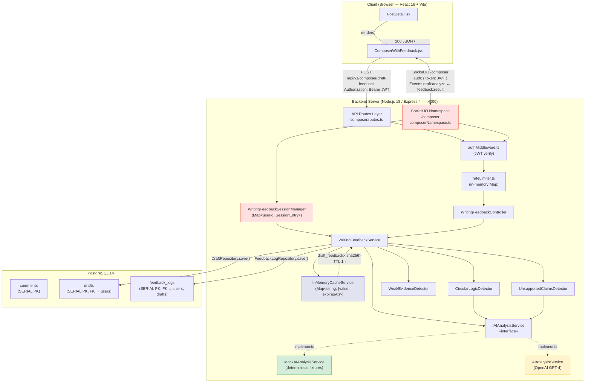

# US3 — Backend Modules Specification: Real-Time Writing Feedback

---

## 1. Module Features

### What This Module Does

- **Real-time draft analysis via WebSocket (Socket.IO `/composer` namespace)**: Provides AI-generated writing feedback as the user composes a reply, delivered through a persistent WebSocket connection using Socket.IO's `/composer` namespace with a 500 ms client-side debounce.
- **One-shot draft analysis via REST (`POST /composer/draft-feedback`)**: Offers a stateless HTTP fallback for obtaining the same feedback when WebSocket is unavailable.
- **Circular logic, weak evidence, and unsupported claim detection**: Three specialized detectors (`CircularLogicDetector`, `WeakEvidenceDetector`, `UnsupportedClaimsDetector`) run in parallel via `Promise.all` to identify argumentative flaws.
- **Draft save/restore via REST (`POST /composer/drafts`)**: Users can explicitly persist their in-progress draft to PostgreSQL with a 30-day expiry.
- **In-memory cache (`Map`-based, P4 constraint)**: Caches `FeedbackResult` by SHA-256 hash of draft text with a 1-hour TTL, avoiding redundant AI analysis on identical text. Replaces Redis under the P4 10-user constraint.
- **Mocked AI service for testing**: All AI/LLM interactions are abstracted behind the `IAIAnalysisService` interface. A `MockAIAnalysisService` returns deterministic fixtures for development and test environments — zero network calls.
- **Numeric `SERIAL` IDs for all tables**: All primary keys use PostgreSQL `SERIAL` (auto-incrementing integers), not UUIDs.
- **Composer session manager for ≤10 concurrent users**: `WritingFeedbackSessionManager` tracks active WebSocket sessions, enforces the P4 concurrency cap, and prevents duplicate concurrent analyses via an `analysisInFlight` flag.

### What This Module Does NOT Do

- **Thread-level debate summary (US2)**: Does not analyze or summarize entire threads/debates.
- **Inline AI reasoning summary on existing comments (US1)**: Does not generate summaries for posted comments; that is the US1 module's responsibility.
- **Grammar/spelling checking**: Does not perform grammar or spelling analysis.
- **Full text-editor (rich text, markdown preview)**: Does not provide rich text editing or markdown previewing capabilities.
- **Redis or distributed cache**: Does not use Redis or any external cache system.
- **Production OpenAI prompt tuning**: Does not include optimized production prompts; relies on the mock implementation for dev/test.
- **UUID primary keys**: Does not use UUIDs for any table.
- **Horizontal scaling / multi-instance session state**: Does not support distributed session state across multiple server instances.

---

## 2. Internal Architecture

### Textual Description of Information Flows

1. User types in the `ComposerWithFeedback` component (text input event).
2. Client-side debounce timer waits 500 ms after last keystroke.
3. On debounce expiry, client emits `draft:analyze` via Socket.IO (or falls back to `POST /api/v1/composer/draft-feedback`).
4. `authMiddleware` verifies JWT on WebSocket handshake (or on HTTP header).
5. `WritingFeedbackSessionManager` tracks the active session; prevents duplicate concurrent analyses for the same user (`analysisInFlight` flag).
6. `WritingFeedbackService.analyzeDraft(text)` checks `InMemoryCacheService` (key: `draft_feedback:<sha256>`).
7. **Cache hit** → return cached `FeedbackResult` immediately.
8. **Cache miss** → run three detectors in parallel (`Promise.all`): `CircularLogicDetector`, `WeakEvidenceDetector`, `UnsupportedClaimsDetector`.
9. Detectors use `IAIAnalysisService.extractClaims()` and `IAIAnalysisService.extractEvidence()` to identify claims and evidence.
10. Issues are aggregated, scored, and placed into a `FeedbackResult` DTO.
11. Result is cached in `InMemoryCacheService` (TTL 1 h) and logged in `feedback_logs` table.
12. Server emits `feedback:result` event (or returns HTTP 200 JSON).
13. Frontend highlights issues inline with explanations, suggestions, and good points.
14. User optionally saves draft (`draft:save` / `POST /composer/drafts`); draft persisted in `drafts` table with 30-day expiry.

### Architecture Diagram



### Architectural Justifications

| Component        | Runtime                            | Notes                                                                           |
| ---------------- | ---------------------------------- | ------------------------------------------------------------------------------- |
| Client           | Browser (React 18 + Vite, `:3000`) | Plain JavaScript (JSX), NOT TypeScript                                          |
| API Server       | Node.js 18 + Express 4 (`:4000`)   | TypeScript 5.x; single HTTP server shared with Socket.IO                        |
| WebSocket Server | Socket.IO 4.x (`:4000`)            | Namespace `/composer`; upgrades on the same HTTP server                         |
| Database         | PostgreSQL 14+                     | Single tenant; numeric `SERIAL` PKs                                             |
| Cache            | In-process `Map`                   | **No Redis** — P4 constraint (10 users)                                         |
| AI Service       | `IAIAnalysisService` interface     | `MockAIAnalysisService` in dev/test; `AIAnalysisService` (OpenAI) in production |

---

## 3. Data Abstraction (MIT 6.005) — `WritingFeedbackSessionManager`

The **primary state-holding class** in the Writing Feedback module is `WritingFeedbackSessionManager`. It tracks active composer sessions (one per user) and their latest analysis state, replacing what would otherwise be a Redis pub/sub + Bull queue setup.

### Overview

`WritingFeedbackSessionManager` provides a **mutable** abstract data type that maps each connected user to their current drafting session, including their latest draft text, the last feedback result, and a pending-analysis flag that prevents duplicate concurrent analyses for the same user.

### Space of Representation Values (Rep)

```typescript
class WritingFeedbackSessionManager {
  // -- Rep --
  private sessions: Map<
    number,
    {
      socketId: string; // Socket.IO socket id
      currentDraft: string; // latest draft text received
      lastFeedback: FeedbackResult | null; // most recent analysis result
      analysisInFlight: boolean; // true while an analysis Promise is pending
      lastActivityAt: number; // Date.now() of last event
    }
  >;
  private readonly maxSessions: number; // upper bound, default 10
  private readonly sessionTimeoutMs: number; // inactivity timeout, default 30 min
}
```

**Rep components:**

| Field                           | Type                        | Domain                                                               |
| ------------------------------- | --------------------------- | -------------------------------------------------------------------- |
| `sessions`                      | `Map<number, SessionEntry>` | keys ⊂ ℤ⁺ (valid user IDs); size ∈ [0, `maxSessions`]                |
| `SessionEntry.socketId`         | `string`                    | non-empty string matching Socket.IO format                           |
| `SessionEntry.currentDraft`     | `string`                    | any string (may be empty)                                            |
| `SessionEntry.lastFeedback`     | `FeedbackResult \| null`    | either `null` or a well-formed `FeedbackResult` with `score ∈ [0,1]` |
| `SessionEntry.analysisInFlight` | `boolean`                   | exactly `true` or `false`                                            |
| `SessionEntry.lastActivityAt`   | `number`                    | positive integer (epoch milliseconds)                                |
| `maxSessions`                   | `number`                    | positive integer, default 10                                         |
| `sessionTimeoutMs`              | `number`                    | positive integer, default 1 800 000 (30 min)                         |

### Space of Abstract Values

Abstractly, a `WritingFeedbackSessionManager` represents:

> A **finite partial function** _f : UserId → ComposerSession_ from user IDs to composer sessions, where each session captures the user's current draft, its latest AI feedback (if any), and whether an analysis is currently running. The function's domain has cardinality ≤ _N_ (the max concurrency), and each session that has been inactive longer than _T_ milliseconds is considered expired.

In set-builder notation:

$$A = \{ f : \mathbb{Z}^+ \rightharpoonup \text{ComposerSession} \mid |dom(f)| \leq N \}$$

where:

$$\text{ComposerSession} = \text{String} \times (\text{FeedbackResult} \cup \{\bot\}) \times \text{Bool} \times \mathbb{Z}^+$$

### Rep Invariant (RI)

```
RI(r) =
    r.sessions.size ≤ r.maxSessions
  ∧ r.maxSessions > 0
  ∧ r.sessionTimeoutMs > 0
  ∧ ∀ (userId, entry) ∈ r.sessions:
        userId > 0
      ∧ entry.socketId.length > 0
      ∧ entry.lastActivityAt > 0
      ∧ (entry.lastFeedback === null
          ∨ (entry.lastFeedback.score ≥ 0 ∧ entry.lastFeedback.score ≤ 1
             ∧ entry.lastFeedback.confidence ≥ 0 ∧ entry.lastFeedback.confidence ≤ 1
             ∧ Array.isArray(entry.lastFeedback.issues)))
```

A `checkRep()` method enforces this invariant after every mutator in debug builds:

```typescript
private checkRep(): void {
    assert(this.sessions.size <= this.maxSessions);
    assert(this.maxSessions > 0);
    assert(this.sessionTimeoutMs > 0);
    for (const [userId, entry] of this.sessions) {
        assert(userId > 0);
        assert(entry.socketId.length > 0);
        assert(entry.lastActivityAt > 0);
        if (entry.lastFeedback !== null) {
            assert(entry.lastFeedback.score >= 0 && entry.lastFeedback.score <= 1);
            assert(entry.lastFeedback.confidence >= 0 && entry.lastFeedback.confidence <= 1);
            assert(Array.isArray(entry.lastFeedback.issues));
        }
    }
}
```

### Abstraction Function (AF)

```
AF(r) = the partial function f where:
    dom(f) = { userId | sessions.has(userId) ∧ (now - entry.lastActivityAt) < sessionTimeoutMs }
    f(userId) = ComposerSession(
                    draft       = entry.currentDraft,
                    feedback    = entry.lastFeedback,
                    isAnalyzing = entry.analysisInFlight,
                    lastActive  = entry.lastActivityAt
                )
```

In words: _the abstract value is the set of non-expired sessions, where each maps a user ID to their current drafting state._ Expired sessions are invisible to the abstract value — they exist in `r.sessions` only until the next sweep.

### Safety from Rep Exposure

The class ensures no client can obtain a direct reference to its mutable internal state:

| Technique                       | Where Applied                                                                                                                                     |
| ------------------------------- | ------------------------------------------------------------------------------------------------------------------------------------------------- |
| **`private` fields**            | `sessions`, `maxSessions`, `sessionTimeoutMs` are all `private readonly` (except `sessions` which is `private`). No public field exposes the Map. |
| **Defensive copying on output** | `getSession(userId)` returns a deep clone (via `structuredClone`) of the `SessionEntry`, never the Map entry itself.                              |
| **Defensive copying on input**  | `updateFeedback(userId, result)` clones the incoming `FeedbackResult` before storing, so the caller cannot mutate it after the fact.              |
| **Immutable config**            | `maxSessions` and `sessionTimeoutMs` are `readonly`; set once in the constructor, never changed.                                                  |
| **No iterator exposure**        | There is no `getAll()` that returns the Map. `getActiveUserIds()` returns a `number[]` snapshot, not a live reference.                            |

---

## 4. Stable Storage Mechanism

> **Rubric constraint addressed:** _"Determine the stable storage mechanism… you can't just use an in-memory data structure because your app might crash and lose its memory. Customers really hate data loss."_

**PostgreSQL 14+ is the sole, authoritative stable storage mechanism for all US3 customer data.** Both the `drafts` and `feedback_logs` tables are committed to PostgreSQL before any success response is returned to the client. The in-memory `WritingFeedbackSessionManager` and `InMemoryCacheService` are ephemeral acceleration layers — they hold no data that cannot be safely reconstructed.

### Persistence Guarantees by Data Type

| Data                       | Storage                                           | Persistence Path                                                                                                                                                                         |
| -------------------------- | ------------------------------------------------- | ---------------------------------------------------------------------------------------------------------------------------------------------------------------------------------------- |
| **Saved drafts**           | `drafts` table (PostgreSQL)                       | `POST /composer/drafts` or `draft:save` event → `DraftRepository.save()` → parameterized `INSERT … RETURNING *` committed to WAL before 201/`draft:saved` response.                      |
| **Feedback analysis logs** | `feedback_logs` table (PostgreSQL)                | Every successful `WritingFeedbackService.analyzeDraft()` call writes to `FeedbackLogRepository.save()` **before** returning the `FeedbackResult` to the controller or WebSocket handler. |
| **Active session state**   | `WritingFeedbackSessionManager` (in-memory `Map`) | Ephemeral — tracks `socketId`, `currentDraft`, `analysisInFlight`. **Not** a source of truth.                                                                                            |
| **Cached feedback**        | `InMemoryCacheService` (in-memory `Map`)          | Ephemeral — read-through optimization. Key: `draft_feedback:<sha256>`, TTL 1 h.                                                                                                          |

### What Happens on a Node.js Process Crash

| Layer                               | Effect of Crash                                                                                                                                  | Customer Data Loss?                                                                                                                                                                                                                                                                                                                                                                                                           |
| ----------------------------------- | ------------------------------------------------------------------------------------------------------------------------------------------------ | ----------------------------------------------------------------------------------------------------------------------------------------------------------------------------------------------------------------------------------------------------------------------------------------------------------------------------------------------------------------------------------------------------------------------------- |
| **PostgreSQL**                      | Unaffected. Committed rows survive process, container, and OS restarts. WAL + `fsync` guarantee ACID durability.                                 | **None**                                                                                                                                                                                                                                                                                                                                                                                                                      |
| **`WritingFeedbackSessionManager`** | All active session entries are lost (expected). WebSocket connections drop; Socket.IO clients auto-reconnect and call `registerSession()` again. | **None** — session state is transient coordination data (which user is typing, whether an analysis is in-flight). It contains no customer content that is not already either (a) in the user's browser text area, or (b) persisted in the `drafts` table via an explicit save action. On reconnect, the client re-emits `draft:analyze` with the current text area content, and the server rebuilds the session from scratch. |
| **`InMemoryCacheService`**          | Entire cache is lost (expected).                                                                                                                 | **None** — the cache is a _derived, ephemeral replica_ of feedback results already committed to `feedback_logs`. On the next `draft:analyze` or `POST /composer/draft-feedback` request, a cache miss triggers a fresh analysis, the result is persisted to `feedback_logs`, and the cache is repopulated lazily.                                                                                                             |
| **In-flight analysis**              | If the crash occurs _during_ an analysis (after `extractClaims` but before `FeedbackLogRepository.save()`), the partial result is lost.          | **None** — no row was committed, so no stale data exists. The client's Socket.IO reconnection handler re-emits `draft:analyze`, triggering a fresh analysis. The user sees a brief reconnection spinner followed by normal feedback delivery.                                                                                                                                                                                 |

### Why `WritingFeedbackSessionManager` Does Not Need Stable Storage

The `WritingFeedbackSessionManager` is a **coordination structure**, not a **data store**. It exists solely to:

1. Enforce the 10-user concurrency cap (P4 constraint).
2. Prevent duplicate in-flight analyses for the same user via the `analysisInFlight` flag.
3. Track the latest draft text for the WebSocket flow (so the server can correlate `feedback:result` events to the correct socket).

None of these three concerns represent customer data. The user's draft text lives in the browser's `<textarea>` (source of truth during composition) and optionally in the `drafts` PostgreSQL table (source of truth after an explicit save). If the server crashes:

- The user's `<textarea>` content is unaffected (client-side state).
- Any previously saved draft is safe in PostgreSQL.
- The `analysisInFlight` flag resets naturally (no stale lock), because the new process starts with an empty session map.
- The concurrency cap resets to 0/10 — strictly safer than persisting stale sessions that reference dead sockets.

### Design Invariant

At no point does the system return a `201 Created` for draft saves or a `200 OK` / `feedback:result` for analysis results unless the corresponding PostgreSQL row has been durably committed. The `WritingFeedbackSessionManager` and `InMemoryCacheService` are strictly **ephemeral coordination and caching layers** — losing them is operationally equivalent to a cold start. Customers experience **zero data loss** on any process crash.

---

## 5. Data Schemas

> All schemas below use **numeric `SERIAL` primary keys** per the P4 Data Standardization constraint. These replace the UUID PKs from the original DS3.

### `drafts` Table (US3)

```sql
CREATE TABLE drafts (
    id               SERIAL PRIMARY KEY,
    user_id          INTEGER     NOT NULL REFERENCES users(id) ON DELETE CASCADE,
    post_id          INTEGER              REFERENCES posts(id) ON DELETE SET NULL,
    text             TEXT        NOT NULL,
    last_feedback    JSONB,
    last_analyzed_at TIMESTAMP,
    created_at       TIMESTAMP   DEFAULT CURRENT_TIMESTAMP,
    updated_at       TIMESTAMP   DEFAULT CURRENT_TIMESTAMP,
    expires_at       TIMESTAMP   DEFAULT (CURRENT_TIMESTAMP + INTERVAL '30 days')
);

CREATE INDEX idx_drafts_user    ON drafts(user_id);
CREATE INDEX idx_drafts_expires ON drafts(expires_at);
```

### `feedback_logs` Table (US3)

```sql
CREATE TABLE feedback_logs (
    id          SERIAL PRIMARY KEY,
    user_id     INTEGER      NOT NULL REFERENCES users(id)  ON DELETE CASCADE,
    draft_id    INTEGER               REFERENCES drafts(id) ON DELETE SET NULL,
    draft_text  TEXT         NOT NULL,
    issues      JSONB        NOT NULL,
    score       NUMERIC(3,2) CHECK (score >= 0 AND score <= 1),
    suggestions JSONB,
    confidence  NUMERIC(3,2) CHECK (confidence >= 0 AND confidence <= 1),
    created_at  TIMESTAMP    DEFAULT CURRENT_TIMESTAMP
);

CREATE INDEX idx_feedback_user    ON feedback_logs(user_id);
CREATE INDEX idx_feedback_draft   ON feedback_logs(draft_id);
CREATE INDEX idx_feedback_created ON feedback_logs(created_at DESC);
```

### Dependent Base Tables (Defined in Blueprint)

```sql
-- users (Blueprint §2.1)
CREATE TABLE users (
    id            SERIAL PRIMARY KEY,
    username      VARCHAR(50)  NOT NULL UNIQUE,
    email         VARCHAR(255) NOT NULL UNIQUE,
    password_hash VARCHAR(255) NOT NULL,
    avatar        VARCHAR(255) DEFAULT '👤',
    karma         INTEGER      DEFAULT 0,
    joined_date   TIMESTAMP    DEFAULT CURRENT_TIMESTAMP,
    created_at    TIMESTAMP    DEFAULT CURRENT_TIMESTAMP,
    updated_at    TIMESTAMP    DEFAULT CURRENT_TIMESTAMP
);

-- posts (Blueprint §2.4)
CREATE TABLE posts (
    id            SERIAL PRIMARY KEY,
    title         VARCHAR(300) NOT NULL,
    content       TEXT         NOT NULL,
    author_id     INTEGER      NOT NULL REFERENCES users(id)      ON DELETE CASCADE,
    subreddit_id  INTEGER      NOT NULL REFERENCES subreddits(id) ON DELETE CASCADE,
    upvotes       INTEGER      DEFAULT 0,
    downvotes     INTEGER      DEFAULT 0,
    comment_count INTEGER      DEFAULT 0,
    image         TEXT,
    created_at    TIMESTAMP    DEFAULT CURRENT_TIMESTAMP,
    updated_at    TIMESTAMP    DEFAULT CURRENT_TIMESTAMP
);

-- comments (Blueprint §2.5)
CREATE TABLE comments (
    id                SERIAL PRIMARY KEY,
    post_id           INTEGER NOT NULL REFERENCES posts(id) ON DELETE CASCADE,
    author_id         INTEGER NOT NULL REFERENCES users(id) ON DELETE CASCADE,
    parent_comment_id INTEGER          REFERENCES comments(id) ON DELETE CASCADE,
    text              TEXT    NOT NULL,
    upvotes           INTEGER DEFAULT 0,
    downvotes         INTEGER DEFAULT 0,
    created_at        TIMESTAMP DEFAULT CURRENT_TIMESTAMP,
    updated_at        TIMESTAMP DEFAULT CURRENT_TIMESTAMP
);
```

---

## 6. API Definitions

### REST API Endpoints

#### 1. Analyze Draft for Feedback

```http
POST /api/v1/composer/draft-feedback
Authorization: Bearer {jwt_token}
```

**Request Body:**

```json
{
  "draftText": "I think climate change is real because all scientists agree on it. Plus, I already said this before, so this is another point you're missing.",
  "contextId": 5
}
```

**Zod Validation Schema:**

```typescript
import { z } from "zod";

export const analyzeDraftBody = z.object({
  draftText: z.string().min(1).max(10000),
  contextId: z.coerce.number().int().positive(),
});
```

**Response — 200 OK:**

```json
{
  "issues": [
    {
      "type": "circular_logic",
      "position": { "start": 95, "end": 120 },
      "lineNumber": 2,
      "flaggedText": "I already said this before",
      "explanation": "This argument repeats a point made earlier in the draft (see line 1).",
      "severity": "medium",
      "confidence": 0.82
    },
    {
      "type": "weak_evidence",
      "position": { "start": 30, "end": 55 },
      "lineNumber": 1,
      "flaggedText": "all scientists agree on it",
      "explanation": "While commonly stated, be specific: cite IPCC reports, specific studies, or add 'consensus figure (97%)'.",
      "severity": "low",
      "confidence": 0.76
    }
  ],
  "score": 0.62,
  "suggestions": [
    {
      "text": "Add a specific citation (e.g., 'IPCC 6th Assessment' or link to meta-analysis)",
      "type": "reference",
      "priority": "high",
      "exampleFix": "'According to the IPCC 6th Assessment Report (2023)...'"
    },
    {
      "text": "Remove repeated argument or expand it with new evidence",
      "type": "structure",
      "priority": "medium",
      "exampleFix": "Move this to a separate paragraph with new supporting points"
    }
  ],
  "goodPoints": [
    "Clear assertion of main position",
    "Attempts to provide evidence (even if general)"
  ],
  "confidence": 0.79,
  "generatedAt": "2026-03-11T15:45:00.000Z"
}
```

**Response — 400 Bad Request:**

```json
{
  "error": "INVALID_DRAFT_TEXT",
  "message": "draftText must be a non-empty string of at most 10,000 characters"
}
```

**Response — 401 Unauthorized:**

```json
{
  "error": "UNAUTHORIZED",
  "message": "Missing or invalid JWT token"
}
```

**Response — 429 Too Many Requests:**

```json
{
  "error": "RATE_LIMIT_EXCEEDED",
  "message": "Rate limit of 100 requests per minute exceeded",
  "retryAfterMs": 12400
}
```

**Response — 500 Internal Server Error:**

```json
{
  "error": "ANALYSIS_FAILED",
  "message": "Failed to analyze draft. Please try again."
}
```

#### 2. Get Feedback History

```http
GET /api/v1/composer/draft-feedback/history?limit=20&offset=0
Authorization: Bearer {jwt_token}
```

**Query Parameters:**

| Param    | Type      | Default | Constraints |
| -------- | --------- | ------- | ----------- |
| `limit`  | `integer` | 20      | 1–100       |
| `offset` | `integer` | 0       | ≥ 0         |

**Zod Validation Schema:**

```typescript
export const feedbackHistoryQuery = z.object({
  limit: z.coerce.number().int().min(1).max(100).default(20),
  offset: z.coerce.number().int().min(0).default(0),
});
```

**Response — 200 OK:**

```json
{
  "feedbacks": [
    {
      "id": 42,
      "draftText": "I think climate change is...",
      "score": 0.62,
      "issues": [
        {
          "type": "circular_logic",
          "flaggedText": "I already said this before",
          "severity": "medium"
        }
      ],
      "confidence": 0.79,
      "createdAt": "2026-03-11T15:45:00.000Z"
    }
  ],
  "total": 147,
  "limit": 20,
  "offset": 0
}
```

#### 3. Save Draft

```http
POST /api/v1/composer/drafts
Authorization: Bearer {jwt_token}
```

**Request Body:**

```json
{
  "text": "Draft comment text...",
  "contextId": 5
}
```

**Zod Validation Schema:**

```typescript
export const saveDraftBody = z.object({
  text: z.string().min(1).max(10000),
  contextId: z.coerce.number().int().positive(),
});
```

**Response — 201 Created:**

```json
{
  "id": 7,
  "text": "Draft comment text...",
  "contextId": 5,
  "createdAt": "2026-03-11T15:45:00.000Z",
  "expiresAt": "2026-04-10T15:45:00.000Z"
}
```

### Response DTO Contracts

```typescript
/** Returned by POST /composer/draft-feedback and feedback:result event. */
interface FeedbackResultResponse {
  issues: {
    type:
      | "circular_logic"
      | "weak_evidence"
      | "unsupported_claim"
      | "logical_fallacy";
    position: { start: number; end: number };
    lineNumber: number;
    flaggedText: string;
    explanation: string;
    severity: "low" | "medium" | "high";
    confidence: number; // 0–1
  }[];
  score: number; // 0–1
  suggestions: {
    text: string;
    type: "improvement" | "reference" | "structure" | "clarity";
    priority: "high" | "medium" | "low";
    exampleFix: string;
    docLink?: string;
  }[];
  goodPoints: string[];
  confidence: number; // 0–1
  generatedAt: string; // ISO 8601
}
```

### Related CRUD Endpoints (Defined in Blueprint)

These core endpoints are **not** US3-specific but are required for the composer to function:

| #   | Method | Endpoint                     | Purpose                                            |
| --- | ------ | ---------------------------- | -------------------------------------------------- |
| 1   | `GET`  | `/api/v1/posts/:id/comments` | List comments for the post the user is replying to |
| 2   | `POST` | `/api/v1/posts/:id/comments` | Submit the finalized comment after editing         |
| 3   | `POST` | `/api/v1/auth/login`         | Obtain JWT for authenticated requests              |
| 4   | `POST` | `/api/v1/auth/register`      | Register user                                      |

### WebSocket Events (Namespace: `/composer`)

#### Connection Handshake

```typescript
// Client connects with JWT auth
const socket = io("/composer", {
  auth: { token: jwtToken },
});
```

On connection, the server:

1. Verifies the JWT via `authMiddleware` logic on the Socket.IO handshake.
2. Joins the socket to room `composer:<userId>`.
3. Registers the session in `WritingFeedbackSessionManager`.

#### Client → Server Events

| Event           | Payload                                            | Description                                                                                                      |
| --------------- | -------------------------------------------------- | ---------------------------------------------------------------------------------------------------------------- |
| `draft:analyze` | `{ draftText: string, contextId: number }`         | Analyze draft text for feedback. Server checks `analysisInFlight`; if not in flight, runs analysis pipeline.     |
| `draft:save`    | `{ id?: number, text: string, contextId: number }` | Persist the current draft to `drafts` table. If `id` is provided, updates the existing draft; otherwise inserts. |

#### Server → Client Events

| Event             | Payload                                                                                                                                            | Description                                                                              |
| ----------------- | -------------------------------------------------------------------------------------------------------------------------------------------------- | ---------------------------------------------------------------------------------------- |
| `feedback:result` | `{ feedbackId: number, issues: Issue[], score: number, suggestions: Suggestion[], goodPoints: string[], confidence: number, generatedAt: string }` | Analysis results. `feedbackId` corresponds to the `feedback_logs.id` row.                |
| `feedback:error`  | `{ message: string, code: string }`                                                                                                                | Error during analysis. Codes: `ANALYSIS_FAILED`, `RATE_LIMIT_EXCEEDED`, `INVALID_INPUT`. |
| `draft:saved`     | `{ id: number, createdAt: string, expiresAt: string }`                                                                                             | Confirmation that draft was persisted. `id` is the numeric `drafts.id`.                  |

#### Disconnect Handling

On socket `disconnect`, the server:

1. Removes the session from `WritingFeedbackSessionManager`.
2. If `analysisInFlight` was true, cancels the pending analysis (best-effort).
3. Logs the disconnection event.

---

## 7. Class Declarations

### List of Classes

| Class Name                      | Package                | Responsibility                                                                                                                                                                                       |
| ------------------------------- | ---------------------- | ---------------------------------------------------------------------------------------------------------------------------------------------------------------------------------------------------- |
| `WritingFeedbackController`     | `controllers/`         | Thin HTTP handler for `POST /composer/draft-feedback`, `GET /composer/draft-feedback/history`, `POST /composer/drafts`; validates input via `DraftValidator`, delegates to `IWritingFeedbackService` |
| `WritingFeedbackService`        | `services/`            | Central orchestrator; runs three detectors in parallel via `Promise.all`, aggregates issues, computes score, caches result; implements `IWritingFeedbackService`                                     |
| `WritingFeedbackSessionManager` | `services/`            | Tracks active WebSocket composer sessions (one per user, max 10); manages `analysisInFlight` flag to prevent duplicate analyses; MIT 6.005 data abstraction                                          |
| `CircularLogicDetector`         | `services/`            | Detects self-referential or repeated arguments via n-gram overlap and sentence-graph cycle detection                                                                                                 |
| `WeakEvidenceDetector`          | `services/`            | Identifies unsupported claims and weak citations via citation extraction and evidence strength scoring                                                                                               |
| `UnsupportedClaimsDetector`     | `services/`            | Extracts claims via `IAIAnalysisService`, then checks each claim has supporting evidence                                                                                                             |
| `IAIAnalysisService`            | `services/interfaces/` | Interface — single contract for all LLM interaction (shared with US1)                                                                                                                                |
| `AIAnalysisService`             | `services/`            | Production implementation; wraps `openai` npm client; sends structured prompts to GPT-4                                                                                                              |
| `MockAIAnalysisService`         | `services/`            | Test implementation; returns deterministic fixtures; zero network calls                                                                                                                              |
| `ICacheService`                 | `services/interfaces/` | Interface for key-value cache with TTL                                                                                                                                                               |
| `InMemoryCacheService`          | `services/`            | `Map`-based implementation; 60 s sweep interval; replaces Redis (P4)                                                                                                                                 |
| `DraftRepository`               | `repositories/`        | CRUD on `drafts` table; parameterized SQL via `pg` Pool                                                                                                                                              |
| `FeedbackLogRepository`         | `repositories/`        | CRUD on `feedback_logs` table; supports pagination for history endpoint                                                                                                                              |
| `FeedbackResult`                | `models/`              | DTO containing `issues`, `score`, `suggestions`, `goodPoints`, `confidence`, `generatedAt`                                                                                                           |
| `Issue`                         | `models/`              | Value object: `{ type, position, lineNumber, flaggedText, explanation, severity, confidence }`                                                                                                       |
| `Suggestion`                    | `models/`              | Value object: `{ text, type, priority, exampleFix, docLink }`                                                                                                                                        |
| `Draft`                         | `models/`              | Entity: `{ id, userId, postId, text, lastFeedback, lastAnalyzedAt, createdAt, updatedAt, expiresAt }`                                                                                                |
| `DraftValidator`                | `utils/`               | Validates and sanitizes `draftText` (non-empty, max 10 000 chars) and `contextId` (positive integer)                                                                                                 |
| `NLPProcessor`                  | `utils/`               | Sentence splitting and tokenization for heuristic detectors (shared with US1)                                                                                                                        |
| `CitationParser`                | `utils/`               | Extracts citation patterns (URLs, "according to…", parenthetical references) and scores their strength                                                                                               |
| `hashDraftText`                 | `utils/`               | SHA-256 hash utility for generating deterministic cache keys from draft content                                                                                                                      |

### Public Interfaces

#### Backend Service Interfaces

```typescript
// ─── services/interfaces/IWritingFeedbackService.ts ───
import { FeedbackResult } from "../../models/FeedbackResult";

export interface IWritingFeedbackService {
  /** Analyze draft text and return structured feedback. */
  analyzeDraft(text: string): Promise<FeedbackResult>;
}
```

```typescript
// ─── services/interfaces/IAIAnalysisService.ts ───  (shared with US1)
import { Claim } from "../../models/Claim";
import { EvidenceBlock } from "../../models/EvidenceBlock";
import { AnalysisResult } from "../../models/AnalysisResult";

export interface IAIAnalysisService {
  extractClaims(text: string): Promise<Claim[]>;
  extractEvidence(text: string): Promise<EvidenceBlock[]>;
  evaluateCoherence(
    claims: Claim[],
    evidence: EvidenceBlock[],
  ): Promise<number>;
  generateSummary(analysis: AnalysisResult): Promise<string>;
}
```

```typescript
// ─── services/interfaces/ICacheService.ts ───  (shared with US1)
export interface ICacheService {
  get<T = object>(key: string): Promise<T | null>;
  set(key: string, value: object, ttlSeconds?: number): Promise<void>;
  delete(key: string): Promise<void>;
  exists(key: string): Promise<boolean>;
}
```

#### Model Interfaces (DTOs)

```typescript
// ─── models/FeedbackResult.ts ───
import { Issue } from "./Issue";
import { Suggestion } from "./Suggestion";

/** Immutable DTO returned to the frontend via REST or WebSocket. */
export interface FeedbackResult {
  issues: Issue[];
  score: number; // 0–1
  suggestions: Suggestion[];
  goodPoints: string[];
  confidence: number; // 0–1
  generatedAt: Date;
}
```

```typescript
// ─── models/Issue.ts ───
export interface Issue {
  type:
    | "circular_logic"
    | "weak_evidence"
    | "unsupported_claim"
    | "logical_fallacy";
  position: { start: number; end: number };
  lineNumber: number;
  flaggedText: string;
  explanation: string;
  severity: "low" | "medium" | "high";
  confidence: number; // 0–1
}
```

```typescript
// ─── models/Suggestion.ts ───
export interface Suggestion {
  text: string;
  type: "improvement" | "reference" | "structure" | "clarity";
  priority: "high" | "medium" | "low";
  exampleFix: string;
  docLink?: string;
}
```

```typescript
// ─── models/Draft.ts ───
import { FeedbackResult } from "./FeedbackResult";

/** DTO for draft state. */
export interface DraftDTO {
  id: number;
  userId: number;
  postId: number | null;
  text: string;
  lastFeedback: FeedbackResult | null;
  lastAnalyzedAt: Date | null;
  createdAt: Date;
  updatedAt: Date;
  expiresAt: Date;
}

/** Shape for inserting into the DB. */
export interface DraftInsert {
  userId: number;
  postId: number | null;
  text: string;
}

/** Raw row shape from PostgreSQL. */
export interface DraftRow {
  id: number;
  user_id: number;
  post_id: number | null;
  text: string;
  last_feedback: object | null;
  last_analyzed_at: Date | null;
  created_at: Date;
  updated_at: Date;
  expires_at: Date;
}
```

```typescript
// ─── models/FeedbackLog.ts ───
/** Shape for inserting into feedback_logs. */
export interface FeedbackLogInsert {
  userId: number;
  draftId: number | null;
  draftText: string;
  issues: object; // JSONB
  score: number;
  suggestions: object; // JSONB
  confidence: number;
}

/** Raw row shape from PostgreSQL. */
export interface FeedbackLogRow {
  id: number;
  user_id: number;
  draft_id: number | null;
  draft_text: string;
  issues: object;
  score: string; // NUMERIC comes as string from pg
  suggestions: object;
  confidence: string; // NUMERIC comes as string from pg
  created_at: Date;
}
```

#### Repository Classes

```typescript
// ─── repositories/DraftRepository.ts ───
import { DraftInsert, DraftRow } from "../models/Draft";
import { Pool } from "pg";

export class DraftRepository {
  /** private */ private pool: Pool;

  constructor(pool: Pool) {
    this.pool = pool;
  }

  /** public */ async save(data: DraftInsert): Promise<DraftRow>;
  /** public */ async findByUserId(userId: number): Promise<DraftRow[]>;
  /** public */ async findById(id: number): Promise<DraftRow | null>;
  /** public */ async updateText(
    id: number,
    text: string,
  ): Promise<DraftRow | null>;
  /** public */ async deleteById(id: number): Promise<void>;
}
```

```typescript
// ─── repositories/FeedbackLogRepository.ts ───
import { FeedbackLogInsert, FeedbackLogRow } from "../models/FeedbackLog";
import { Pool } from "pg";

export class FeedbackLogRepository {
  /** private */ private pool: Pool;

  constructor(pool: Pool) {
    this.pool = pool;
  }

  /** public */ async save(data: FeedbackLogInsert): Promise<FeedbackLogRow>;
  /** public */ async findByUserId(
    userId: number,
    limit: number,
    offset: number,
  ): Promise<FeedbackLogRow[]>;
  /** public */ async countByUserId(userId: number): Promise<number>;
}
```

#### Controller Class

```typescript
// ─── controllers/WritingFeedbackController.ts ───
export class WritingFeedbackController {
  /** private */ private writingFeedbackService: IWritingFeedbackService;
  /** private */ private draftRepository: DraftRepository;
  /** private */ private feedbackLogRepository: FeedbackLogRepository;

  /** public */ async analyzeDraft(req, res): Promise<void>;
  /** public */ async getFeedbackHistory(req, res): Promise<void>;
  /** public */ async saveDraft(req, res): Promise<void>;
}
```

#### Session Manager Class

```typescript
// ─── services/WritingFeedbackSessionManager.ts ───
export class WritingFeedbackSessionManager {
  /** private */ private sessions: Map<number, SessionEntry>;
  /** private readonly */ private readonly maxSessions: number;
  /** private readonly */ private readonly sessionTimeoutMs: number;

  /** public */ registerSession(userId: number, socketId: string): boolean;
  /** public */ removeSession(userId: number): void;
  /** public */ updateDraft(userId: number, draftText: string): boolean;
  /** public */ updateFeedback(
    userId: number,
    feedback: FeedbackResult,
  ): boolean;
  /** public */ markAnalysisInFlight(userId: number): boolean;
  /** public */ isAnalysisInFlight(userId: number): boolean;
  /** public */ getSession(userId: number): SessionEntry | null;
  /** public */ getActiveUserIds(): number[];
  /** public */ sweepExpiredSessions(): number;
  /** private */ private checkRep(): void;
}
```

#### Shared Utility Classes

```typescript
// ─── utils/DraftValidator.ts ───
export class DraftValidator {
  /** public */ static validateDraftText(text: any): string;
  /** public */ static validateContextId(id: any): number;
}
```

```typescript
// ─── utils/NLPProcessor.ts ───
export class NLPProcessor {
  /** public */ tokenize(text: string): string[];
  /** public */ parseSentences(text: string): string[];
}
```

```typescript
// ─── utils/CitationParser.ts ───
export class CitationParser {
  /** public */ extractCitations(text: string): Citation[];
  /** public */ scoreCitation(citation: Citation): number;
}
```

---

## 8. Class Hierarchy Diagram

```mermaid
classDiagram
    class WritingFeedbackController {
        -writingFeedbackService: IWritingFeedbackService
        -draftRepository: DraftRepository
        -feedbackLogRepository: FeedbackLogRepository
        +analyzeDraft(req, res): Promise~void~
        +getFeedbackHistory(req, res): Promise~void~
        +saveDraft(req, res): Promise~void~
    }

    class IWritingFeedbackService {
        <<interface>>
        +analyzeDraft(text: string): Promise~FeedbackResult~
    }

    class WritingFeedbackService {
        -aiService: IAIAnalysisService
        -cache: ICacheService
        -circularLogicDetector: CircularLogicDetector
        -weakEvidenceDetector: WeakEvidenceDetector
        -unsupportedClaimsDetector: UnsupportedClaimsDetector
        -feedbackLogRepo: FeedbackLogRepository
        +analyzeDraft(text: string): Promise~FeedbackResult~
        -aggregateFeedback(issues: Issue[][]): FeedbackResult
        -computeScore(issues: Issue[]): number
    }

    class WritingFeedbackSessionManager {
        -sessions: Map~number_SessionEntry~
        -maxSessions: number
        -sessionTimeoutMs: number
        +registerSession(userId: number, socketId: string): boolean
        +removeSession(userId: number): void
        +updateDraft(userId: number, draftText: string): boolean
        +updateFeedback(userId: number, feedback: FeedbackResult): boolean
        +markAnalysisInFlight(userId: number): boolean
        +isAnalysisInFlight(userId: number): boolean
        +getSession(userId: number): SessionEntry or null
        +getActiveUserIds(): number[]
        +sweepExpiredSessions(): number
        -checkRep(): void
    }

    class IAIAnalysisService {
        <<interface>>
        +extractClaims(text: string): Promise~Claim[]~
        +extractEvidence(text: string): Promise~EvidenceBlock[]~
        +evaluateCoherence(claims: Claim[], evidence: EvidenceBlock[]): Promise~number~
        +generateSummary(analysis: AnalysisResult): Promise~string~
    }

    class AIAnalysisService {
        -openaiClient: OpenAI
        -model: string
        +extractClaims(text: string): Promise~Claim[]~
        +extractEvidence(text: string): Promise~EvidenceBlock[]~
        +evaluateCoherence(claims: Claim[], evidence: EvidenceBlock[]): Promise~number~
        +generateSummary(analysis: AnalysisResult): Promise~string~
    }

    class MockAIAnalysisService {
        -fixtures: Map~string_AnalysisResult~
        +extractClaims(text: string): Promise~Claim[]~
        +extractEvidence(text: string): Promise~EvidenceBlock[]~
        +evaluateCoherence(claims: Claim[], evidence: EvidenceBlock[]): Promise~number~
        +generateSummary(analysis: AnalysisResult): Promise~string~
    }

    class ICacheService {
        <<interface>>
        +get(key: string): Promise~object_or_null~
        +set(key: string, value: object, ttl: number): Promise~void~
        +delete(key: string): Promise~void~
        +exists(key: string): Promise~boolean~
    }

    class InMemoryCacheService {
        -store: Map~string_CacheEntry~
        -sweepIntervalId: NodeJS.Timeout
        +get(key: string): Promise~object_or_null~
        +set(key: string, value: object, ttl: number): Promise~void~
        +delete(key: string): Promise~void~
        +exists(key: string): Promise~boolean~
        +sweepExpired(): void
        +destroy(): void
    }

    class CircularLogicDetector {
        -nlpProcessor: NLPProcessor
        +detect(text: string): Promise~Issue[]~
        -buildSentenceGraph(sentences: string[]): Map~number_number[]~
        -findCycles(graph: Map~number_number[]~): number[][]
        -computeNgramOverlap(sentences: string[], n: number): Overlap[]
    }

    class WeakEvidenceDetector {
        -citationParser: CitationParser
        +detect(text: string): Promise~Issue[]~
        -scoreEvidence(citations: Citation[]): number
    }

    class UnsupportedClaimsDetector {
        -aiService: IAIAnalysisService
        +detect(text: string): Promise~Issue[]~
        -matchClaimsToEvidence(claims: Claim[], evidence: EvidenceBlock[]): ClaimValidation[]
    }

    class DraftRepository {
        -pool: Pool
        +save(draft: DraftInsert): Promise~DraftRow~
        +findByUserId(userId: number): Promise~DraftRow[]~
        +findById(id: number): Promise~DraftRow or null~
        +deleteById(id: number): Promise~void~
    }

    class FeedbackLogRepository {
        -pool: Pool
        +save(log: FeedbackLogInsert): Promise~FeedbackLogRow~
        +findByUserId(userId: number, limit: number, offset: number): Promise~FeedbackLogRow[]~
        +countByUserId(userId: number): Promise~number~
    }

    class FeedbackResult {
        +issues: Issue[]
        +score: number
        +suggestions: Suggestion[]
        +goodPoints: string[]
        +confidence: number
        +generatedAt: Date
    }

    class Issue {
        +type: string
        +position: Position
        +lineNumber: number
        +flaggedText: string
        +explanation: string
        +severity: string
        +confidence: number
    }

    class Suggestion {
        +text: string
        +type: string
        +priority: string
        +exampleFix: string
        +docLink: string
    }

    class NLPProcessor {
        +tokenize(text: string): string[]
        +parseSentences(text: string): string[]
    }

    class CitationParser {
        +extractCitations(text: string): Citation[]
        +scoreCitation(citation: Citation): number
    }

    class DraftValidator {
        +validateDraftText(text: any): string
        +validateContextId(id: any): number
    }

    WritingFeedbackController --> IWritingFeedbackService
    IWritingFeedbackService <|.. WritingFeedbackService
    WritingFeedbackService --> IAIAnalysisService
    WritingFeedbackService --> ICacheService
    WritingFeedbackService --> CircularLogicDetector
    WritingFeedbackService --> WeakEvidenceDetector
    WritingFeedbackService --> UnsupportedClaimsDetector
    WritingFeedbackService --> FeedbackLogRepository
    WritingFeedbackSessionManager --> WritingFeedbackService
    IAIAnalysisService <|.. AIAnalysisService
    IAIAnalysisService <|.. MockAIAnalysisService
    ICacheService <|.. InMemoryCacheService
    CircularLogicDetector --> NLPProcessor
    WeakEvidenceDetector --> CitationParser
    UnsupportedClaimsDetector --> IAIAnalysisService
    WritingFeedbackService ..> FeedbackResult : creates
    FeedbackResult --> Issue
    FeedbackResult --> Suggestion
    WritingFeedbackController --> DraftRepository
    WritingFeedbackController --> DraftValidator
```



---

## 9. Generated Code

### `WritingFeedbackSessionManager.ts`

```typescript
// ─── services/WritingFeedbackSessionManager.ts ───
import { FeedbackResult } from "../models/FeedbackResult";
import assert from "node:assert";

/**
 * Represents the state of a single active composer session.
 * Returned by getSession() as a deep clone — never a reference to internal state.
 */
export interface SessionEntry {
  socketId: string;
  currentDraft: string;
  lastFeedback: FeedbackResult | null;
  analysisInFlight: boolean;
  lastActivityAt: number;
}

/**
 * WritingFeedbackSessionManager — MIT 6.005 Mutable ADT
 *
 * Tracks active WebSocket composer sessions (one per user, max N).
 * Manages the analysisInFlight flag to prevent duplicate concurrent analyses.
 *
 * ── Abstract Value ──
 * A finite partial function  f : UserId → ComposerSession  where |dom(f)| ≤ maxSessions.
 * Expired sessions (lastActivityAt older than sessionTimeoutMs) are invisible to the
 * abstract value and exist in the Map only until the next sweep.
 *
 * ── Rep Invariant (RI) ──
 * RI(r) =
 *     r.sessions.size ≤ r.maxSessions
 *   ∧ r.maxSessions > 0
 *   ∧ r.sessionTimeoutMs > 0
 *   ∧ ∀ (userId, entry) ∈ r.sessions:
 *         userId > 0
 *       ∧ entry.socketId.length > 0
 *       ∧ entry.lastActivityAt > 0
 *       ∧ (entry.lastFeedback === null
 *           ∨ (entry.lastFeedback.score ≥ 0 ∧ entry.lastFeedback.score ≤ 1
 *              ∧ entry.lastFeedback.confidence ≥ 0 ∧ entry.lastFeedback.confidence ≤ 1
 *              ∧ Array.isArray(entry.lastFeedback.issues)))
 *
 * ── Abstraction Function (AF) ──
 * AF(r) = the partial function f where:
 *     dom(f) = { userId | sessions.has(userId) ∧ (now - entry.lastActivityAt) < sessionTimeoutMs }
 *     f(userId) = ComposerSession(
 *                     draft       = entry.currentDraft,
 *                     feedback    = entry.lastFeedback,
 *                     isAnalyzing = entry.analysisInFlight,
 *                     lastActive  = entry.lastActivityAt
 *                 )
 *
 * ── Safety from Rep Exposure ──
 * - sessions Map is private; never exposed.
 * - getSession() returns a structuredClone; caller cannot mutate internal state.
 * - updateFeedback() clones the incoming FeedbackResult before storing.
 * - getActiveUserIds() returns a fresh number[] snapshot.
 * - maxSessions and sessionTimeoutMs are readonly.
 */
export class WritingFeedbackSessionManager {
  // ── Rep ──
  private sessions: Map<number, SessionEntry>;
  private readonly maxSessions: number;
  private readonly sessionTimeoutMs: number;

  /**
   * @param maxSessions      Upper bound on concurrent sessions (default 10, P4 constraint).
   * @param sessionTimeoutMs Inactivity timeout in ms (default 1 800 000 = 30 min).
   */
  constructor(maxSessions: number = 10, sessionTimeoutMs: number = 1_800_000) {
    assert(maxSessions > 0, "maxSessions must be positive");
    assert(sessionTimeoutMs > 0, "sessionTimeoutMs must be positive");

    this.sessions = new Map();
    this.maxSessions = maxSessions;
    this.sessionTimeoutMs = sessionTimeoutMs;

    this.checkRep();
  }

  // ──────────────────── Public Mutators ────────────────────

  /**
   * Register a new socket connection for a user.
   * If the user already has a session, the existing session is replaced (reconnect case).
   * @returns true if registered; false if at capacity and user has no existing session.
   */
  registerSession(userId: number, socketId: string): boolean {
    assert(userId > 0, "userId must be positive");
    assert(socketId.length > 0, "socketId must be non-empty");

    // Reconnect: replace existing session for this user (does not consume a new slot)
    if (this.sessions.has(userId)) {
      const existing = this.sessions.get(userId)!;
      existing.socketId = socketId;
      existing.analysisInFlight = false; // reset stale in-flight flag on reconnect
      existing.lastActivityAt = Date.now();
      this.checkRep();
      return true;
    }

    // New user — check capacity
    if (this.sessions.size >= this.maxSessions) {
      return false;
    }

    this.sessions.set(userId, {
      socketId,
      currentDraft: "",
      lastFeedback: null,
      analysisInFlight: false,
      lastActivityAt: Date.now(),
    });

    this.checkRep();
    return true;
  }

  /** Remove session on disconnect. No-op if userId is not tracked. */
  removeSession(userId: number): void {
    this.sessions.delete(userId);
    this.checkRep();
  }

  /**
   * Update the draft text for a user. Touches lastActivityAt.
   * @returns false if no session exists for this userId.
   */
  updateDraft(userId: number, draftText: string): boolean {
    const entry = this.sessions.get(userId);
    if (!entry) return false;

    entry.currentDraft = draftText;
    entry.lastActivityAt = Date.now();
    this.checkRep();
    return true;
  }

  /**
   * Store the latest feedback result. Clones the input to prevent rep exposure.
   * Automatically sets analysisInFlight = false.
   * @returns false if no session exists for this userId.
   */
  updateFeedback(userId: number, feedback: FeedbackResult): boolean {
    const entry = this.sessions.get(userId);
    if (!entry) return false;

    // Defensive copy on input — caller cannot mutate our internal state
    entry.lastFeedback = structuredClone(feedback);
    entry.analysisInFlight = false;
    entry.lastActivityAt = Date.now();
    this.checkRep();
    return true;
  }

  /**
   * Mark that an analysis is in progress for this user.
   * @returns true if the flag was set (was not already in-flight);
   *          false if already in-flight or no session exists.
   */
  markAnalysisInFlight(userId: number): boolean {
    const entry = this.sessions.get(userId);
    if (!entry || entry.analysisInFlight) return false;

    entry.analysisInFlight = true;
    entry.lastActivityAt = Date.now();
    this.checkRep();
    return true;
  }

  /**
   * Clear the analysisInFlight flag (e.g., on error).
   * @returns false if no session exists for this userId.
   */
  clearAnalysisInFlight(userId: number): boolean {
    const entry = this.sessions.get(userId);
    if (!entry) return false;

    entry.analysisInFlight = false;
    entry.lastActivityAt = Date.now();
    this.checkRep();
    return true;
  }

  /**
   * Evict sessions whose lastActivityAt is older than sessionTimeoutMs.
   * @returns the number of sessions evicted.
   */
  sweepExpiredSessions(): number {
    const now = Date.now();
    let evicted = 0;
    for (const [userId, entry] of this.sessions) {
      if (now - entry.lastActivityAt >= this.sessionTimeoutMs) {
        this.sessions.delete(userId);
        evicted++;
      }
    }
    this.checkRep();
    return evicted;
  }

  // ──────────────────── Public Observers ────────────────────

  /** Is analysis already running for this user? Returns false if no session. */
  isAnalysisInFlight(userId: number): boolean {
    const entry = this.sessions.get(userId);
    return entry ? entry.analysisInFlight : false;
  }

  /**
   * Get a deep COPY of the session entry, or null if not found.
   * The caller cannot mutate internal state through the returned object.
   */
  getSession(userId: number): SessionEntry | null {
    const entry = this.sessions.get(userId);
    if (!entry) return null;
    return structuredClone(entry);
  }

  /**
   * Get active (non-expired) user IDs. Returns a fresh array — not a live reference.
   */
  getActiveUserIds(): number[] {
    const now = Date.now();
    const active: number[] = [];
    for (const [userId, entry] of this.sessions) {
      if (now - entry.lastActivityAt < this.sessionTimeoutMs) {
        active.push(userId);
      }
    }
    return active;
  }

  /** Current number of tracked sessions (including potentially expired ones). */
  getSessionCount(): number {
    return this.sessions.size;
  }

  // ──────────────────── Rep Invariant Check ────────────────────

  /**
   * Asserts the rep invariant. Called after every mutator.
   * In production builds this can be compiled out via a build flag,
   * but remains active in development and test environments.
   */
  private checkRep(): void {
    assert(
      this.sessions.size <= this.maxSessions,
      `RI violated: sessions.size (${this.sessions.size}) > maxSessions (${this.maxSessions})`,
    );
    assert(this.maxSessions > 0, "RI violated: maxSessions must be > 0");
    assert(
      this.sessionTimeoutMs > 0,
      "RI violated: sessionTimeoutMs must be > 0",
    );

    for (const [userId, entry] of this.sessions) {
      assert(userId > 0, `RI violated: userId (${userId}) must be > 0`);
      assert(
        entry.socketId.length > 0,
        `RI violated: socketId for user ${userId} must be non-empty`,
      );
      assert(
        entry.lastActivityAt > 0,
        `RI violated: lastActivityAt for user ${userId} must be > 0`,
      );

      if (entry.lastFeedback !== null) {
        assert(
          entry.lastFeedback.score >= 0 && entry.lastFeedback.score <= 1,
          `RI violated: score (${entry.lastFeedback.score}) for user ${userId} must be in [0, 1]`,
        );
        assert(
          entry.lastFeedback.confidence >= 0 &&
            entry.lastFeedback.confidence <= 1,
          `RI violated: confidence (${entry.lastFeedback.confidence}) for user ${userId} must be in [0, 1]`,
        );
        assert(
          Array.isArray(entry.lastFeedback.issues),
          `RI violated: issues for user ${userId} must be an array`,
        );
      }
    }
  }
}
```

### `WritingFeedbackService.ts`

```typescript
// ─── services/WritingFeedbackService.ts ───
import { IWritingFeedbackService } from "./interfaces/IWritingFeedbackService";
import { IAIAnalysisService } from "./interfaces/IAIAnalysisService";
import { ICacheService } from "./interfaces/ICacheService";
import { FeedbackResult } from "../models/FeedbackResult";
import { Issue } from "../models/Issue";
import { Suggestion } from "../models/Suggestion";
import { CircularLogicDetector } from "./CircularLogicDetector";
import { WeakEvidenceDetector } from "./WeakEvidenceDetector";
import { UnsupportedClaimsDetector } from "./UnsupportedClaimsDetector";
import { FeedbackLogRepository } from "../repositories/FeedbackLogRepository";
import { hashDraftText } from "../utils/hashDraftText";

/**
 * Central orchestrator for US3 real-time writing feedback.
 *
 * Responsibilities:
 * 1. Check InMemoryCacheService for a previously computed result (keyed by SHA-256 of draft text).
 * 2. On cache miss, run three detectors in parallel via Promise.all.
 * 3. Aggregate issues, compute an overall score, generate suggestions and good points.
 * 4. Persist the result to feedback_logs (PostgreSQL) — the durable source of truth.
 * 5. Cache the result (TTL 1 h) for subsequent identical drafts.
 * 6. Return the FeedbackResult DTO.
 */
export class WritingFeedbackService implements IWritingFeedbackService {
  private readonly aiService: IAIAnalysisService;
  private readonly cache: ICacheService;
  private readonly circularLogicDetector: CircularLogicDetector;
  private readonly weakEvidenceDetector: WeakEvidenceDetector;
  private readonly unsupportedClaimsDetector: UnsupportedClaimsDetector;
  private readonly feedbackLogRepo: FeedbackLogRepository;

  private static readonly CACHE_PREFIX = "draft_feedback:";
  private static readonly CACHE_TTL_SECONDS = 3600; // 1 hour

  constructor(
    aiService: IAIAnalysisService,
    cache: ICacheService,
    circularLogicDetector: CircularLogicDetector,
    weakEvidenceDetector: WeakEvidenceDetector,
    unsupportedClaimsDetector: UnsupportedClaimsDetector,
    feedbackLogRepo: FeedbackLogRepository,
  ) {
    this.aiService = aiService;
    this.cache = cache;
    this.circularLogicDetector = circularLogicDetector;
    this.weakEvidenceDetector = weakEvidenceDetector;
    this.unsupportedClaimsDetector = unsupportedClaimsDetector;
    this.feedbackLogRepo = feedbackLogRepo;
  }

  /**
   * Analyze draft text and return structured feedback.
   *
   * Flow:
   *   1. Hash draft text → check cache.
   *   2. Cache hit → return immediately.
   *   3. Cache miss → extract claims & evidence via IAIAnalysisService,
   *      run three detectors in parallel, aggregate, persist, cache, return.
   */
  async analyzeDraft(
    text: string,
    userId?: number,
    draftId?: number,
  ): Promise<FeedbackResult> {
    const hash = hashDraftText(text);
    const cacheKey = WritingFeedbackService.CACHE_PREFIX + hash;

    // ── Step 1: Cache lookup ──
    const cached = await this.cache.get<FeedbackResult>(cacheKey);
    if (cached) {
      return cached;
    }

    // ── Step 2: Extract claims and evidence via AI service ──
    const [claims, evidence] = await Promise.all([
      this.aiService.extractClaims(text),
      this.aiService.extractEvidence(text),
    ]);

    // ── Step 3: Run three detectors in parallel ──
    const [circularIssues, weakEvidenceIssues, unsupportedIssues] =
      await Promise.all([
        this.circularLogicDetector.detect(text),
        this.weakEvidenceDetector.detect(text),
        this.unsupportedClaimsDetector.detect(text),
      ]);

    const allIssues: Issue[] = [
      ...circularIssues,
      ...weakEvidenceIssues,
      ...unsupportedIssues,
    ];

    // ── Step 4: Aggregate into FeedbackResult ──
    const score = this.computeScore(allIssues);
    const suggestions = this.generateSuggestions(allIssues);
    const goodPoints = this.identifyGoodPoints(text, claims, allIssues);
    const confidence = this.computeConfidence(allIssues, claims, evidence);

    const result: FeedbackResult = {
      issues: allIssues,
      score,
      suggestions,
      goodPoints,
      confidence,
      generatedAt: new Date(),
    };

    // ── Step 5: Persist to PostgreSQL (durable storage) ──
    await this.feedbackLogRepo.save({
      userId: userId ?? 0,
      draftId: draftId ?? null,
      draftText: text,
      issues: allIssues,
      score,
      suggestions,
      confidence,
    });

    // ── Step 6: Populate cache (ephemeral acceleration layer) ──
    await this.cache.set(
      cacheKey,
      result,
      WritingFeedbackService.CACHE_TTL_SECONDS,
    );

    return result;
  }

  /**
   * Compute an overall argument quality score in [0, 1].
   * Starts at 1.0; each issue reduces the score based on severity.
   */
  private computeScore(issues: Issue[]): number {
    const penalties: Record<string, number> = {
      high: 0.15,
      medium: 0.08,
      low: 0.03,
    };

    let score = 1.0;
    for (const issue of issues) {
      score -= penalties[issue.severity] ?? 0.05;
    }

    return Math.max(0, Math.min(1, parseFloat(score.toFixed(2))));
  }

  /**
   * Generate improvement suggestions based on detected issues.
   * Groups by issue type and returns actionable recommendations.
   */
  private generateSuggestions(issues: Issue[]): Suggestion[] {
    const suggestions: Suggestion[] = [];
    const seenTypes = new Set<string>();

    for (const issue of issues) {
      if (seenTypes.has(issue.type)) continue;
      seenTypes.add(issue.type);

      switch (issue.type) {
        case "circular_logic":
          suggestions.push({
            text: "Restructure the argument to avoid repeating the same point as both premise and conclusion.",
            type: "structure",
            priority: "high",
            exampleFix:
              "Instead of restating your conclusion, introduce independent supporting evidence.",
          });
          break;

        case "weak_evidence":
          suggestions.push({
            text: "Add a specific citation (e.g., a study, report, or verifiable data source).",
            type: "reference",
            priority: "high",
            exampleFix:
              "'According to [specific source], [statistic or finding]...'",
          });
          break;

        case "unsupported_claim":
          suggestions.push({
            text: "Provide evidence or reasoning to support this claim, or qualify it as an opinion.",
            type: "improvement",
            priority: "medium",
            exampleFix: "'Evidence suggests that...' or 'In my view,...'",
          });
          break;

        case "logical_fallacy":
          suggestions.push({
            text: "Review the logical structure of this argument for common fallacies.",
            type: "clarity",
            priority: "medium",
            exampleFix:
              "Ensure each premise logically supports the conclusion without appeals to emotion or authority alone.",
          });
          break;
      }
    }

    return suggestions;
  }

  /**
   * Identify positive aspects of the draft to provide balanced feedback.
   */
  private identifyGoodPoints(
    text: string,
    claims: { text: string; supportingEvidence: string[] }[],
    issues: Issue[],
  ): string[] {
    const goodPoints: string[] = [];

    // Acknowledge that the user is making identifiable claims
    if (claims.length > 0) {
      goodPoints.push("Clear assertion of main position");
    }

    // Acknowledge evidence attempts even if weak
    const hasEvidence = claims.some((c) => c.supportingEvidence.length > 0);
    if (hasEvidence) {
      goodPoints.push("Attempts to provide evidence for claims");
    }

    // Acknowledge structured writing (paragraphs / line breaks)
    if (text.includes("\n\n") || text.split("\n").length > 2) {
      goodPoints.push("Well-structured with paragraph breaks");
    }

    // If few issues were found, the draft is relatively strong
    if (issues.length <= 1) {
      goodPoints.push("Generally well-reasoned argument");
    }

    return goodPoints;
  }

  /**
   * Compute overall confidence in the analysis result in [0, 1].
   * Weighted average of individual issue confidences, adjusted by volume of extracted data.
   */
  private computeConfidence(
    issues: Issue[],
    claims: { text: string }[],
    evidence: { content: string }[],
  ): number {
    if (issues.length === 0) {
      // No issues found — lower confidence because the AI may have missed things
      return claims.length > 0 ? 0.65 : 0.5;
    }

    const avgIssueConfidence =
      issues.reduce((sum, i) => sum + i.confidence, 0) / issues.length;

    // Boost confidence if we had rich claim/evidence data to work with
    const dataRichness = Math.min(1, (claims.length + evidence.length) / 6);
    const confidence = avgIssueConfidence * 0.7 + dataRichness * 0.3;

    return parseFloat(Math.max(0, Math.min(1, confidence)).toFixed(2));
  }
}
```
