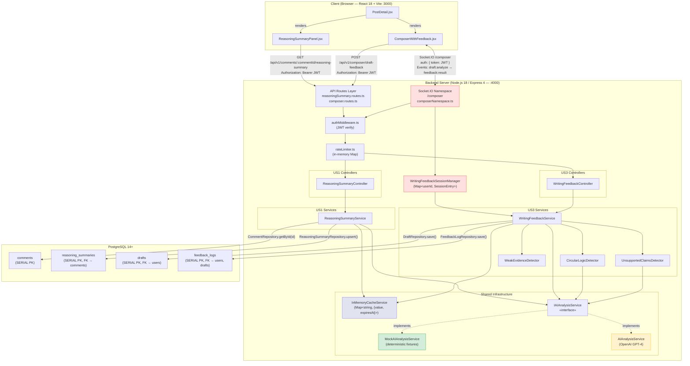
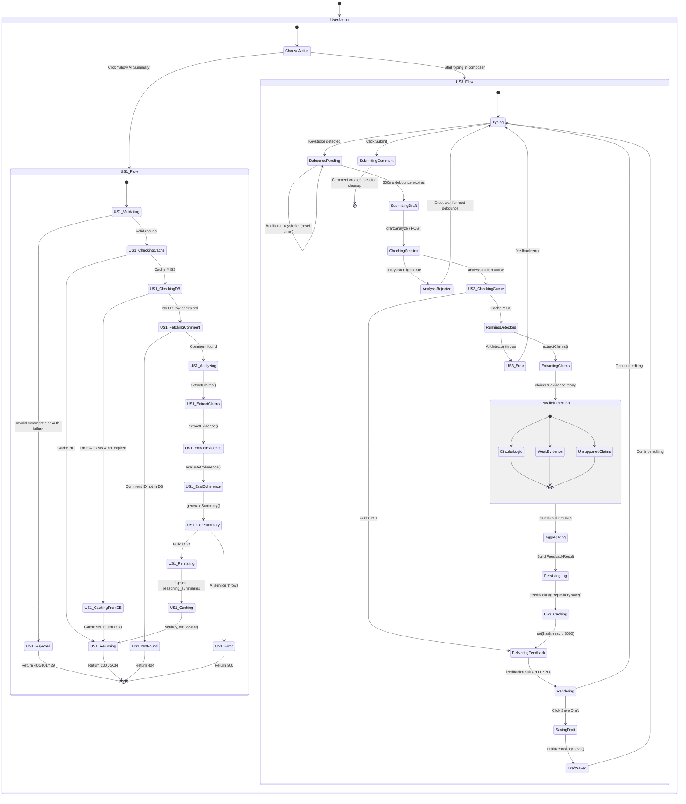
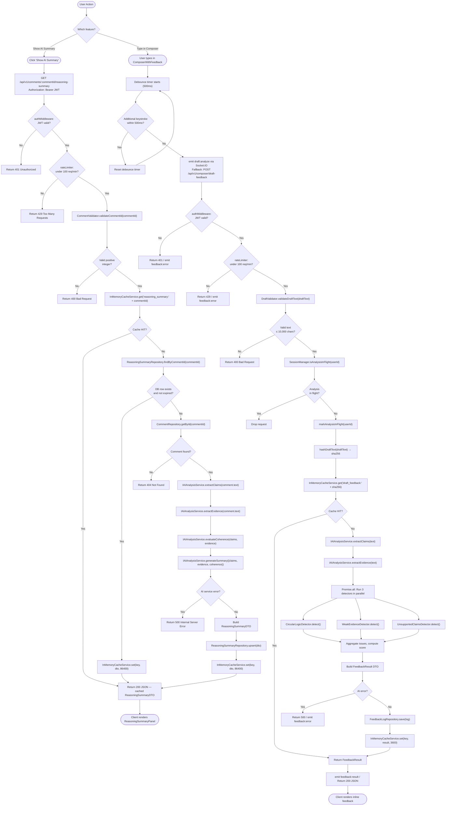
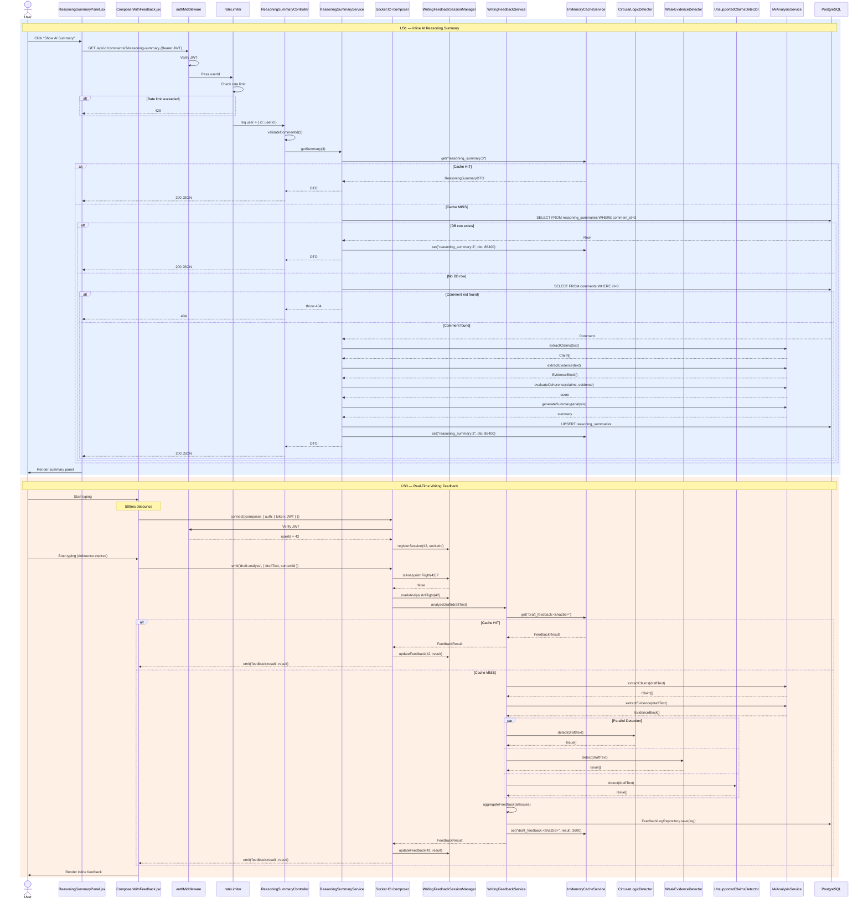

# Harmonized Backend Blueprint — US1 + US3

> **Scope:** Single backend powering **US1** (Inline AI Reasoning Summary, REST) and **US3** (Real-Time Writing Feedback, WebSocket + REST).
>
> **P4 Constraints in Effect:**
> - Exactly **10 simultaneous frontend users** — no Redis, no Bull; use native Node.js `Map`/`Set`.
> - All OpenAI calls behind an **`IAIAnalysisService` interface**, mocked for testing.
> - Single-tenant **PostgreSQL**; table name is **`posts`** (not threads); all base-table PKs are **numeric** (`SERIAL`/`INTEGER`).

---

## 1. Unified Architecture Description

### 1.1 High-Level Overview

A single **Node.js 18 / Express 4 / TypeScript 5** process hosts:

| Concern | Transport | Entry Point |
|---------|-----------|-------------|
| CRUD (posts, comments, subreddits, users, auth) | REST | `GET/POST /api/v1/*` |
| AI Reasoning Summary (US1) | REST | `GET /api/v1/comments/:commentId/reasoning-summary` |
| Draft Feedback — one-shot (US3) | REST | `POST /api/v1/composer/draft-feedback` |
| Draft Feedback — real-time (US3) | WebSocket | Socket.IO namespace `/composer` |
| Draft/History management (US3) | REST | `POST /api/v1/composer/drafts`, `GET /api/v1/composer/draft-feedback/history` |

A **single HTTP server** is created (`http.createServer(expressApp)`), then shared between Express and Socket.IO. There is no separate WebSocket port; Socket.IO upgrades on the same `:4000` port.

### 1.2 Request Flow — US1 (Reasoning Summary)

```
Browser                         Backend (:4000)
  │                                  │
  │  GET /comments/:id/reasoning-summary
  │ ─────────────────────────────►   │
  │                                  ├─ authMiddleware (verify JWT)
  │                                  ├─ rateLimiter (in-memory Map)
  │                                  ├─ ReasoningSummaryController
  │                                  │    └─ ReasoningSummaryService
  │                                  │         ├─ check InMemoryCache (Map)
  │                                  │         │   ├─ HIT  → return cached DTO
  │                                  │         │   └─ MISS ↓
  │                                  │         ├─ CommentRepository.getById(id)  ← PostgreSQL
  │                                  │         ├─ IAIAnalysisService.extractClaims(text)
  │                                  │         ├─ IAIAnalysisService.extractEvidence(text)
  │                                  │         ├─ IAIAnalysisService.evaluateCoherence(…)
  │                                  │         ├─ IAIAnalysisService.generateSummary(…)
  │                                  │         ├─ ReasoningSummaryRepository.upsert(…)  ← PostgreSQL
  │                                  │         └─ InMemoryCache.set(key, dto, ttl=86400s)
  │  ◄──── 200 { summary, primaryClaim, evidenceBlocks, coherenceScore, generatedAt }
```

### 1.3 Request Flow — US3 (Writing Feedback — REST)

```
Browser                         Backend (:4000)
  │                                  │
  │  POST /composer/draft-feedback   │
  │  { draftText, contextId }        │
  │ ─────────────────────────────►   │
  │                                  ├─ authMiddleware (JWT)
  │                                  ├─ rateLimiter
  │                                  ├─ WritingFeedbackController
  │                                  │    └─ WritingFeedbackService.analyzeDraft(text)
  │                                  │         ├─ hash(draftText) → check InMemoryCache
  │                                  │         │   HIT → return cached FeedbackResult
  │                                  │         │   MISS ↓
  │                                  │         ├─ IAIAnalysisService.extractClaims(text)
  │                                  │         ├─ IAIAnalysisService.extractEvidence(text)
  │                                  │         ├─ Run detectors in parallel:
  │                                  │         │   ├─ CircularLogicDetector.detect(text)
  │                                  │         │   ├─ WeakEvidenceDetector.detect(text)
  │                                  │         │   └─ UnsupportedClaimsDetector.detect(text)
  │                                  │         ├─ aggregateFeedback(issues)
  │                                  │         ├─ FeedbackLogRepository.save(…)  ← PostgreSQL
  │                                  │         └─ InMemoryCache.set(hash, result, ttl=3600s)
  │  ◄──── 200 { issues, score, suggestions, goodPoints, confidence, generatedAt }
```

### 1.4 Request Flow — US3 (Writing Feedback — WebSocket)

```
Browser                         Backend (:4000)
  │                                  │
  │  Socket.IO CONNECT /composer     │
  │  (auth: { token: JWT })          │
  │ ─────────────────────────────►   │
  │                                  ├─ verify JWT on handshake
  │                                  ├─ join room `composer:<userId>`
  │                                  │
  │  emit('draft:analyze', {         │
  │    draftText, contextId })       │
  │ ─────────────────────────────►   │
  │                                  ├─ WritingFeedbackService.analyzeDraft(text)
  │                                  │   (same pipeline as REST above)
  │                                  │
  │  ◄──── emit('feedback:result', { feedbackId, issues, score, … })
  │                                  │
  │  emit('draft:save', { text })    │
  │ ─────────────────────────────►   │
  │                                  ├─ DraftRepository.save(…)
  │  ◄──── emit('draft:saved', { id, createdAt, expiresAt })
```

### 1.5 In-Memory Cache (replaces Redis)

Because the P4 constraint targets exactly **10 simultaneous users**, an in-memory `Map`-based cache is sufficient. A single `InMemoryCacheService` implements the `ICacheService` interface:

```
InMemoryCacheService
├── store: Map<string, { value: object, expiresAt: number }>
├── get(key) → returns value or null if expired
├── set(key, value, ttlSeconds)
├── delete(key)
├── exists(key) → boolean
└── sweepExpired() → called on interval (every 60 s)
```

Key patterns:
- `reasoning_summary:<commentId>` — TTL 86 400 s (24 h)
- `draft_feedback:<sha256-of-draftText>` — TTL 3 600 s (1 h)

### 1.6 In-Memory Rate Limiter (replaces Redis-based limiter)

A `Map<userId, { count, windowStart }>` tracks per-user request counts. Window = 60 s, limit = 100.

### 1.7 Shared `IAIAnalysisService`

Both US1 and US3 depend on the **same** `IAIAnalysisService` instance (injected via constructor). In production this calls OpenAI GPT-4; in tests a `MockAIAnalysisService` returns deterministic fixtures.

```
                    ┌──────────────────────────────┐
                    │    IAIAnalysisService         │
                    │  (interface)                  │
                    │  + extractClaims(text)        │
                    │  + extractEvidence(text)      │
                    │  + evaluateCoherence(c, e)    │
                    │  + generateSummary(analysis)  │
                    └──────────┬───────────────────┘
                               │
              ┌────────────────┼────────────────┐
              ▼                                 ▼
 ┌────────────────────────┐       ┌──────────────────────────┐
 │ OpenAIAnalysisService  │       │ MockAIAnalysisService    │
 │ (production)           │       │ (testing / dev)          │
 └────────────────────────┘       └──────────────────────────┘
```

### 1.8 Technology Stack (Harmonized, P4-adjusted)

| Layer | Technology | Version | Notes |
|-------|-----------|---------|-------|
| Runtime | Node.js | 18.x LTS | |
| Framework | Express.js | 4.x | |
| Language | TypeScript | 5.x | |
| Database | PostgreSQL | 14+ | Single tenant, numeric PKs |
| Cache | **In-memory `Map`** | N/A | **Replaces Redis** (P4) |
| Job Queue | **`setTimeout` / `Promise.all`** | N/A | **Replaces Bull** (P4) |
| AI | OpenAI API (GPT-4) | Latest | Behind `IAIAnalysisService` |
| WebSocket | Socket.IO | 4.x | Namespace `/composer` |
| NLP (fallback) | natural / compromise | Latest | Local heuristic detectors |
| Testing | Jest | 29.x | + `MockAIAnalysisService` |
| Auth | JWT (jsonwebtoken) | Latest | HS256 |
| Validation | zod | 3.x | Schema-based request validation |
| ORM/Query | pg (node-postgres) | 8.x | Raw SQL + repository pattern |

### 1.9 Unified Mermaid Diagrams

The following diagrams provide a visual reference for the harmonized backend, uniting components from **US1** (Inline AI Reasoning Summary) and **US3** (Real-Time Writing Feedback) into a single architectural picture.

#### 1.9.1 Architecture Diagram



#### 1.9.2 Class Hierarchy Diagram

```mermaid
classDiagram
    %% === US1 Controllers ===
    class ReasoningSummaryController {
        -reasoningSummaryService: IReasoningSummaryService
        +getSummary(req, res): Promise~void~
    }

    %% === US3 Controllers ===
    class WritingFeedbackController {
        -writingFeedbackService: IWritingFeedbackService
        -draftRepository: DraftRepository
        -feedbackLogRepository: FeedbackLogRepository
        +analyzeDraft(req, res): Promise~void~
        +getFeedbackHistory(req, res): Promise~void~
        +saveDraft(req, res): Promise~void~
    }

    %% === US1 Service Interface ===
    class IReasoningSummaryService {
        <<interface>>
        +getSummary(commentId: number): Promise~ReasoningSummaryDTO~
        +generateAndCacheSummary(comment: Comment): Promise~ReasoningSummaryDTO~
        +invalidateCache(commentId: number): Promise~void~
    }

    class ReasoningSummaryService {
        -aiService: IAIAnalysisService
        -cache: ICacheService
        -commentRepo: CommentRepository
        -summaryRepo: ReasoningSummaryRepository
        +getSummary(commentId: number): Promise~ReasoningSummaryDTO~
        +generateAndCacheSummary(comment: Comment): Promise~ReasoningSummaryDTO~
        +invalidateCache(commentId: number): Promise~void~
        -buildDTO(row: DBRow): ReasoningSummaryDTO
    }

    %% === US3 Service Interface ===
    class IWritingFeedbackService {
        <<interface>>
        +analyzeDraft(text: string): Promise~FeedbackResult~
    }

    class WritingFeedbackService {
        -aiService: IAIAnalysisService
        -cache: ICacheService
        -circularLogicDetector: CircularLogicDetector
        -weakEvidenceDetector: WeakEvidenceDetector
        -unsupportedClaimsDetector: UnsupportedClaimsDetector
        -feedbackLogRepo: FeedbackLogRepository
        +analyzeDraft(text: string): Promise~FeedbackResult~
        -aggregateFeedback(issues: Issue[][]): FeedbackResult
        -computeScore(issues: Issue[]): number
    }

    class WritingFeedbackSessionManager {
        -sessions: Map~number_SessionEntry~
        -maxSessions: number
        -sessionTimeoutMs: number
        +registerSession(userId: number, socketId: string): boolean
        +removeSession(userId: number): void
        +updateDraft(userId: number, draftText: string): boolean
        +updateFeedback(userId: number, feedback: FeedbackResult): boolean
        +markAnalysisInFlight(userId: number): boolean
        +isAnalysisInFlight(userId: number): boolean
        +getSession(userId: number): SessionEntry or null
        +getActiveUserIds(): number[]
        +sweepExpiredSessions(): number
        -checkRep(): void
    }

    %% === Shared AI Service ===
    class IAIAnalysisService {
        <<interface>>
        +extractClaims(text: string): Promise~Claim[]~
        +extractEvidence(text: string): Promise~EvidenceBlock[]~
        +evaluateCoherence(claims: Claim[], evidence: EvidenceBlock[]): Promise~number~
        +generateSummary(analysis: AnalysisResult): Promise~string~
    }

    class AIAnalysisService {
        -openaiClient: OpenAI
        -model: string
        +extractClaims(text: string): Promise~Claim[]~
        +extractEvidence(text: string): Promise~EvidenceBlock[]~
        +evaluateCoherence(claims: Claim[], evidence: EvidenceBlock[]): Promise~number~
        +generateSummary(analysis: AnalysisResult): Promise~string~
    }

    class MockAIAnalysisService {
        -fixtures: Map~string_AnalysisResult~
        +extractClaims(text: string): Promise~Claim[]~
        +extractEvidence(text: string): Promise~EvidenceBlock[]~
        +evaluateCoherence(claims: Claim[], evidence: EvidenceBlock[]): Promise~number~
        +generateSummary(analysis: AnalysisResult): Promise~string~
    }

    %% === Shared Cache ===
    class ICacheService {
        <<interface>>
        +get(key: string): Promise~object_or_null~
        +set(key: string, value: object, ttl: number): Promise~void~
        +delete(key: string): Promise~void~
        +exists(key: string): Promise~boolean~
    }

    class InMemoryCacheService {
        -store: Map~string_CacheEntry~
        -sweepIntervalId: NodeJS.Timeout
        +get(key: string): Promise~object_or_null~
        +set(key: string, value: object, ttl: number): Promise~void~
        +delete(key: string): Promise~void~
        +exists(key: string): Promise~boolean~
        +sweepExpired(): void
        +destroy(): void
    }

    %% === US3 Detectors ===
    class CircularLogicDetector {
        -nlpProcessor: NLPProcessor
        +detect(text: string): Promise~Issue[]~
        -buildSentenceGraph(sentences: string[]): Map~number_number[]~
        -findCycles(graph: Map~number_number[]~): number[][]
        -computeNgramOverlap(sentences: string[], n: number): Overlap[]
    }

    class WeakEvidenceDetector {
        -citationParser: CitationParser
        +detect(text: string): Promise~Issue[]~
        -scoreEvidence(citations: Citation[]): number
    }

    class UnsupportedClaimsDetector {
        -aiService: IAIAnalysisService
        +detect(text: string): Promise~Issue[]~
        -matchClaimsToEvidence(claims: Claim[], evidence: EvidenceBlock[]): ClaimValidation[]
    }

    %% === US1 Repositories ===
    class CommentRepository {
        -pool: Pool
        +getById(id: number): Promise~Comment_or_null~
        +getByPostId(postId: number): Promise~Comment[]~
    }

    class ReasoningSummaryRepository {
        -pool: Pool
        +findByCommentId(commentId: number): Promise~DBRow_or_null~
        +upsert(summary: ReasoningSummaryInsert): Promise~DBRow~
        +deleteByCommentId(commentId: number): Promise~void~
    }

    %% === US3 Repositories ===
    class DraftRepository {
        -pool: Pool
        +save(draft: DraftInsert): Promise~DraftRow~
        +findByUserId(userId: number): Promise~DraftRow[]~
        +findById(id: number): Promise~DraftRow_or_null~
        +deleteById(id: number): Promise~void~
    }

    class FeedbackLogRepository {
        -pool: Pool
        +save(log: FeedbackLogInsert): Promise~FeedbackLogRow~
        +findByUserId(userId: number, limit: number, offset: number): Promise~FeedbackLogRow[]~
        +countByUserId(userId: number): Promise~number~
    }

    %% === Shared Utilities ===
    class NLPProcessor {
        +tokenize(text: string): string[]
        +parseSentences(text: string): string[]
    }

    class CommentValidator {
        +validateCommentId(id: any): number
        +sanitizeText(text: string): string
    }

    class DraftValidator {
        +validateDraftText(text: any): string
        +validateContextId(id: any): number
    }

    class CitationParser {
        +extractCitations(text: string): Citation[]
        +scoreCitation(citation: Citation): number
    }

    %% === US1 Models/DTOs ===
    class ReasoningSummaryDTO {
        +commentId: number
        +summary: string
        +primaryClaim: string
        +evidenceBlocks: EvidenceBlock[]
        +coherenceScore: number
        +generatedAt: Date
    }

    class EvidenceBlock {
        +type: string
        +content: string
        +strength: string
    }

    class Claim {
        +id: number
        +text: string
        +supportingEvidence: string[]
    }

    %% === US3 Models/DTOs ===
    class FeedbackResult {
        +issues: Issue[]
        +score: number
        +suggestions: Suggestion[]
        +goodPoints: string[]
        +confidence: number
        +generatedAt: Date
    }

    class Issue {
        +type: string
        +position: Position
        +lineNumber: number
        +flaggedText: string
        +explanation: string
        +severity: string
        +confidence: number
    }

    class Suggestion {
        +text: string
        +type: string
        +priority: string
        +exampleFix: string
        +docLink: string
    }

    %% === US1 Relationships ===
    ReasoningSummaryController --> IReasoningSummaryService
    IReasoningSummaryService <|.. ReasoningSummaryService
    ReasoningSummaryService --> IAIAnalysisService
    ReasoningSummaryService --> ICacheService
    ReasoningSummaryService --> CommentRepository
    ReasoningSummaryService --> ReasoningSummaryRepository
    ReasoningSummaryService --> CommentValidator
    ReasoningSummaryService --> NLPProcessor
    ReasoningSummaryService ..> ReasoningSummaryDTO : creates
    ReasoningSummaryDTO --> EvidenceBlock
    ReasoningSummaryDTO --> Claim

    %% === US3 Relationships ===
    WritingFeedbackController --> IWritingFeedbackService
    IWritingFeedbackService <|.. WritingFeedbackService
    WritingFeedbackService --> IAIAnalysisService
    WritingFeedbackService --> ICacheService
    WritingFeedbackService --> CircularLogicDetector
    WritingFeedbackService --> WeakEvidenceDetector
    WritingFeedbackService --> UnsupportedClaimsDetector
    WritingFeedbackService --> FeedbackLogRepository
    WritingFeedbackSessionManager --> WritingFeedbackService
    WritingFeedbackController --> DraftRepository
    WritingFeedbackController --> DraftValidator
    WritingFeedbackService ..> FeedbackResult : creates
    FeedbackResult --> Issue
    FeedbackResult --> Suggestion

    %% === Shared Relationships ===
    IAIAnalysisService <|.. AIAnalysisService
    IAIAnalysisService <|.. MockAIAnalysisService
    ICacheService <|.. InMemoryCacheService
    CircularLogicDetector --> NLPProcessor
    WeakEvidenceDetector --> CitationParser
    UnsupportedClaimsDetector --> IAIAnalysisService
```



#### 1.9.3 State Diagram



#### 1.9.4 Flow Chart



#### 1.9.5 Sequence Diagram



---

## 2. Database Schemas

All base tables use `SERIAL` (auto-incrementing integer) primary keys. AI-specific tables (`reasoning_summaries`, `feedback_logs`, `drafts`) also use `SERIAL` PKs to match the convention. Timestamps default to `CURRENT_TIMESTAMP`.

### 2.1 `users`

```sql
CREATE TABLE users (
    id            SERIAL PRIMARY KEY,
    username      VARCHAR(50)  NOT NULL UNIQUE,
    email         VARCHAR(255) NOT NULL UNIQUE,
    password_hash VARCHAR(255) NOT NULL,
    avatar        VARCHAR(255) DEFAULT '👤',
    karma         INTEGER      DEFAULT 0,
    joined_date   TIMESTAMP    DEFAULT CURRENT_TIMESTAMP,
    created_at    TIMESTAMP    DEFAULT CURRENT_TIMESTAMP,
    updated_at    TIMESTAMP    DEFAULT CURRENT_TIMESTAMP
);

CREATE INDEX idx_users_username ON users(username);
CREATE INDEX idx_users_email    ON users(email);
```

### 2.2 `subreddits`

```sql
CREATE TABLE subreddits (
    id           SERIAL PRIMARY KEY,
    name         VARCHAR(100) NOT NULL UNIQUE,
    icon         VARCHAR(50)  DEFAULT '📁',
    member_count INTEGER      DEFAULT 0,
    color        VARCHAR(50)  DEFAULT 'bg-blue-500',
    created_at   TIMESTAMP    DEFAULT CURRENT_TIMESTAMP
);

CREATE INDEX idx_subreddits_name ON subreddits(name);
```

### 2.3 `user_subreddit_memberships` (join table)

```sql
CREATE TABLE user_subreddit_memberships (
    user_id      INTEGER NOT NULL REFERENCES users(id)      ON DELETE CASCADE,
    subreddit_id INTEGER NOT NULL REFERENCES subreddits(id) ON DELETE CASCADE,
    joined_at    TIMESTAMP DEFAULT CURRENT_TIMESTAMP,
    PRIMARY KEY (user_id, subreddit_id)
);
```

### 2.4 `posts`

```sql
CREATE TABLE posts (
    id            SERIAL PRIMARY KEY,
    title         VARCHAR(300) NOT NULL,
    content       TEXT         NOT NULL,
    author_id     INTEGER      NOT NULL REFERENCES users(id)      ON DELETE CASCADE,
    subreddit_id  INTEGER      NOT NULL REFERENCES subreddits(id) ON DELETE CASCADE,
    upvotes       INTEGER      DEFAULT 0,
    downvotes     INTEGER      DEFAULT 0,
    comment_count INTEGER      DEFAULT 0,
    image         TEXT,
    created_at    TIMESTAMP    DEFAULT CURRENT_TIMESTAMP,
    updated_at    TIMESTAMP    DEFAULT CURRENT_TIMESTAMP
);

CREATE INDEX idx_posts_subreddit ON posts(subreddit_id);
CREATE INDEX idx_posts_author    ON posts(author_id);
CREATE INDEX idx_posts_created   ON posts(created_at DESC);
```

### 2.5 `comments`

```sql
CREATE TABLE comments (
    id                SERIAL PRIMARY KEY,
    post_id           INTEGER NOT NULL REFERENCES posts(id) ON DELETE CASCADE,
    author_id         INTEGER NOT NULL REFERENCES users(id) ON DELETE CASCADE,
    parent_comment_id INTEGER          REFERENCES comments(id) ON DELETE CASCADE,
    text              TEXT    NOT NULL,
    upvotes           INTEGER DEFAULT 0,
    downvotes         INTEGER DEFAULT 0,
    created_at        TIMESTAMP DEFAULT CURRENT_TIMESTAMP,
    updated_at        TIMESTAMP DEFAULT CURRENT_TIMESTAMP
);

CREATE INDEX idx_comments_post   ON comments(post_id);
CREATE INDEX idx_comments_author ON comments(author_id);
CREATE INDEX idx_comments_parent ON comments(parent_comment_id);
```

### 2.6 `votes`

```sql
CREATE TABLE votes (
    id           SERIAL PRIMARY KEY,
    user_id      INTEGER     NOT NULL REFERENCES users(id) ON DELETE CASCADE,
    target_type  VARCHAR(10) NOT NULL CHECK (target_type IN ('post', 'comment')),
    target_id    INTEGER     NOT NULL,
    vote_type    VARCHAR(4)  NOT NULL CHECK (vote_type IN ('up', 'down')),
    created_at   TIMESTAMP   DEFAULT CURRENT_TIMESTAMP,
    UNIQUE (user_id, target_type, target_id)
);

CREATE INDEX idx_votes_target ON votes(target_type, target_id);
CREATE INDEX idx_votes_user   ON votes(user_id);
```

### 2.7 `reports`

```sql
CREATE TABLE reports (
    id               SERIAL PRIMARY KEY,
    reporter_user_id INTEGER     NOT NULL REFERENCES users(id)    ON DELETE CASCADE,
    comment_id       INTEGER     NOT NULL REFERENCES comments(id) ON DELETE CASCADE,
    reason           TEXT        NOT NULL,
    status           VARCHAR(20) DEFAULT 'pending'
                                 CHECK (status IN ('pending','reviewed','dismissed','actioned')),
    created_at       TIMESTAMP   DEFAULT CURRENT_TIMESTAMP,
    reviewed_at      TIMESTAMP,
    reviewed_by      INTEGER     REFERENCES users(id) ON DELETE SET NULL
);

CREATE INDEX idx_reports_comment ON reports(comment_id);
CREATE INDEX idx_reports_status  ON reports(status);
```

### 2.8 `drafts` (US3)

```sql
CREATE TABLE drafts (
    id               SERIAL PRIMARY KEY,
    user_id          INTEGER     NOT NULL REFERENCES users(id) ON DELETE CASCADE,
    post_id          INTEGER              REFERENCES posts(id) ON DELETE SET NULL,
    text             TEXT        NOT NULL,
    last_feedback    JSONB,
    last_analyzed_at TIMESTAMP,
    created_at       TIMESTAMP   DEFAULT CURRENT_TIMESTAMP,
    updated_at       TIMESTAMP   DEFAULT CURRENT_TIMESTAMP,
    expires_at       TIMESTAMP   DEFAULT (CURRENT_TIMESTAMP + INTERVAL '30 days')
);

CREATE INDEX idx_drafts_user    ON drafts(user_id);
CREATE INDEX idx_drafts_expires ON drafts(expires_at);
```

### 2.9 `feedback_logs` (US3)

```sql
CREATE TABLE feedback_logs (
    id          SERIAL PRIMARY KEY,
    user_id     INTEGER      NOT NULL REFERENCES users(id)  ON DELETE CASCADE,
    draft_id    INTEGER               REFERENCES drafts(id) ON DELETE SET NULL,
    draft_text  TEXT         NOT NULL,
    issues      JSONB        NOT NULL,
    score       NUMERIC(3,2) CHECK (score >= 0 AND score <= 1),
    suggestions JSONB,
    confidence  NUMERIC(3,2) CHECK (confidence >= 0 AND confidence <= 1),
    created_at  TIMESTAMP    DEFAULT CURRENT_TIMESTAMP
);

CREATE INDEX idx_feedback_user    ON feedback_logs(user_id);
CREATE INDEX idx_feedback_draft   ON feedback_logs(draft_id);
CREATE INDEX idx_feedback_created ON feedback_logs(created_at DESC);
```

### 2.10 `reasoning_summaries` (US1)

```sql
CREATE TABLE reasoning_summaries (
    id              SERIAL PRIMARY KEY,
    comment_id      INTEGER       NOT NULL UNIQUE REFERENCES comments(id) ON DELETE CASCADE,
    summary         TEXT          NOT NULL,
    primary_claim   TEXT          NOT NULL,
    evidence_blocks JSONB         NOT NULL,
    coherence_score NUMERIC(3,2)  CHECK (coherence_score >= 0 AND coherence_score <= 1),
    created_at      TIMESTAMP     DEFAULT CURRENT_TIMESTAMP,
    updated_at      TIMESTAMP     DEFAULT CURRENT_TIMESTAMP,
    expires_at      TIMESTAMP     DEFAULT (CURRENT_TIMESTAMP + INTERVAL '24 hours')
);

CREATE INDEX idx_reasoning_comment ON reasoning_summaries(comment_id);
CREATE INDEX idx_reasoning_expires ON reasoning_summaries(expires_at);
```

### 2.11 Entity-Relationship Summary

```
users ──1:N──► posts
users ──1:N──► comments
users ──1:N──► votes
users ──1:N──► reports        (reporter)
users ──1:N──► drafts
users ──1:N──► feedback_logs
users ──M:N──► subreddits     (via user_subreddit_memberships)

subreddits ──1:N──► posts

posts ──1:N──► comments

comments ──1:N──► comments    (self-ref: parent_comment_id)
comments ──1:1──► reasoning_summaries
comments ──1:N──► reports

drafts ──1:N──► feedback_logs
```

---

## 3. Backend Modules

### 3.1 Module Map

```
backend/src/
├── index.ts                          # Express + Socket.IO bootstrap
├── config/
│   ├── database.ts                   # pg Pool config
│   └── env.ts                        # Validated env vars (PORT, JWT_SECRET, DB_*, OPENAI_API_KEY)
│
├── middleware/
│   ├── authMiddleware.ts             # JWT verification (express + socket.io)
│   ├── rateLimiter.ts                # In-memory per-user rate limiter (Map)
│   ├── validate.ts                   # Zod-based request body/param validation
│   └── errorHandler.ts              # Global Express error handler
│
├── routes/
│   ├── auth.routes.ts                # POST /login, /register
│   ├── posts.routes.ts               # CRUD posts, vote
│   ├── comments.routes.ts            # CRUD comments, vote, report
│   ├── subreddits.routes.ts          # List, join/leave
│   ├── users.routes.ts               # GET /me
│   ├── reasoningSummary.routes.ts    # GET /comments/:id/reasoning-summary  ← US1
│   └── composer.routes.ts            # POST /draft-feedback, GET /history, POST /drafts  ← US3
│
├── controllers/
│   ├── AuthController.ts
│   ├── PostController.ts
│   ├── CommentController.ts
│   ├── SubredditController.ts
│   ├── UserController.ts
│   ├── ReasoningSummaryController.ts          ← US1
│   └── WritingFeedbackController.ts           ← US3
│
├── services/
│   ├── interfaces/
│   │   ├── IAIAnalysisService.ts              # Shared AI interface
│   │   ├── ICacheService.ts                   # In-memory cache interface
│   │   ├── IReasoningSummaryService.ts        # US1 service interface
│   │   └── IWritingFeedbackService.ts         # US3 service interface
│   │
│   ├── AIAnalysisService.ts                   # Production OpenAI implementation
│   ├── MockAIAnalysisService.ts               # Deterministic mock (for tests)
│   ├── InMemoryCacheService.ts                # Map-based cache (replaces Redis)
│   ├── ReasoningSummaryService.ts             # US1 orchestrator
│   ├── WritingFeedbackService.ts              # US3 orchestrator
│   ├── CircularLogicDetector.ts               # US3 — NLP heuristic
│   ├── WeakEvidenceDetector.ts                # US3 — citation analysis
│   └── UnsupportedClaimsDetector.ts           # US3 — claim validation
│
├── repositories/
│   ├── UserRepository.ts
│   ├── PostRepository.ts
│   ├── CommentRepository.ts
│   ├── SubredditRepository.ts
│   ├── VoteRepository.ts
│   ├── ReportRepository.ts
│   ├── ReasoningSummaryRepository.ts          ← US1
│   ├── DraftRepository.ts                     ← US3
│   └── FeedbackLogRepository.ts               ← US3
│
├── models/                                    # TypeScript interfaces / DTOs
│   ├── User.ts
│   ├── Post.ts
│   ├── Comment.ts
│   ├── Subreddit.ts
│   ├── Vote.ts
│   ├── Report.ts
│   ├── ReasoningSummary.ts                    ← US1
│   ├── EvidenceBlock.ts                       ← US1
│   ├── Claim.ts                               ← shared
│   ├── FeedbackResult.ts                      ← US3
│   ├── Issue.ts                               ← US3
│   ├── Suggestion.ts                          ← US3
│   └── Draft.ts                               ← US3
│
├── websocket/
│   └── composerNamespace.ts                   # Socket.IO /composer — US3
│
└── utils/
    ├── NLPProcessor.ts                        # Sentence splitting, tokenization
    ├── CitationParser.ts                      # Extract/score citations
    └── hashDraftText.ts                       # SHA-256 hash for cache key
```

### 3.2 Module Responsibilities

#### A. Core CRUD Module (posts, comments, subreddits, users, auth)

Provides the base Reddit-clone REST API consumed by the frontend. Stateless controllers delegate to repositories that execute parameterized SQL via the `pg` Pool.

- **AuthController** — `POST /auth/login` (returns JWT), `POST /auth/register` (hashes password with `bcrypt`, inserts user, returns JWT).
- **PostController** — list (with subreddit filter + full-text `q` search), get by id, create, vote (upsert into `votes`; atomically increment/decrement `posts.upvotes`/`downvotes`).
- **CommentController** — list by post (supports nested via `parent_comment_id`), create, vote, report.
- **SubredditController** — list all, join/leave (toggle `user_subreddit_memberships`).
- **UserController** — `GET /users/me` returns the authenticated user's profile.

#### B. Mocked AI Analysis Module (shared by US1 + US3)

Single point of contact for all LLM interaction.

**Interface — `IAIAnalysisService`:**

```typescript
interface IAIAnalysisService {
    extractClaims(text: string): Promise<Claim[]>;
    extractEvidence(text: string): Promise<EvidenceBlock[]>;
    evaluateCoherence(claims: Claim[], evidence: EvidenceBlock[]): Promise<number>;
    generateSummary(analysis: AnalysisResult): Promise<string>;
}
```

**Production — `AIAnalysisService`:** wraps `openai` npm package; sends structured prompts to GPT-4 and parses JSON responses.

**Mock — `MockAIAnalysisService`:** returns hardcoded, deterministic fixtures keyed on input length ranges. Zero network calls. Used in all Jest test suites.

#### C. Reasoning Summary Module (US1)

Orchestrates the "click to view AI summary" flow.

- **`ReasoningSummaryService`** — checks in-memory cache → falls back to DB row → falls back to generating via `IAIAnalysisService` → stores in DB + cache.
- **`ReasoningSummaryRepository`** — CRUD on `reasoning_summaries` table.
- **`ReasoningSummaryController`** — thin HTTP handler; validates `commentId`, delegates to service, serializes the DTO to match the frontend `aiSummary` shape.

#### D. Writing Feedback Module (US3)

Orchestrates the real-time draft analysis flow over both REST and WebSocket.

- **`WritingFeedbackService`** — the central orchestrator. Accepts a draft string, runs three detectors in parallel (`Promise.all`), aggregates issues, computes score, builds `FeedbackResult`.
- **Detectors** (each implements a `detect(text): Promise<Issue[]>` method):
  - `CircularLogicDetector` — n-gram overlap + sentence-graph cycle detection.
  - `WeakEvidenceDetector` — citation extraction, evidence strength scoring.
  - `UnsupportedClaimsDetector` — claim extraction via `IAIAnalysisService`, then checks each claim has supporting evidence.
- **`DraftRepository`** / **`FeedbackLogRepository`** — persistence layer.
- **`WritingFeedbackController`** — REST handler for `POST /composer/draft-feedback`, `GET /composer/draft-feedback/history`, `POST /composer/drafts`.
- **`composerNamespace.ts`** — Socket.IO namespace `/composer`; authenticates on handshake; listens for `draft:analyze` and `draft:save` events; emits `feedback:result`, `feedback:error`, `draft:saved`.

#### E. In-Memory Cache Module (replaces Redis)

- **`InMemoryCacheService`** — implements `ICacheService`. Internally a `Map<string, { value: object; expiresAt: number }>`. A `setInterval` sweeper runs every 60 s to evict expired entries. Thread-safe within the single Node.js event loop.

---

## 4. MIT 6.005 Data Abstraction — `WritingFeedbackSessionManager`

The **primary state-holding class** in the Writing Feedback module is `WritingFeedbackSessionManager`. It tracks active composer sessions (one per user) and their latest analysis state, replacing what would otherwise be a Redis pub/sub + Bull queue setup.

### 4.1 Overview

`WritingFeedbackSessionManager` provides a **mutable** abstract data type that maps each connected user to their current drafting session, including their latest draft text, the last feedback result, and a pending-analysis flag that prevents duplicate concurrent analyses for the same user.

### 4.2 Space of Representation Values (Rep)

```typescript
class WritingFeedbackSessionManager {
    // -- Rep --
    private sessions: Map<number, {
        socketId:       string;          // Socket.IO socket id
        currentDraft:   string;          // latest draft text received
        lastFeedback:   FeedbackResult | null;  // most recent analysis result
        analysisInFlight: boolean;       // true while an analysis Promise is pending
        lastActivityAt:   number;        // Date.now() of last event
    }>;
    private readonly maxSessions: number;        // upper bound, default 10
    private readonly sessionTimeoutMs: number;   // inactivity timeout, default 30 min
}
```

**Rep components:**

| Field | Type | Domain |
|-------|------|--------|
| `sessions` | `Map<number, SessionEntry>` | keys ⊂ ℤ⁺ (valid user IDs); size ∈ [0, `maxSessions`] |
| `SessionEntry.socketId` | `string` | non-empty string matching Socket.IO format |
| `SessionEntry.currentDraft` | `string` | any string (may be empty) |
| `SessionEntry.lastFeedback` | `FeedbackResult \| null` | either `null` or a well-formed `FeedbackResult` with `score ∈ [0,1]` |
| `SessionEntry.analysisInFlight` | `boolean` | exactly `true` or `false` |
| `SessionEntry.lastActivityAt` | `number` | positive integer (epoch milliseconds) |
| `maxSessions` | `number` | positive integer, default 10 |
| `sessionTimeoutMs` | `number` | positive integer, default 1 800 000 (30 min) |

### 4.3 Space of Abstract Values

Abstractly, a `WritingFeedbackSessionManager` represents:

> A **finite partial function** *f : UserId → ComposerSession* from user IDs to composer sessions, where each session captures the user's current draft, its latest AI feedback (if any), and whether an analysis is currently running. The function's domain has cardinality ≤ *N* (the max concurrency), and each session that has been inactive longer than *T* milliseconds is considered expired.

In set-builder notation:

$$A = \{ f : \mathbb{Z}^+ \rightharpoonup \text{ComposerSession} \mid |dom(f)| \leq N \}$$

where:

$$\text{ComposerSession} = \text{String} \times (\text{FeedbackResult} \cup \{\bot\}) \times \text{Bool} \times \mathbb{Z}^+$$

### 4.4 Rep Invariant (RI)

```
RI(r) =
    r.sessions.size ≤ r.maxSessions
  ∧ r.maxSessions > 0
  ∧ r.sessionTimeoutMs > 0
  ∧ ∀ (userId, entry) ∈ r.sessions:
        userId > 0
      ∧ entry.socketId.length > 0
      ∧ entry.lastActivityAt > 0
      ∧ (entry.lastFeedback === null
          ∨ (entry.lastFeedback.score ≥ 0 ∧ entry.lastFeedback.score ≤ 1
             ∧ entry.lastFeedback.confidence ≥ 0 ∧ entry.lastFeedback.confidence ≤ 1
             ∧ Array.isArray(entry.lastFeedback.issues)))
```

A `checkRep()` method enforces this invariant after every mutator in debug builds:

```typescript
private checkRep(): void {
    assert(this.sessions.size <= this.maxSessions);
    assert(this.maxSessions > 0);
    assert(this.sessionTimeoutMs > 0);
    for (const [userId, entry] of this.sessions) {
        assert(userId > 0);
        assert(entry.socketId.length > 0);
        assert(entry.lastActivityAt > 0);
        if (entry.lastFeedback !== null) {
            assert(entry.lastFeedback.score >= 0 && entry.lastFeedback.score <= 1);
            assert(entry.lastFeedback.confidence >= 0 && entry.lastFeedback.confidence <= 1);
            assert(Array.isArray(entry.lastFeedback.issues));
        }
    }
}
```

### 4.5 Abstraction Function (AF)

```
AF(r) = the partial function f where:
    dom(f) = { userId | sessions.has(userId) ∧ (now - entry.lastActivityAt) < sessionTimeoutMs }
    f(userId) = ComposerSession(
                    draft       = entry.currentDraft,
                    feedback    = entry.lastFeedback,
                    isAnalyzing = entry.analysisInFlight,
                    lastActive  = entry.lastActivityAt
                )
```

In words: *the abstract value is the set of non-expired sessions, where each maps a user ID to their current drafting state.* Expired sessions are invisible to the abstract value — they exist in `r.sessions` only until the next sweep.

### 4.6 Safety from Rep Exposure

The class ensures no client can obtain a direct reference to its mutable internal state:

| Technique | Where Applied |
|-----------|---------------|
| **`private` fields** | `sessions`, `maxSessions`, `sessionTimeoutMs` are all `private readonly` (except `sessions` which is `private`). No public field exposes the Map. |
| **Defensive copying on output** | `getSession(userId)` returns a deep clone (via `structuredClone`) of the `SessionEntry`, never the Map entry itself. |
| **Defensive copying on input** | `updateFeedback(userId, result)` clones the incoming `FeedbackResult` before storing, so the caller cannot mutate it after the fact. |
| **Immutable config** | `maxSessions` and `sessionTimeoutMs` are `readonly`; set once in the constructor, never changed. |
| **No iterator exposure** | There is no `getAll()` that returns the Map. `getActiveUserIds()` returns a `number[]` snapshot, not a live reference. |

**Example public API (returns only copies / primitives):**

```typescript
class WritingFeedbackSessionManager {
    /** Register a new socket connection for a user. */
    registerSession(userId: number, socketId: string): boolean;

    /** Remove session on disconnect. */
    removeSession(userId: number): void;

    /** Update the draft text for a user. Returns false if no session. */
    updateDraft(userId: number, draftText: string): boolean;

    /** Store latest feedback. Clones input. Sets analysisInFlight = false. */
    updateFeedback(userId: number, feedback: FeedbackResult): boolean;

    /** Mark that an analysis is in progress. Prevents duplicate concurrent runs. */
    markAnalysisInFlight(userId: number): boolean;

    /** Is analysis already running for this user? */
    isAnalysisInFlight(userId: number): boolean;

    /** Get a COPY of the session, or null. */
    getSession(userId: number): SessionEntry | null;

    /** Get active (non-expired) user IDs. Returns a new array. */
    getActiveUserIds(): number[];

    /** Evict sessions that have been inactive longer than sessionTimeoutMs. */
    sweepExpiredSessions(): number;  // returns count evicted
}
```

Every mutator calls `checkRep()` at the end (in debug mode), and every accessor returns a fresh copy or primitive, ensuring **no representation exposure**.

---

## Appendix A — Complete REST Endpoint Table

| # | Method | Endpoint | Module | US |
|---|--------|----------|--------|----|
| 1 | POST | `/api/v1/auth/register` | Core | — |
| 2 | POST | `/api/v1/auth/login` | Core | — |
| 3 | GET | `/api/v1/users/me` | Core | — |
| 4 | GET | `/api/v1/subreddits` | Core | — |
| 5 | POST | `/api/v1/subreddits/:id/join` | Core | — |
| 6 | GET | `/api/v1/posts` | Core | — |
| 7 | GET | `/api/v1/posts/:id` | Core | — |
| 8 | POST | `/api/v1/posts` | Core | — |
| 9 | POST | `/api/v1/posts/:id/vote` | Core | — |
| 10 | GET | `/api/v1/posts/:id/comments` | Core | — |
| 11 | POST | `/api/v1/posts/:id/comments` | Core | — |
| 12 | POST | `/api/v1/comments/:id/vote` | Core | — |
| 13 | POST | `/api/v1/comments/:id/report` | Core | — |
| 14 | GET | `/api/v1/comments/:commentId/reasoning-summary` | US1 | US1 |
| 15 | POST | `/api/v1/composer/draft-feedback` | US3 | US3 |
| 16 | GET | `/api/v1/composer/draft-feedback/history` | US3 | US3 |
| 17 | POST | `/api/v1/composer/drafts` | US3 | US3 |

## Appendix B — WebSocket Event Table (Namespace: `/composer`)

| Direction | Event | Payload | US |
|-----------|-------|---------|-----|
| Client → Server | `draft:analyze` | `{ draftText: string, contextId: number }` | US3 |
| Client → Server | `draft:save` | `{ id?: number, text: string, contextId: number }` | US3 |
| Server → Client | `feedback:result` | `{ feedbackId: number, issues: Issue[], score: number, suggestions: Suggestion[], goodPoints: string[] }` | US3 |
| Server → Client | `feedback:error` | `{ message: string, code: string }` | US3 |
| Server → Client | `draft:saved` | `{ id: number, createdAt: string, expiresAt: string }` | US3 |

## Appendix C — Environment Variables

```env
# Server
PORT=4000
NODE_ENV=development

# Database
DB_HOST=localhost
DB_PORT=5432
DB_NAME=reddit_ai_debate
DB_USER=postgres
DB_PASSWORD=postgres

# Auth
JWT_SECRET=<random-256-bit-hex>
JWT_EXPIRES_IN=7d

# OpenAI
OPENAI_API_KEY=sk-...
OPENAI_MODEL=gpt-4

# Cache (informational — handled in-memory)
CACHE_REASONING_TTL=86400
CACHE_FEEDBACK_TTL=3600

# Rate limiting
RATE_LIMIT_WINDOW_MS=60000
RATE_LIMIT_MAX_REQUESTS=100
```

## Appendix D — Key Discrepancy Resolutions

| # | Issue | Resolution |
|---|-------|------------|
| 9.1 | "threads" vs "posts" | **Use `posts` everywhere.** DB table is `posts`; all API routes use `/posts/:id`. The original DS2 `threadId` param is aliased to `postId`. |
| 9.4 | ID format (UUID vs numeric vs string) | **Numeric `SERIAL` for all base tables.** Matches frontend `mockData.js` (ids 1, 2, 3…). AI-specific tables also use `SERIAL`. |
| 9.6 | `aiSummary` inline vs separate | **Separate lazy-load.** Comments endpoint returns `aiSummary: null`; frontend calls `GET /comments/:id/reasoning-summary` on expand. |
| 9.9 | Port allocation | Backend on `:4000`, frontend Vite on `:3000`. Vite proxy: `/api → http://localhost:4000`. |
| P4 | Redis / Bull replacement | `InMemoryCacheService` (Map) and `Promise.all` / `setTimeout` replace Redis and Bull respectively. |
